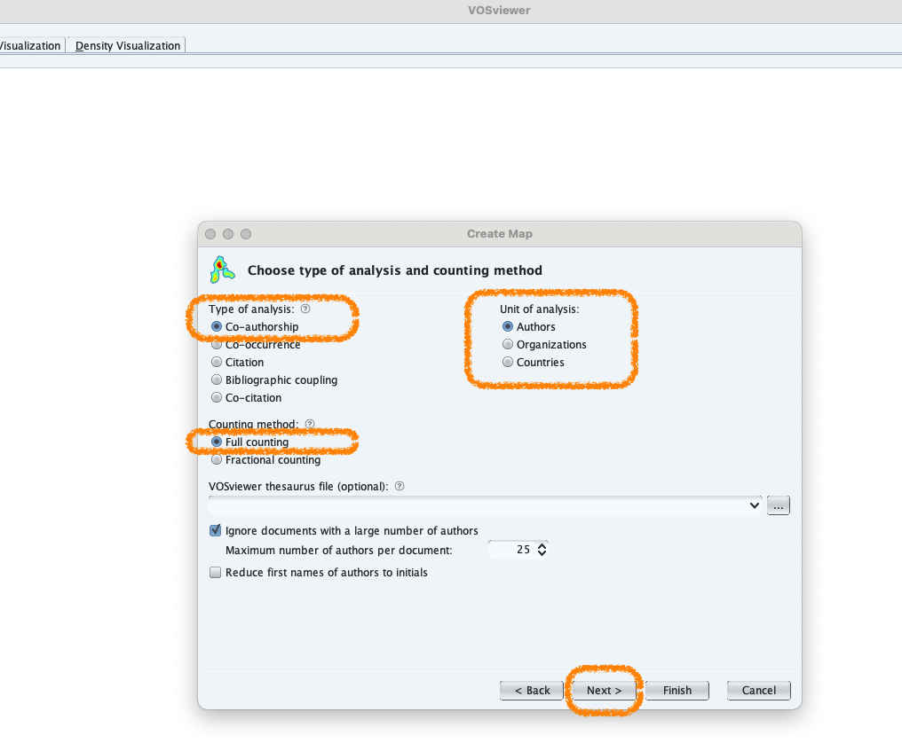
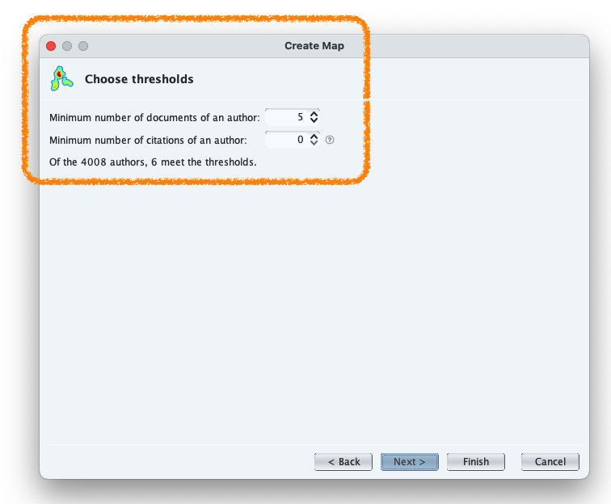
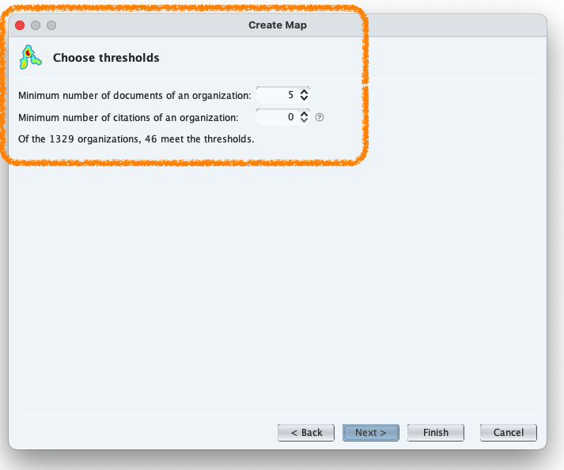
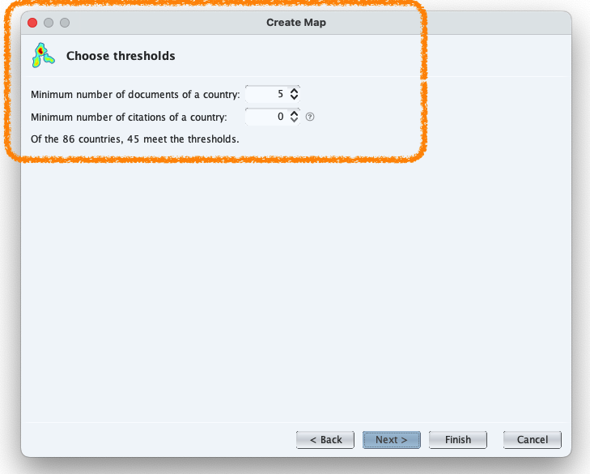

# VOSviewer Installation

## Vosviewer {background-image="figures/vos/website.png" background-size="65%" background-position="100% 50%"}

Scientific Network visualization

[⬇️ &nbsp; Download at   https://www.vosviewer.com/](https://www.vosviewer.com/)

[📕&nbsp; Official Manual](https://www.vosviewer.com/documentation/Manual_VOSviewer_1.6.20.pdf)

## VOSviewer: Terminology

1. **Maps** are created by **items**
2. **Items** are object of interest → 📚*Publications*, 👩🏻‍🔬👨🏻‍🔬*Researchers* or 🔤*Terms*
3. **Links** are the relations between two items.
    - Each link has a *Strength* → Positive number. The higher, the stronger. 
      For instance:
      - **Bibliographic coupling** : Number of cited references two publications have in common.
      - **Co-authorship**: number of publications that two researches have co-authored.
      - **Co-occurence**: Number of publications in which two terms occur together.
     
3. **Clusters** are a group of **items** 

::: {.callout-note}
### Scientific reference

Van Eck, N.J., Waltman, L., 2010. Software survey: VOSviewer, a computer program for bibliometric mapping. Scientometrics 84, 523–538. [https://doi.org/10.1007/s11192-009-0146-3](https://doi.org/10.1007/s11192-009-0146-3)
:::

## Small introduction to VOSViewer

:::{layout="[50,50]"}

:::{}
- Focus on visualization of scientometric networks
- Support for large number of data sources
- Text mining functionality
- Advanced visualization features
- Relatively easy to use
- Limited analysis options
- Developed at CWTS
:::


:::

# Co-Authorship Analysis

## Add data: from `Bibliographic database file`

## Add data: from `Bibliographic database file`

## Add data: Select the `.txt` files from WoS

## Select: `Co-Authorship`

:::{layout="[30,80]" layout-valign="center"}

:::{}
You can see the types of analysis.
Use this **﹖icon** to see the *relatedness* for each type of the analysis:

`Select Co-Authorship`
:::

:::{}

:::
:::

## Select: `Thresholds`

In fonction of the type of 'Co-Authorship analysis' (Authors, Organizations, Countries), different type of **threholds** are proposed:

:::{layout="[30,30,30]"}

:::{}
**Authors**

:::

:::{}
**Organizations**

:::

:::{}
**Countries**

:::
:::

# Co-Occurence of Keywords

## Add data: Minimum number of Occurrencies for Keyworkds

## Add data: Keywords to be plotted

## Add data: Verify if Keywords are correct

Attention to the Redundancies

## Network Visualization

## Overlay Visualization

## Overlay Visualization Selecting the node

## Density Visualization

