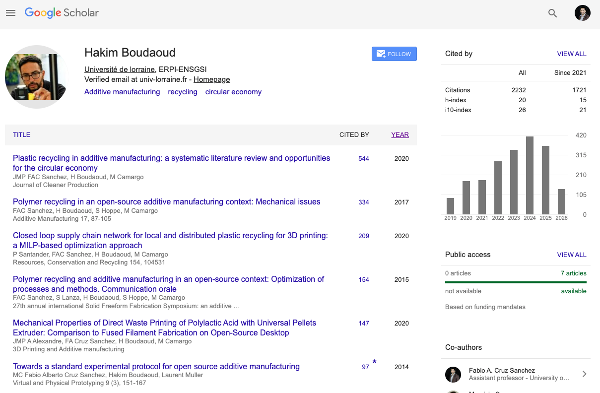
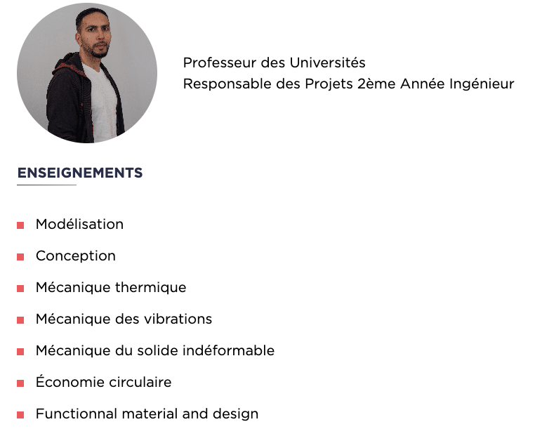
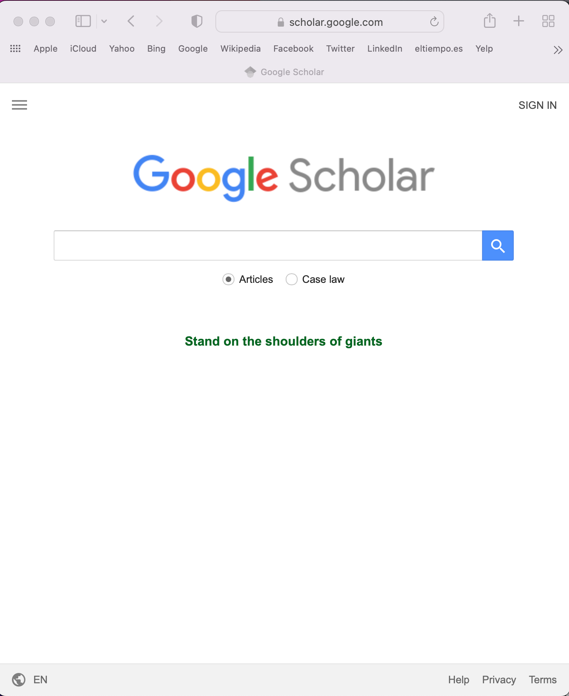
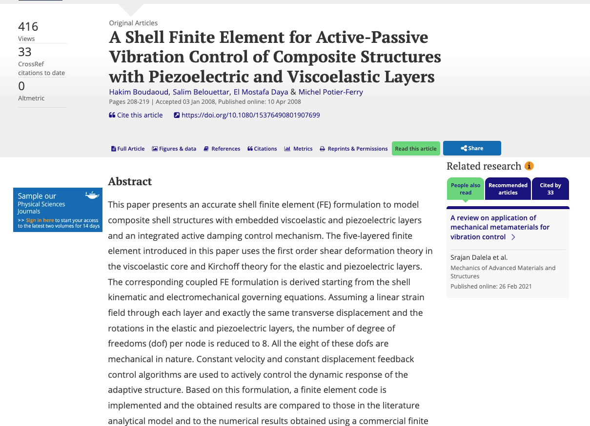
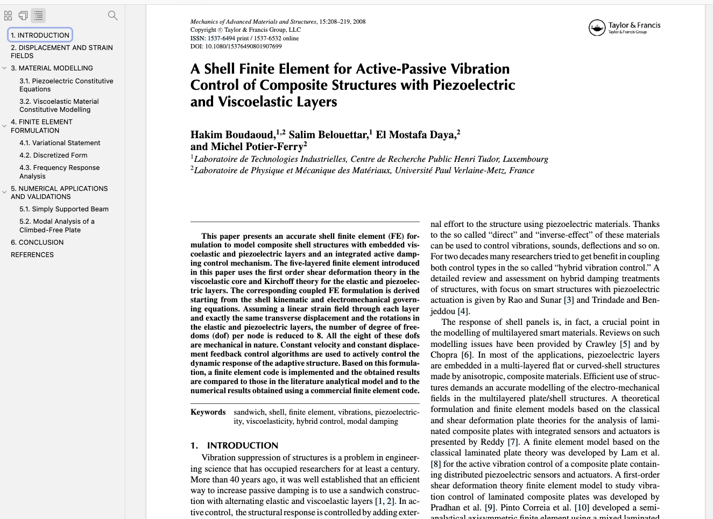
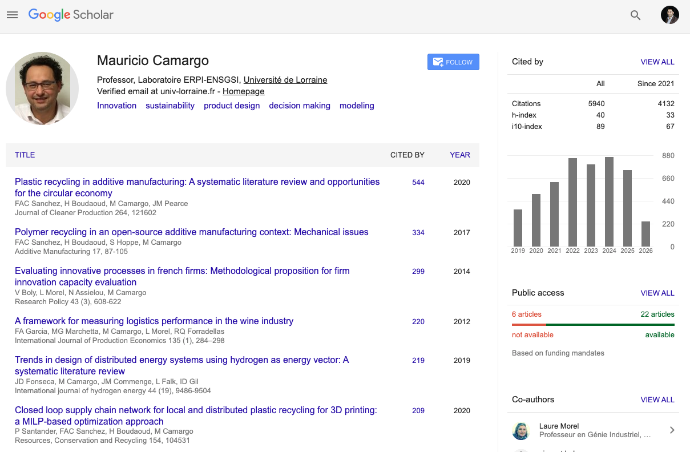
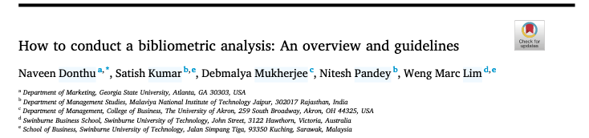

```{r}
# Link for the Figures
URL = c('https://raw.githubusercontent.com/fabbiocrux/Figures/main/')
library(countdown)
```


# Welcome to Introduction to Scientific Research (in Innovation)

## Objectives of the Module CI12 -- 3AI

1. 🧠 **Knowledge** : 
   - Sensibilization on the **scientific research  process** and High Superior Education system.

1. 🔨 **Know-how** : 
   - Search on pertinent scientific databases. 
   - Sensibilization of a critical thinking of research.
   - Identify a pertinent bibliography.

1. ✍ **Competences**  : 
   - Be able to structure a scientific document presenting the main components (Context, Problem, Research Question, Methodology and Results).


## Objectives for Today -- 2AI / GME5

1. 🔨 **Know-how** : 
   - Search on pertinent scientific databases. 
   - Identify a pertinent bibliography.
   - Understand the structure of a Scientific document.


## Why bother to study the scientific research?

**Why should I learn about the search process?** 

## Research and the "Managers"

- 🥼 To work as a researcher (PhD., R&D Department)
- 🗣️ To become a pertinent intelocutor at your company
- ⚖️ Help to make evidence-based decisions: e.g. Public politics
- 🔮 Help in the strategic and future decision-making

As an **Innovation Manager** you are going to face problems that your R&D department or/and external researcher (open-innovation) can help you to solve. 


# Introduction to the Scientific Research


## What are the difference between <br> Engineering and Research (*in Innovation*) ? {.center}


## Engineering vs Research (*in Innovation*)

::: {.r-stack}
{.fragment width="1100" }

{.fragment width="1100" }

{.fragment width="1100" }

{.fragment width="1100" }

{.fragment width="1100" }

{.fragment width="1100" }

{.fragment width="1100" }

{.fragment width="1100" }
:::


## What is scientific research ?


>The process of finding solutions to a problem after a thorough study and analysis of the situational factors. 


Based on two research elements:

- 🔎 Observations (information or data)
- 💡 Theory (arguments)


::: footer
**Source**: Saunders, M.N.K., Lewis, P., Thornhill, A., 2019. <br>Research methods for business students, Eighth Edition. ed. Pearson, New York.
:::


## Types of research


::: {layout-nrow="1" layout-align="center"}
{width="600" fig-align="center"}

{width="500" fig-align="center"}
:::

::: attribution
Photos courtesy of [Wikipedia]()
:::

Are they researchers? What could be the difference between them?

## Scientific approaches: Inductive vs Deductive Research


:::{layout="[50,50]" layout-align="center"}

:::{}
**Deduction**

La méthode par laquelle on va de la cause aux effets, du principe aux conséquences, du général au particulier.

:::

:::{}
**Induction**

La règle découle de l'observation répétée de faits réels, contingents.
:::
:::


## How can be this translate to the Material Science??{.center}

:::{layout="[48,-3,48]"}

 ](GM5/Graphene.png){ fig-alt="alt"}

](GM5/Biomimetisme.png){ fig-alt="alt"}

:::


## I am not and expert in Material Science.. but my purpose is


# Understanding the ecosystems of the scientific research


##  The perspectives of the Scientific Research

:::{layout="[25,25, 25, 25]" layout-valign="bottom"}

:::{}

:::


:::{}

:::

:::{}
{width="auto" height="200px"} 
:::

:::{}
{width="auto" height="200px"}
:::
:::


##  The perspectives of the Scientific Research

:::{layout="[55, -5, 40]" layout-valign="bottom"}





:::


## What the difference these two googles? 

{heigth=200px fig-align="left"}


## Peer Reviewing process {background-image="figures/Peer-Review-Process.jpeg" background-size="55%" background-position="90% 50%"}


{width=40% fig-align="left"}


##  Hakim Boudaoud's research

{fig-align="center" width="50%"}


Boudaoud, H., Belouettar, S., Daya, E.M., Potier-Ferry, M., 2008. A Shell Finite Element for Active-Passive Vibration Control of Composite Structures with Piezoelectric and Viscoelastic Layers. Mechanics of Advanced Materials and Structures 15, 208–219. [https://doi.org/10.1080/15376490801907699](https://doi.org/10.1080/15376490801907699)

##  Hakim Boudaoud's research

{fig-align="center" width="100%"}


##  The perspectives of the Scientific Research: ERPI

:::{layout="[40, -5, 55]" layout-valign="bottom"}



](GM5/Scanner.png)

:::


## Scientific Databases {background-image="figures/databases.png" background-size="35%" background-position="90% 50%" }

At the [`ENT Ul > Ressources en Ligne`](https://bu.univ-lorraine.fr/ressources-en-ligne)

- Scientific databases
- Research papers
- Books 
- Institutional reports → WHO, EU ...
- Societies 
    - Conferences proceedings (IEEE, IAMOT, IFAC...)
- Institutional repositories → dissertations
- IP registrars → Patents

:::{.r-fit-text}
🦸‍♂🦸🏻‍♀️ **Standing on the shoulders of giants**!!
:::


### Web of science → Scientific & Patent databases

{width="400" fig-align="left"}

:::{layout="[50,50]" layout-align="center"}

:::{}
**Scientific Articles**

{fig-align="center"}
:::

:::{}
**Patents database**
{fig-align="center"}
:::
:::


### [OpenAlex - https://openalex.org/](https://openalex.org/)

{width="75%" fig-align="center"}

- [**Open Source Science**]{style="color:red;"}  🔓

- **Offers a replacement for industry-standard scientific knowledge bases like Elsevier's Scopus and Clarivate's Web of Science ❗**


##  The perspectives of the Scientific Research

:::{layout="[25,25, 25, 25]" layout-valign="bottom"}

:::{}

:::


:::{}

:::

:::{}
{width="auto" height="200px"} 
:::

:::{}
{width="auto" height="200px"}
:::
:::


# Bibliometric Analysis - (For 3AI)

Donthu, N., Kumar, S., Mukherjee, D., Pandey, N., Lim, W.M., 2021. <br>
***How to conduct a bibliometric analysis: An overview and guidelines.*** <br>
Journal of Business Research 133, 285–296. https://doi.org/10.1016/j.jbusres.2021.04.070


## What is a Bibliometric Analysis?

A popular and rigorous method for ***exploring and analyzing large volumes of scientific data***. 
It enables us to *unpack the evolutionary nuances* of a specific field, while shedding light on the emerging areas in that field.


## The <br> Bibliometric <br> toolbox {.center background-image="figures/bibliometric/00.png" background-size="65%" background-position="90% 40%"}

For Instance:

[Bibiliometric analysis of ERPI](https://scanr.enseignementsup-recherche.gouv.fr/organizations/200315030D)

## For you today !


# How to find and read an Article ? {.center}

Let's do step by step analysis ...

## How to read an Article ? {background-image="GM5/figures/Article-explanation/01.png" background-size="45%" background-position="90% 50%" }

## How to read an Article ? {background-image="GM5/figures/Article-explanation/02.png" background-size="45%" background-position="90% 50%" }

**💡 Tip 1**
**Identify the context of this paper !!**

1. Scientific database: [**Elsevier**](https://www.elsevier.com/)
1. Journal : [**Journal of Bussiness Research**](https://www.sciencedirect.com/journal/journal-of-business-research)
1. Published : 2021
1. [**Citations**](https://www-sciencedirect-com.bases-doc.univ-lorraine.fr/science/article/pii/S0148296321003155?via%3Dihub#section-cited-by)


## How to read an Article ? 

::: {.columns}
::: {.column width="40%"}
**💡 Tip 2**

**What and Who?**

1. A **good title** gives the purpose of the paper !!
1. People : 
   -  University    
   - Domaine
   - Country
   - ***Contacts !!***
1. DOI: Digital Object Identifier (DOI)

:::
::: {.column width="60%"}
{width="120%"}

.

.

.

{width="120%"}
:::
:::


## How to read an Article ? {background-image="GM5/figures/Article-explanation/04.png" background-size="45%" background-position="90% 50%" }

**💡 Tip 3**
**Start by the Outline !!**


## How to read an Article ? {background-image="GM5/figures/Article-explanation/01.png" background-size="45%" background-position="90% 50%" }

 **💡 Tip 4**: **Méthode AIC**


- [Title]{.bg-yellow} ✅
- 🔎 **Abstract**
- 🔎 **Introduction**
- Literature review
- Methodology
- Results
- Discussion
- 🔎**Conclusion**
- References


## AIC Reading method

For screening read : **Title, Journal, keywords and Abstract**

For detailed synthesis use **AIC**:

- [**Abstract → Summary of the paper**]{.bg-yellow}🔎
- **Introduction → Context of problem and research, gap, summary of what is done**
- **Conclusions → Summary of results and importance of results given the context.**


## The abstract {.center}

:::: {layout="[50,-1,70]" layout-valign="center"}

::: {}
> The minimal viable product of a research.
:::

:::{}
- What’s the topic?
- What's the problem? (Is it important? )
- What’s the research question?
- What is the purpose ?
- How you resolved it?
- Implications for future ?
:::
::::


## Exemple 1 {background-image="GM5/figures/Article-explanation/06.png" background-size="60%" background-position="90% 0%" }

::: {layout="[30]"}

- What’s the topic?
- What's the problem?<br>(Is it important? )
- What’s the research question?
- What is the purpose ?
- How you resolved it?
- Implications for future ?

:::


::: footer
**Source**: Donthu, N., Kumar, S., Mukherjee, D., Pandey, N., Lim, W.M., 2021. [How to conduct a bibliometric analysis: An overview and guidelines](https://doi.org/10.1016/j.jbusres.2021.04.070). 
Journal of Business Research 133, 285–296. 

:::


## Exemple 1 {background-image="GM5/figures/Article-explanation/07.png" background-size="60%" background-position="90% 0%" }

::: {layout="[30]"}

- What’s the topic?
- What's the problem?<br>(Is it important? )
- What’s the research question?
- What is the purpose ?
- How you resolved it?
- Implications for future ?

:::


## Exemple 2 {background-image="GM5/figures/abstracts/ferney-00.png" background-size="60%" background-position="90% 0%"}

::: {layout="[30]"}

- What’s the topic?
- What's the problem?<br>(Is it important? )
- What’s the research question?
- What is the purpose ?
- How you resolved it?
- Implications for future ?

:::


::: footer
**Source**: Osorio et al (2019). [Design and management of innovation laboratories: Toward a performance assessment tool](https://doi.org/10.1111/caim.12301).
<br>Creativity and Innovation Management 28, 82–100. 
:::


```{r echo=FALSE}
countdown(minutes = 5, font_size = "2.5em", color_background="#AED6F1")
```

::: {.content-visible when-meta="version.presenter"}

## Exemple 2 {background-image="figures/abstracts/ferney-01.png" background-size="60%" background-position="90% 0%" }

::: {layout="[30]"}

- What’s the topic?
- What's the problem?<br>(Is it important? )
- What’s the research question?
- What is the purpose ?
- How you resolved it?
- Implications for future ?

:::

::: footer
**Source**: Osorio et al (2019). [Design and management of innovation laboratories: Toward a performance assessment tool](https://doi.org/10.1111/caim.12301).
<br>Creativity and Innovation Management 28, 82–100. 
:::

:::

## Exemple 3 {background-image="GM5/figures/abstracts/Sandra-00.png" background-size="60%" background-position="90% 0%" }


::: {layout="[30]"}

- What’s the topic?
- What's the problem?<br>(Is it important? )
- What’s the research question?
- What is the purpose ?
- How you resolved it?
- Implications for future ?

:::


::: footer
**Source**: Marche, et al. (2022)., [Qualitative sustainability assessment of road verge management in France: <br>An approach from causal diagrams to seize the importance of impact pathways](https://doi.org/10.1016/j.eiar.2022.106911).
Environmental Impact Assessment Review 97, 106911. 
:::


```{r echo=FALSE}
countdown(minutes = 5, font_size = "2.5em", color_background="#AED6F1")
```

::: {.content-visible when-meta="version.presenter"}

## Exemple 3 {background-image="figures/abstracts/Sandra-01.png" background-size="60%" background-position="90% 0%" }

::: {layout="[30]"}

- What’s the topic?
- What's the problem?<br>(Is it important? )
- What’s the research question?
- What is the purpose ?
- How you resolved it?
- Implications for future ?

:::

::: footer
**Source**: Marche, et al. (2022)., [Qualitative sustainability assessment of road verge management in France: <br>An approach from causal diagrams to seize the importance of impact pathways](https://doi.org/10.1016/j.eiar.2022.106911).
Environmental Impact Assessment Review 97, 106911. 
:::

:::

## Exemple 4 {background-image="GM5/figures/abstracts/Alex-00.png" background-size="60%" background-position="90% 0%" }

::: {layout="[30]"}

- What’s the topic?
- What's the problem?<br>(Is it important? )
- What’s the research question?
- What is the purpose ?
- How you resolved it?
- Implications for future ?

:::


::: footer
**Source**: Gabriel, et al. (2016), [Creativity support systems: A systematic mapping study,](https://doi.org/10.1016/j.tsc.2016.05.009)
<br>Thinking Skills and Creativity 21, 109–122.
:::


```{r echo=FALSE}
countdown(minutes = 5, font_size = "2.5em", color_background="#AED6F1")
```


::: {.content-visible when-meta="version.presenter"}

## Exemple 4 {background-image="figures/abstracts/Alex-01.png" background-size="60%" background-position="90% 50%" }

::: {layout="[30]"}

- What’s the topic?
- What's the problem?<br>(Is it important? )
- What’s the research question?
- What is the purpose ?
- How you resolved it?
- Implications for future ?

:::

::: footer
**Source**: Gabriel, et al. (2016), [Creativity support systems: A systematic mapping study,](https://doi.org/10.1016/j.tsc.2016.05.009)
<br>Thinking Skills and Creativity 21, 109–122.
:::

:::

## Mental model when reading an abstract 

:::{.incremental}
1. 🌍 **Topic** → *the writer provides background factual information.*
1. ⚠️ **Problem** → *The writer presents the gap/problem to treat*
1. 🔎 **Research Gap** → *the writer states the limits of current knowledge.* 
1. 🎯 **The purpose** : *the writer presents the general aim and the specific aim of the study.*
1. 📜 **Methodology** → *the writer summarises the methodology and provides details.*
1. 📊 **Results** → *the writer indicates the achievement of the study.*
1. 🚀 **Perspectives** → *the writer presents the implications of the study.*
:::


