```{r}
# Link for the Figures
URL = c('https://raw.githubusercontent.com/fabbiocrux/Figures/main/')
library(countdown)
```


## People

::: {layout="[25,25, 25, 25]"}


:::

:::{layout="[50, 50]" layout-align="center"}
**Seances 1-2**

**Seances 3-4**
:::


### Fabio A. Cruz Sanchez


:::{layout="[30, 60]" layout-valign="center"}


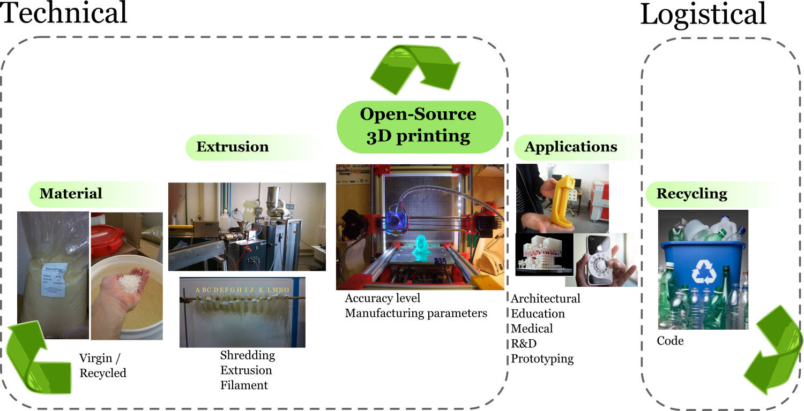

:::


## Objectives of the Module

1. 🧠 **Knowledge** : 
   - Sensibilization on the **scientific research  process** and High Superior Education system

1. 🔨 **Know-how** : 
   - Search on pertinent scientific databases. 
   - Sensibilization of a critical thinking of research.
   - Identify a pertinent bibliography.

1. ✍**Competences**  : 
   - Be able to structure a scientific document presening the main components (Context, Problem, Research Question, Methodology and Results).


## Rules of the game 

:::{layout="[50, 50]"}
:::{}
1. Each session there will be a TD to be putted on **ARCHE**. 

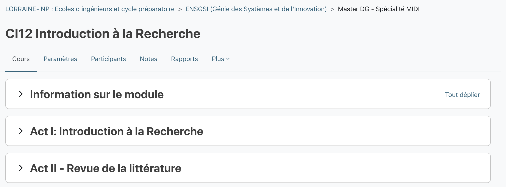

Note finale = $Moyenne$
:::

:::{.small}

2. Research Seminar (May 2026)

  - Article of **State of the Art about your Internship** (7 pages -- Before Seminar) .

     - **Title**
     - **Abstract**
     - **Résumé en Anglais / Français**
     - **Context, Problem, Research Question, Methodology and Expected Results (7 pages)**
     - **References**
  
  - Cross-peer revision  

:::
:::


# Introduction to the Scientific Research
## What are the difference between <br> Engineering and Research (*in Innovation*) ? {.center}


## Engineering vs Research (*in Innovation*)

::: {.r-stack}
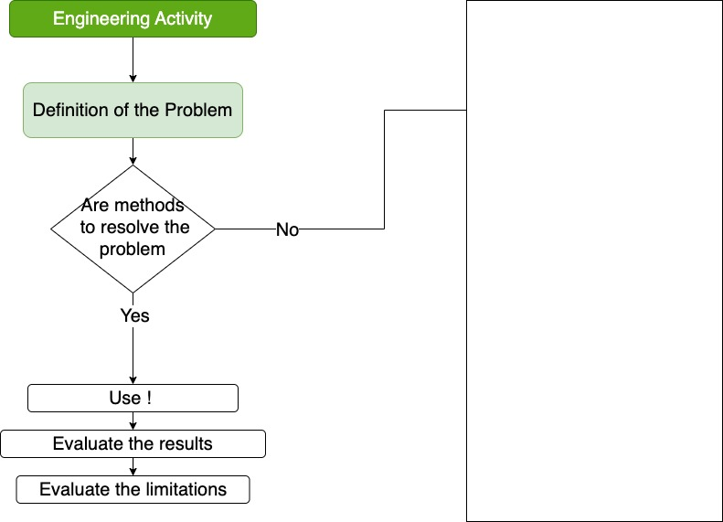{.fragment width="1100" }

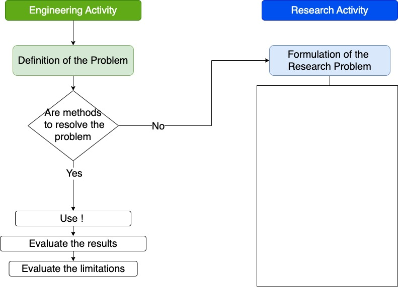{.fragment width="1100" }

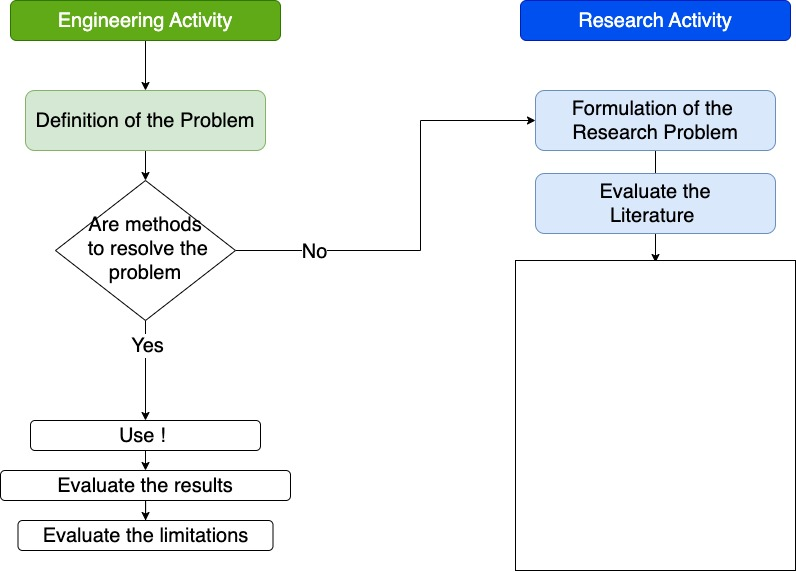{.fragment width="1100" }

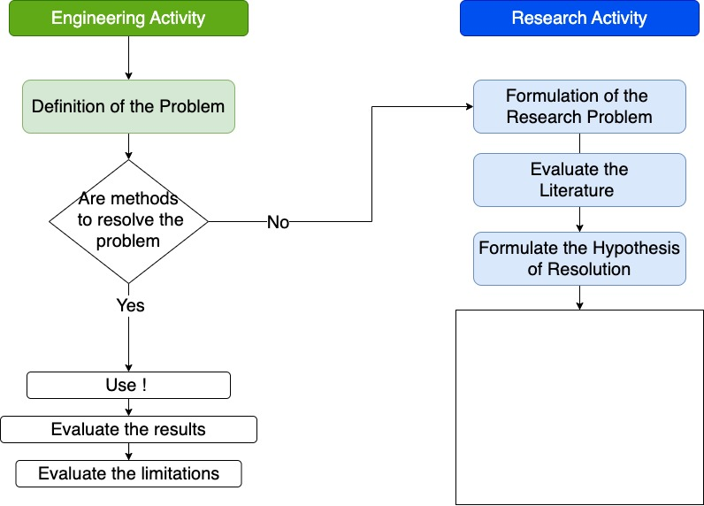{.fragment width="1100" }

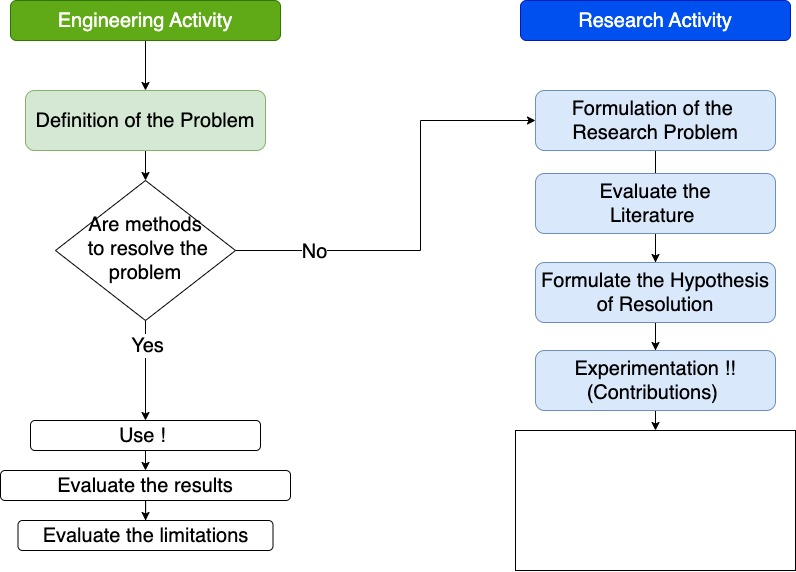{.fragment width="1100" }

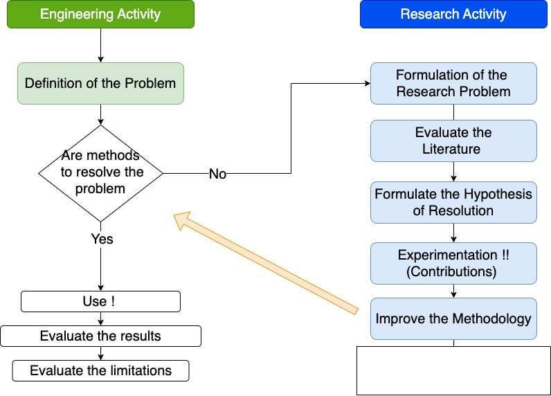{.fragment width="1100" }

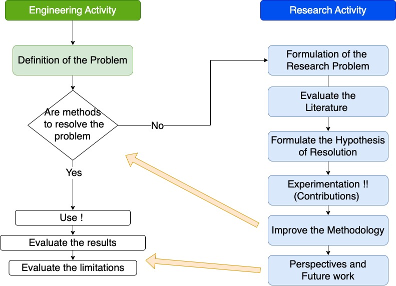{.fragment width="1100" }

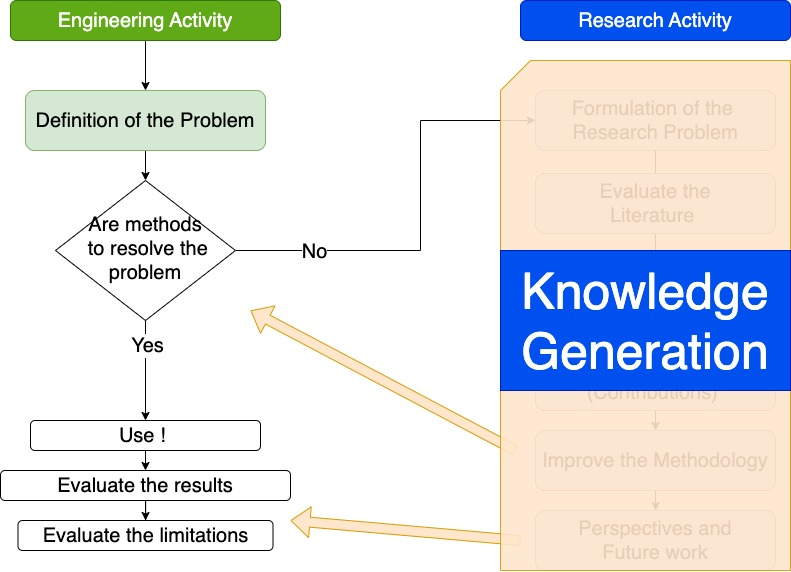{.fragment width="1100" }
:::


## What is scientific research ?


>The process of finding solutions to a problem after a thorough study and analysis of the situational factors. 


Based on two research elements:

- 🔎 Observations (information or data)
- 💡 Theory (arguments)


::: footer
**Source**: Saunders, M.N.K., Lewis, P., Thornhill, A., 2019. <br>Research methods for business students, Eighth Edition. ed. Pearson, New York.
:::


## Types of research


::: {layout-nrow="1" layout-align="center"}
{width="600" fig-align="center"}

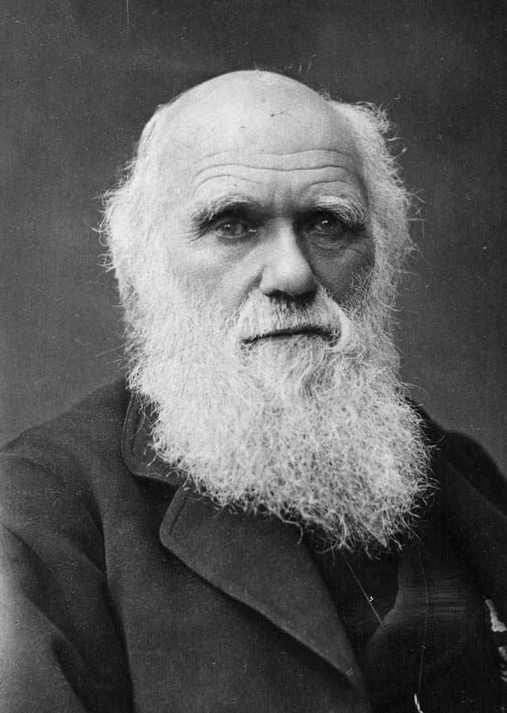{width="500" fig-align="center"}
:::

::: attribution
Photos courtesy of [Wikipedia]()
:::


## Inductive vs Deductive Research ?


## Scientific approaches

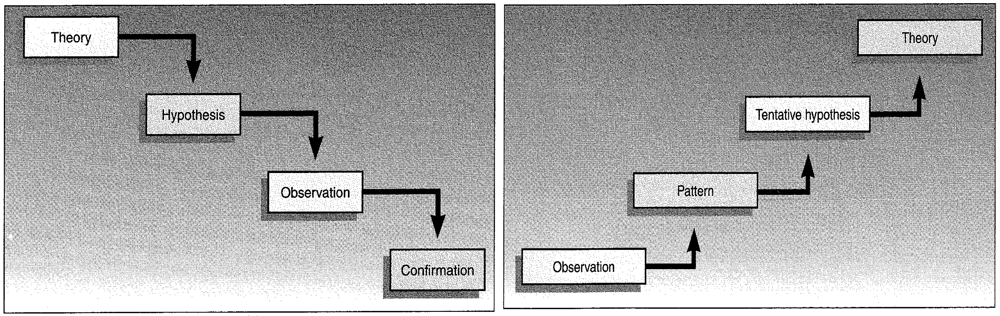

:::{layout="[50,50]" layout-align="center"}

:::{}
**Deduction**

la méthode par laquelle on va de la cause aux effets, du principe aux conséquences, du général au particulier.

:::

:::{}
**Induction**

La règle découle de l'observation répétée de faits réels, contingents.
:::
:::


## Mental model for the course?

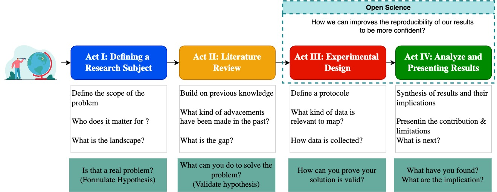{width="30%" fig-align="center"}


# Let’s Get It Started ... {background-color="aquamarine"}

::: {.r-fit-text .white}
**For you,<br> What is Scientific Research ? Is it important?**
:::

{width="10%" fig-align="center" }

## Introduction to the Scientific Research {background-color="aquamarine" .scrollable}


:::{layout="[70,-2,55]" .small}
:::{}
**4 Questions**:

  1. La recherche en innovation doit-elle viser la vérité scientifique ou l’impact économique ?
  1. Les grandes innovations sont-elles le fruit du génie individuel ou de systèmes collectifs ?
  1. L’innovation technologique crée-t-elle plus de problèmes qu’elle n’en résout ?
  1. La recherche en innovation doit-elle être éthiquement neutre ?
  1. Dans quelle mesure pensez-vous que la recherche vous est utile ? (ou pas ?)
:::

:::{}
**Steps**:

  1. 📝&nbsp; Individual reflection. **5min** ⏳
  1. 💬&nbsp; Rotation and Shared discussion. **5min** ⏳
  2. 📢&nbsp; Restitution to all. **3min** ⏱️ 
  
:::
:::


:::{layout="[20,-1,21,-1,20,-1,21, -1, 20]" .scriptsize}
:::{}
**Group 1**

1. **AFFLELOU Joss**$^*$
1. **BOUICHICHI Samir**$^*$
1. DESCHUYTENEER Cyril
1. FUMOUX Mathilde
1. GONTIER Celia
1. MACIEL SILVA Fernanda
1. PERRIN Ines
1. RENOUX Amaury
1. TOURKI Habib

:::

:::{}

**Group 2**

1. **MICHEL Marilou**$^*$
1. **SCHEFTEL Theo**$^*$
1. AGUADO Zoe
1. CAPDEVILA Romane
1. DINE Robin
1. GAGNIE Lola
1. GOYTINO Audrey
1. RABAH Flania
:::
:::{}
**Group 3**

1. **ALHON Jeremy**$^*$
1. **GAU Romane**$^*$
1. CIOBANU Dorin
1. FIDALGO Duarte
1. HANNA Marie
1. MINAFRA  Maria Clara
1. RAZAFINDRAMANANA Benjamin
1. SCHILLING Antonin
:::

:::{}

**Groupe 4**

1. **BEAUCAILLOU Maelle**$^*$
1. **DAGUIER Arthus**$^*$
1. FIOL Alexis
1. GAURIER Emmanuel
1. HENRY Lola
1. NOEL Arthur
1. REMY Matteo
1. SOULIE Arnaud

:::
:::{}

**Groupe 5**

1. **BOTTIN Camille**$^*$
1. **HOERNER Maxime**$^*$
1. DE LA PENA Maria
1. FRICKER Arthur
1. GOBAILLE Jean
1. PEE DIT GRABET Pierre
1. RENAUDIN Rayan
1. THOMAS Marceau
1. VERNET Victor
:::
:::


```{r, include=TRUE}
countdown(minutes = 5, seconds = 00, top = 0, font_size = "2em", padding = "5px",
          margin = "5px",)
```


<br>


:::footer
$^*$: Hôte de table, si vous êtes d'accord?
:::

## Restitution {background-color="aquamarine"}

1. What is Scientific Research for you?
1. *Why do you consider Scientific Research is important? (or not?)*
1. *Do you know, How Scientific Research is made?*
1. *In what extent, do you think Research is helpful for you? (or not?)*


# Understanding the ecosystems of the scientific research

##  The perspectives of the Scientific Research

:::{layout="[25,25, 25, 25]" layout-valign="bottom"}

:::{}

:::


:::{}

:::

:::{}
{width="auto" height="200px"} 
:::

:::{}
{width="auto" height="200px"}
:::
:::

##  Process Perspective {background-image="figures/pandey2015-01.png" background-size="40%" background-position="90% 50%"}

:::{layout="[[40,70],[40,70]]"}

{fig-align="left"}


:::


::: footer
Source: Pandey, S., Pattnaik, P., 2015. <br>
[University Research Ecosystem: A Conceptual Understanding.](https://doi.org/10.1515/rebs-2016-0021) <br>
Review of Economic and Business Studies 8. 
:::


##  Stakeholder Perspective {background-image="figures/pandey2015.png" background-size="40%" background-position="90% 50%"}

:::{layout="[40,70]"}
{fig-align="left"}
{fig-align="left"}
:::


::: footer
Source: Pandey, S., Pattnaik, P., 2015. <br>
[University Research Ecosystem: A Conceptual Understanding.](https://doi.org/10.1515/rebs-2016-0021) <br>
Review of Economic and Business Studies 8. 
:::


## Scientific Documents & Databases 


::: {layout="[70, 30]"}


:::{}
{height="200px" fig-align="left"}

{width="auto" height="200px" fig-align="left"}

{width="auto" height="200px" fig-align="left"}

:::
:::


## What the difference these two googles? 


:::{layout="[50,50]" layout-align="center"}
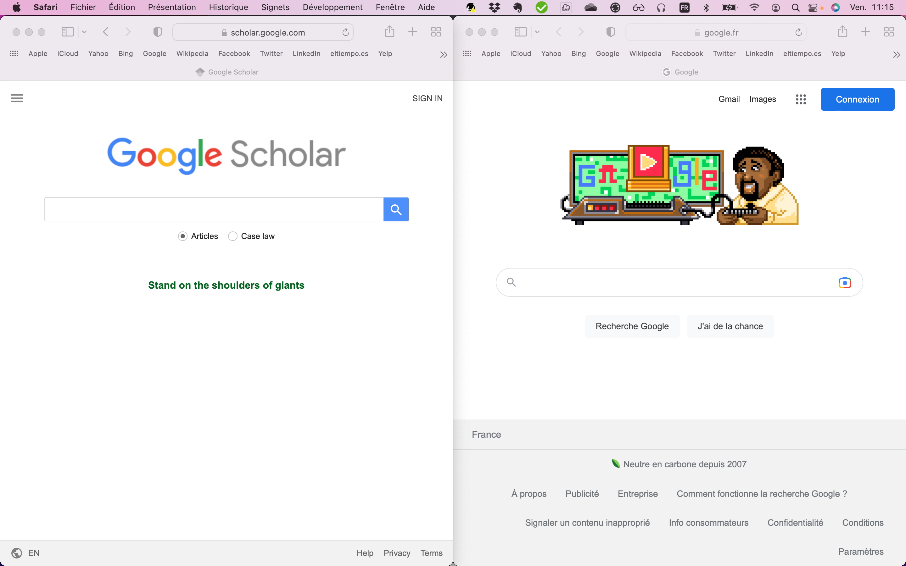{ fig-align="center"}
:::


## Peer Reviewing process {background-image="figures/Peer-Review-Process.jpeg" background-size="45%" background-position="90% 50%"}

:::{layout="[50,50]" layout-align="center"}
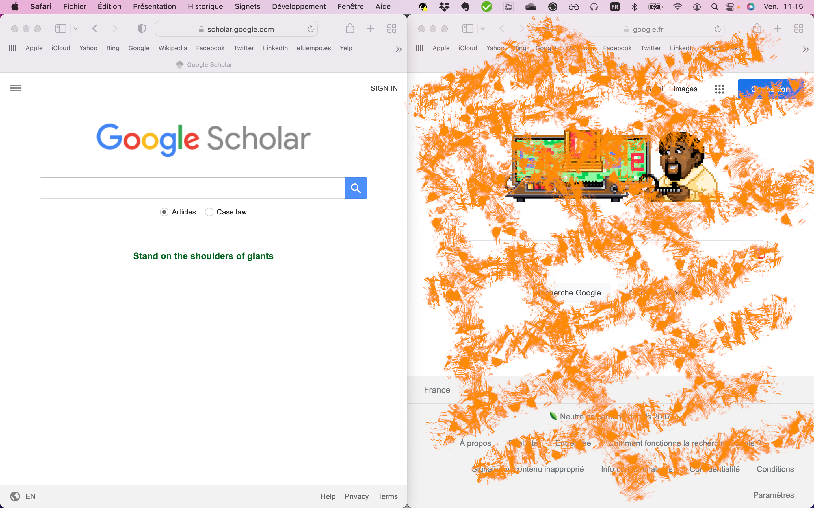{ fig-align="center"}
:::


## Scientific Databases {background-image="figures/databases.png" background-size="35%" background-position="90% 10%" }

At the [`ENT Ul > Ressources en Ligne`](https://bu.univ-lorraine.fr/ressources-en-ligne)

- Scientific databases
- Research papers
- Books 
- Institutional reports → WHO, EU ...
- Societies 
    - Conferences proceedings (IEEE, IAMOT, IFAC...)
- Institutional repositories → dissertations
- IP registrars → Patents

:::{.r-fit-text}
🦸‍♂🦸🏻‍♀️ **Standing on the shoulders of giants**!!
:::


## Web of science → Scientific & Patent databases

{width="400" fig-align="left"}

:::{layout="[50,50]" layout-align="center"}

:::{}
**Scientific Articles**

{fig-align="center"}
:::

:::{}
**Patents database**
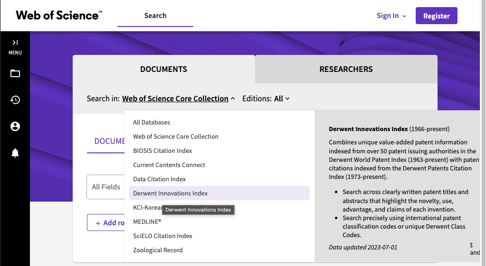{fig-align="center"}
:::
:::


### Funding Agencies (EU, National, Regional, Local)

Research funding bodies play a crucial role in ***shaping the landscape of scientific research***.  

:::{layout="[50,50]"}
:::{}
**Key Roles and Functions**

- Prioritization and Quality Assessment
- Promoting Research Integrity
- Facilitating Interdisciplinary Research
- Influence on Collaboration Networks 
:::

:::{}
**Barriers**

- Partnership Challenges
- Assessment Practices
- Conservative Policies
:::
:::

:::{layout="[25,25,25,25]" layout-valign="center"}


{width="1500"}

{width="1000"}


:::

### The Research Institutions 

:::{layout="[50,50]"}
:::{}
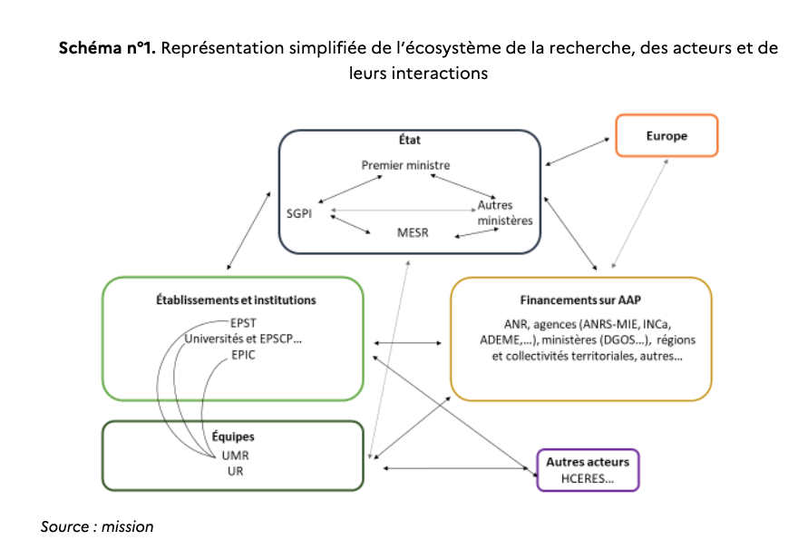

[Source: **Mission sur l'écosystème de la recherche et de l'innovation**](https://www.enseignementsup-recherche.gouv.fr/sites/default/files/2023-06/rapport---mission-sur-l-cosyst-me-de-la-recherche-et-de-l-innovation-28193.pdf)
:::

:::{}
Public authority responsible for evaluating all higher education and research structures.

{width="450px" fig-align="center"}

1. [Evaluation of the Université de Lorraine](https://www.hceres.fr/sites/default/files/media/publications/rapports_evaluations/pdf/C2023-EV-0542493S-DER-SYNT230023534-RD.pdf)
2. [Evaluation of ERPI](https://www.hceres.fr/en/rechercher-une-publication/erpi-equipe-de-recherche-sur-les-processus-innovatifs-1)

:::
:::


### ERPI Laboratory UL

:::{layout="[35,65]" layout-valign="center"}
[https://erpi.univ-lorraine.fr/](https://erpi.univ-lorraine.fr/)

[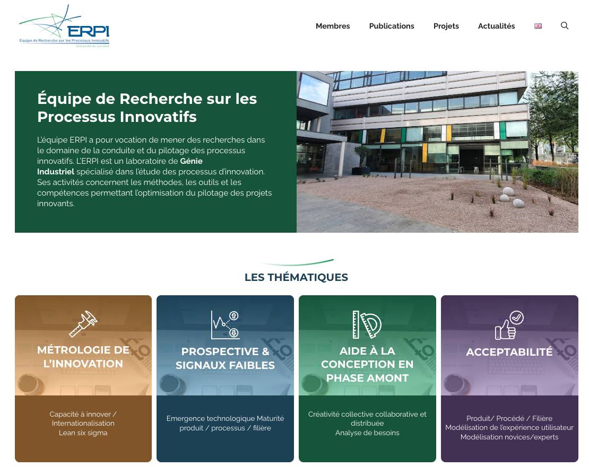{fig-align="center"}](https://erpi.univ-lorraine.fr/)
:::


### The Researcher(s)

:::{layout="[70,30]"}
:::{}
[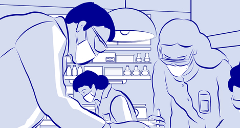{width="500px" fig-align="center"} {width="400px" fig-align="center"}<br>Source: **Personnel enseignant du supérieur et chercheurs**](https://www.enseignementsup-recherche.gouv.fr/fr/ressources-humaines-51859)

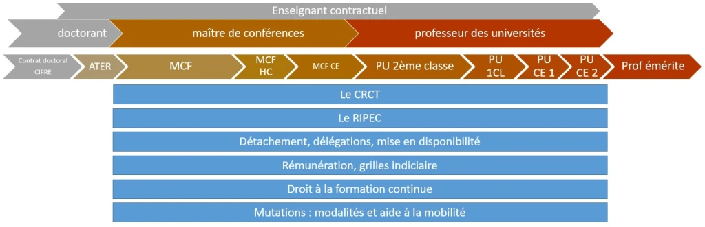
:::

:::{}
Public authority responsible for evaluating all Researches.

{width="450px" fig-align="center"}

Conseil national des universités

:::
:::


# Why bother to study the scientific research?

**Why should I learn about the search process?** 

## Research and the "Managers"

- 🥼 To work as a researcher (PhD., R&D Department)
- 🗣️ To become a pertinent intelocutor at your company

- ⚖️ Help to make evidence-based decisions: e.g. Public politics

- 🔮 Help in the strategic and future decision-making

As an **Innovation Manager** you are going to face problems that your R&D department or/and external researcher (open-innovation) can help you to solve. 


## Why a company would bother with scientific research ? {.center}


## Technology Readiness → Maturity {.nostretch}

The industrial emergence mapping framework.

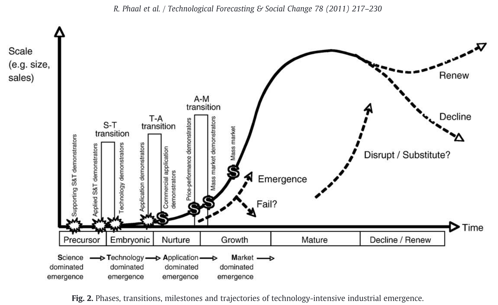{width=60% fig-align='center'}

::: footer
Phaal, R., O’Sullivan, E., Routley, M., Ford, S., Probert, D., 2011. [A framework for mapping industrial emergence](https://doi.org/10.1016/j.techfore.2010.06.018). 
<br>Technological Forecasting and Social Change 78, 217–230. 
:::


## On the case of Entreprise

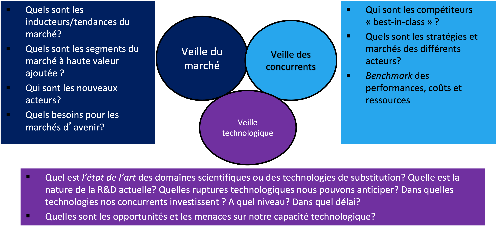{width="90%"}


## Technology Readiness → Levels

Framework developed in the Aeronautical field.

](figures/TRL-00.png)

### Technology Readiness → The Valley of Death

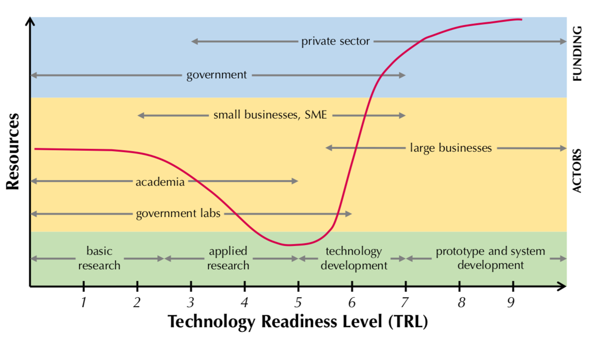{width="70%" fig-align="center"}

::: footer
Source: [Hensen, J., Loonen, R., Archontiki, M., Kanellis, M., 2015. Using building simulation for moving innovations across the "Valley of Death." <br>REHVA Journal 52, 58--62.](https://www.researchgate.net/profile/Roel-Loonen/publication/276205251_Using_building_simulation_for_moving_innovations_across_the_Valley_of_Death/links/5552333108ae6fd2d81d4406/Using-building-simulation-for-moving-innovations-across-the-Valley-of-Death.pdf)
:::

### Technology Readiness → Challenges TRL4 - TRL7

{width="70%" fig-align="center"}

::: footer
Source: [Hensen, J., Loonen, R., Archontiki, M., Kanellis, M., 2015. Using building simulation for moving innovations across the "Valley of Death." REHVA Journal 52, 58--62.](https://www.researchgate.net/profile/Roel-Loonen/publication/276205251_Using_building_simulation_for_moving_innovations_across_the_Valley_of_Death/links/5552333108ae6fd2d81d4406/Using-building-simulation-for-moving-innovations-across-the-Valley-of-Death.pdf)
:::

### Technology Readiness → Challenges TRL4 - TRL7

-   There is a **lack of tools** that can provide insights into **technology-integration** issues at an early R&D phase (TRL 1-5).
-   This results in a **mismatch between information** need and availability and **complicates decision-making**.
-   The process requires an **interdisciplinary approach**. The right combination of skills and expertise may not always be available

### Technology Readiness → Evolution

::: {.r-stack}
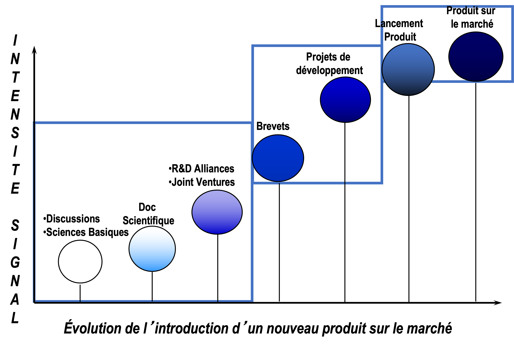{width="70%" fig-align="center"}

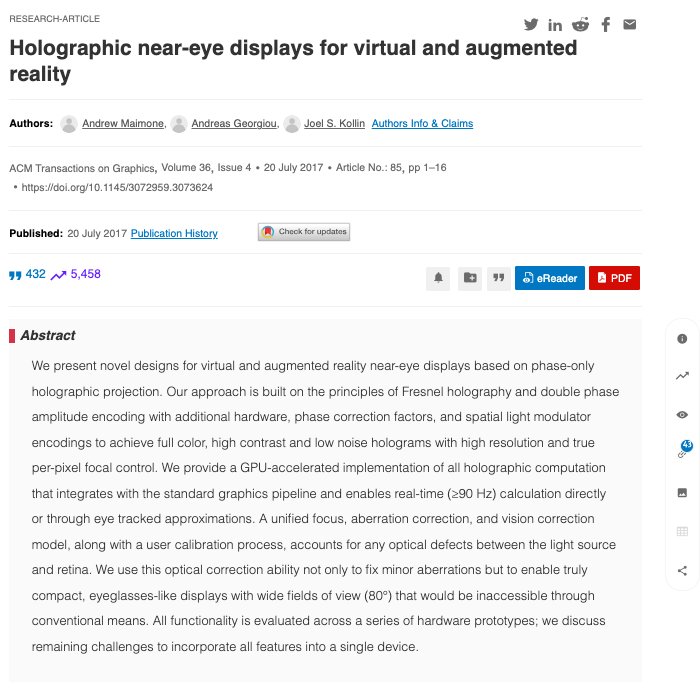{.fragment .absolute width="500"  top=250 left=0}

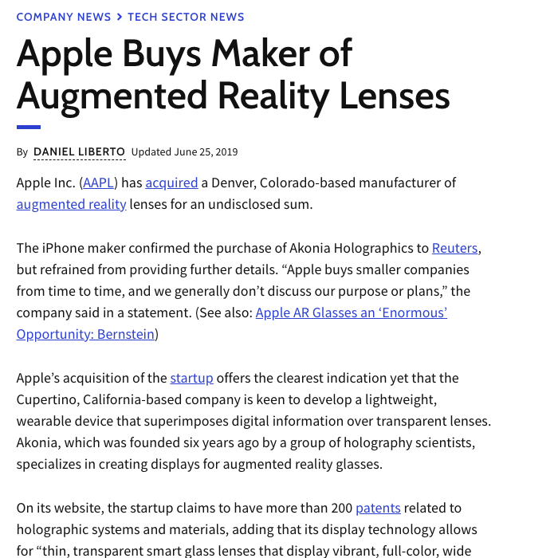{.fragment width="500" fig-align="center"}

{.fragment .absolute top=50 right=50 width="400" }

{.fragment .absolute top=250 left=0 width="500" }

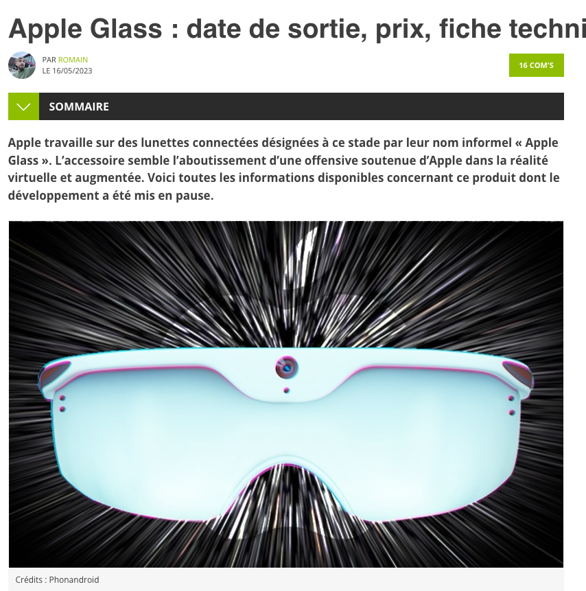{.fragment  width="800" fig-align="center"}
:::


## How to be a relevant interlocuteur?{.center}


# Bibliometric Analysis

Donthu, N., Kumar, S., Mukherjee, D., Pandey, N., Lim, W.M., 2021. <br>
***How to conduct a bibliometric analysis: An overview and guidelines.*** <br>
Journal of Business Research 133, 285–296. https://doi.org/10.1016/j.jbusres.2021.04.070


## What is a Bibliometric Analysis?

A popular and rigorous method for ***exploring and analyzing large volumes of scientific data***. 
It enables us to *unpack the evolutionary nuances* of a specific field, while shedding light on the emerging areas in that field.


## The <br> Bibliometric <br> toolbox {.center background-image="figures/bibliometric/00.png" background-size="65%" background-position="90% 40%"}

### The Bibliometric <br> toolbox { background-image="figures/bibliometric/01.png" background-size="65%" background-position="90% 40%"}

**Techniques** 

1. **Performance**: Examines the *contributions* of research constitutiens to a given field.
2. **Science Mapping**: Examines the *Relationships* among the research constitutiens to a given field.


### The Bibliometric <br> toolbox { background-image="figures/bibliometric/02.png" background-size="65%" background-position="90% 40%"}

**Performance Techniques** 

:::{layout="[30, -25, 40]" layout-valign="center"}
:::{}
Quantity of:

- Documents
- Authors
- Productivity
:::
:::{}

:::{.callout-tip title="Real question is:"}
**Is this subject interest for scientific community? 🧐**
:::
:::
:::

:::{.r-fit-text}
Quantitative Description !!
:::

### The Bibliometric <br> toolbox { background-image="figures/bibliometric/03.png" background-size="65%" background-position="90% 40%"}

#### Citation-related metrics

:::{layout="[30, -25, 40]" layout-valign="center"}
:::{}
Quantity of:

- [Citations](https://www.flickr.com/photos/manchesterarchiveplus/5214528911/in/photostream/)
:::
:::{}

<br>

:::{.callout-tip title="Real question is:"}
**Have this subject an *Impact and diffusion* of knowledge in the community? 🧐**
:::
:::
:::
<br>
⛔️ Although their relationship with research quality is **complex and multifaceted** issue. 


### The Bibliometric <br> toolbox { background-image="figures/bibliometric/04.png" background-size="65%" background-position="90% 40%"}

#### Citation-publication <br> related metrics

:::{layout="[30, -25, 40]" layout-valign="center"}
:::{}
Quantity of:

- Collaborations
- Citations
- 'Impact factors': 
  - *h-index*
  - *g-index*
  - *i-index*
:::
:::{}
<br>

:::{.callout-tip title="Real question is:"}
**How this research is made? 🧐 <br>**
**What is its statistical distribution?📊**<br>
**How many 'big fish' documents ? 🐋**
:::
:::
:::


### The Bibliometric <br> toolbox { background-image="figures/bibliometric/01.png" background-size="65%" background-position="90% 40%"}

**Techniques** 

1. Performance: Examines the *contributions* of research constitutiens to a given field.
2. **Science Mapping**: Examines the *Relationships* among the research constitutiens to a given field.

:::{.r-fit-text}
Qualitative Description !!
:::


### The Bibliometric <br> toolbox { background-image="figures/bibliometric/05.png" background-size="65%" background-position="90% 40%"}

#### Citation Analysis

:::{layout="[60, 40]" layout-valign="center"}
:::{}
Relationship of documents based on:

- Citations
:::
:::

:::{layout="[60, 40]" layout-valign="center"}

:::{.callout-tip title="Real question is:"}
**What documents are the most *important* based on the citations parameter? 🧐 <br>**
:::
:::{}
For example:

[](https://app.vosviewer.com/){preview-link="true"}

:::

:::


### The Bibliometric <br> toolbox { background-image="figures/bibliometric/06.png" background-size="65%" background-position="90% 40%"}

#### Co-citation 

:::{layout="[60, 40]" layout-valign="center"}
:::{}

- Publications *that are cited together* <r> frequently *are similar thematically*

:::
:::

<br><br>

:::{layout="[60, 40]" layout-valign="center"}
:::{.callout-tip title="Real question is:"}
**What are the seminal publications and knowledge foundations for a topic? 🧐 <br>**
:::

:::{}
For example:

[](https://app.vosviewer.com/){preview-link="true"}
:::
:::


### The Bibliometric <br> toolbox { background-image="figures/bibliometric/07.png" background-size="65%" background-position="90% 40%"}

#### Bibliographic coupling

:::{layout="[50, 40]" layout-valign="center"}
:::{}
- Two publications *sharing common references* are <br> also *similar* in their content
:::
:::


<br><br><br>

:::{layout="[60, 40]" layout-valign="center"}
:::{.callout-tip title="Real question is:"}
**What are the broad spectrum of themes of a topic and its latest developments?🧐 <br>**
:::


:::{}
For example:<br>
[](https://app.vosviewer.com/){preview-link="true"}
:::
:::


### The Bibliometric <br> toolbox { background-image="figures/bibliometric/08.png" background-size="65%" background-position="90% 40%"}

#### Co-word Analysis 

:::{layout="[50, -20, 18]" layout-valign="center"}
:::{}

- Unit of analysis is → **"Words"**  
   - *Titles, Keywords, Abstracts*.
- Words that frequently appear together have a thematic relationship with one another

:::{.callout-tip title="Real question is:"}
**What is the semantic field of a topic?🧐 <br>**
:::

:::

:::{}
<br><br><br><br><br><br>

For example:<br>
[](https://app.vosviewer.com/){preview-link="true"}

:::

:::


Co-citation analysis (*Past*) → Bibliographic coupling (*Present*) → and Co-word Analysis (*Future*)


### The Bibliometric <br> toolbox { background-image="figures/bibliometric/09.png" background-size="65%" background-position="90% 40%"}

#### Co-authorship analysis

:::{layout="[50, -20, 18]" layout-valign="center"}

:::{}
- Interactions among scholars (Universities, Countries) in a research field.
- Co-authorship is a formal way of intellectual collaboration.
- Collaborations across different periods of time
- Valuable information to reach out and collaborate with established and trending scholars


:::{.callout-tip title="Real question is:"}
**Who researcher / University / Country is the best placed in a  particular topic? 🧐 <br>**
:::
:::


:::{}
<br><br><br><br><br><br><br>

For example:<br>
[](https://app.vosviewer.com/){preview-link="true"}

:::

:::


## Your Turn for Conceptualize your research ! {background-color="aquamarine"}

Two options: 


# Presentation of TD

## Mental model of the Research conceptualization


::: {.r-stack}
{ width="1100" }

{.fragment width="1100" }

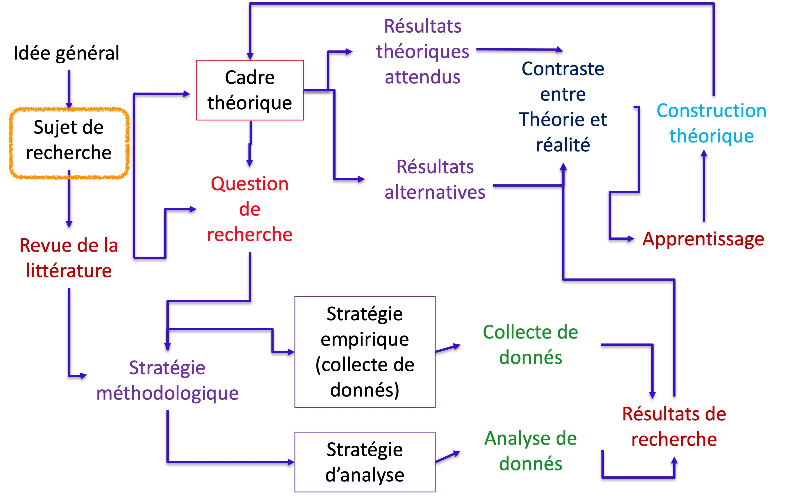{.fragment width="1100" }
:::


## Theoretical background

:::{layout="[40,60]" layout-valign="center"}

:::{}
1. Scientific databases

{width="100px" fig-align="center"}

2. Methodological Support : **Bibliometric Analysis**

:::
<br>
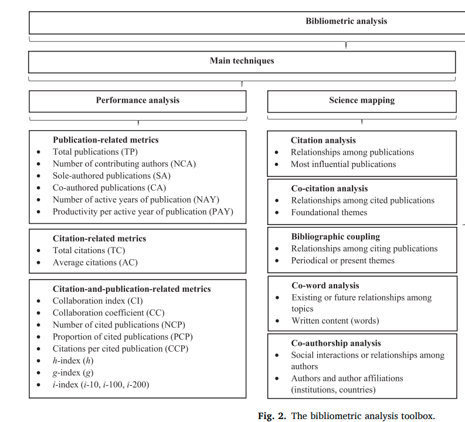{width="70%" fig-align="center"}
:::

:::footer
Source:
Donthu, N., Kumar, S., Mukherjee, D., Pandey, N., Lim, W.M., 2021. <br>
[How to conduct a bibliometric analysis: An overview and guidelines.](https://doi.org/10.1016/j.jbusres.2021.04.070) <br>
Journal of Business Research 133, 285–296. 

:::


## The Exercises

::: columns
::: {.column width="30%"}
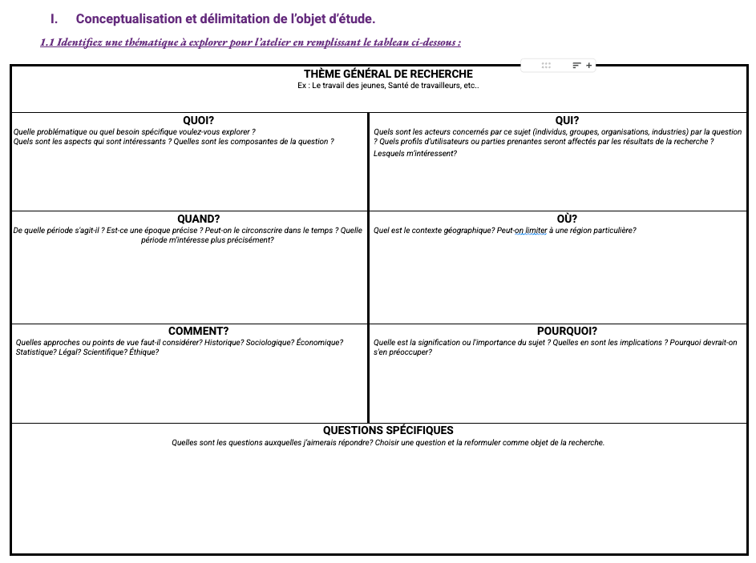{fig-align="center"}
:::

::: {.column width="30%"}
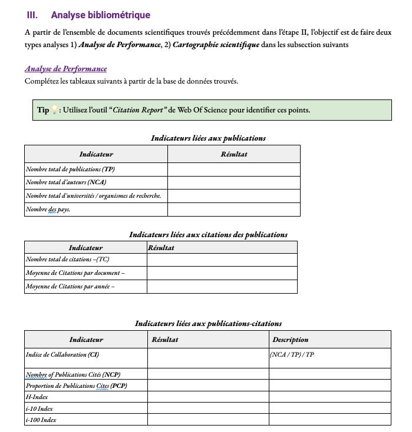{fig-align="center"}
:::

::: {.column width="30%"}
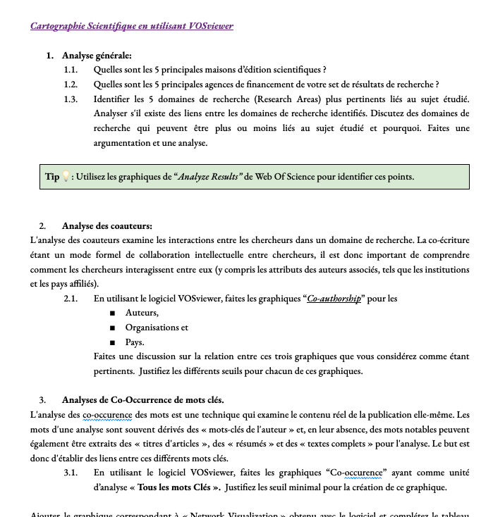{fig-align="center"}
:::

:::

📃 [Download the Document on ARCHE](https://arche.univ-lorraine.fr/course/view.php?id=14191)


## Bibliometric mapping: Vosviewer

{width="900" fig-align="center"}

[Download at https://www.vosviewer.com/](https://www.vosviewer.com/)

::: aside
van Eck, N.J., Waltman, L., 2010. Software survey: VOSviewer, a computer program for bibliometric mapping. Scientometrics 84, 523–538. https://doi.org/10.1007/s11192-009-0146-3
:::


# Thank you


# Everything start with a good research question !

## Everything start with a good research question {background-image="figures/Research-questions.png" background-size="45%" background-position="100% 50%"}

<br>

::: {layout="[50,50]"}
:::{}
1 **Descriptive (What, When, Where, Who or How)**

e.g. What percentageof coachees report that coaching helped them with a problem they experienced

2 **Explanatory (Why?)**

e.g. Why dis 65% of coachees report that coacing helped them with a problem they experienced?
this
:::
:::

::: aside
Source: Rojon, C. & Saunders, M. N. K. [Formulating a convincing rationale for a research study](https://doi.org/10.1080/17521882.2011.648335). Coaching: An International Journal of Theory, Research and Practice 5, 55–61 (2012).
:::


## Good research question: Descriptive & Explanatory 

Being able to provide meaningful explanations requires answers to why (i.e. explanatory) questions in addition to what (i.e. descriptive) questions.

For example:

- *'How effective is the coaching process at helping coachees to solve a problem they experience and what are the reasons for this?'* 
- *'To what extent is the coaching process effective at helping coachees solve a problem and why?'*

::: aside
Source: Rojon, C. & Saunders, M. N. K. [Formulating a convincing rationale for a research study](https://doi.org/10.1080/17521882.2011.648335). Coaching: An International Journal of Theory, Research and Practice 5, 55–61 (2012).
:::


## PICOC Framework

**Parameter** | **Meaning**
--|:-----
**P**opulation|The *What* or *Who* in which the evidence is collected, 
**I**ntervention | The *how* applied in the empirical study
**C**omparison| In which the intervention is compared to
**O**utcomes| What you expect to observe
**C**ontext| In which particular environment of the population, including whether it is conducted in academia or industry


## PICOC Framework: Example 1

[Semantic Web and Linked Data for Information Exchange between the Building and Product Manufacturing Industries: A Literature Review.](http://itc.scix.net/paper/w78-2020-paper-018)

:::{layout="[40,60]"}

::: {.callout-note title="Research question"}

> What are the benefits and limitations of using the Semantic Web and Linked data LD technologies for developing product data templates for information ex-changes
between the building and lighting product manufacturing industries in comparison with the conventional approach of information exchanges using the openBIM standards?
:::


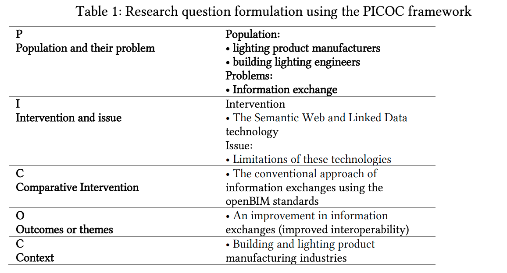{fig-align="center" width="50%"}
:::

:::footer
**Source**: R Kebede, A Moscati, P Johansson, H Tan (2020). 
<br>[Semantic Web and Linked Data for Information Exchange between the Building and Product Manufacturing Industries: A Literature Review.](http://itc.scix.net/paper/w78-2020-paper-018) 
<br>Proceedings of the 37th International Conference of CIB W78, Sao Paulo - online, BR, 18-20 August, pp. 248-265 (ISSN: 2706-6568), 
:::


## PICOC Framework: Example 2

[Ecosystem services research in mountainous regions: A systematic literature review on current knowledge and research gaps](https://www.sciencedirect.com/science/article/abs/pii/S0048969719345723)

:::{layout="[40,60]"}

::: {.callout-note title="Research question"}

1. What is the state-of-the-art in MES? 
2. Which MES types had the highest and the least number of studies?
3. Which modeling approaches are common to assess MES?
....
:::

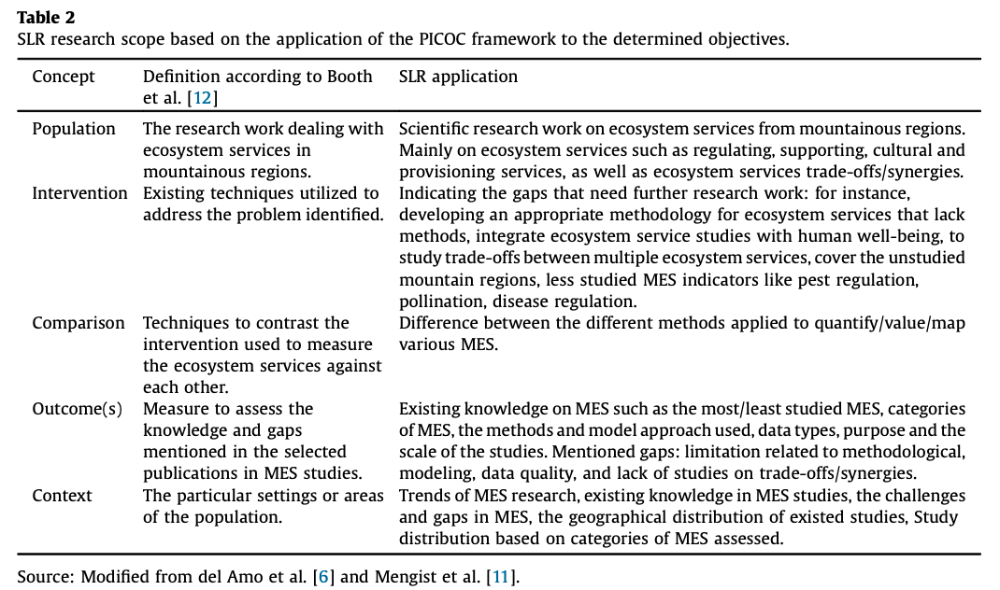{fig-align="center" width="50%"}

:::

:::footer
**Source**: Mengist, Wondimagegn, Teshome Soromessa, and Gudina Legese. 
<br>[Method for conducting systematic literature review and meta-analysis for environmental science research.](https://www.sciencedirect.com/science/article/pii/S221501611930353X) 
<br>MethodsX 7 (2020): 100777.
:::


## Thanks for your Atenttion

