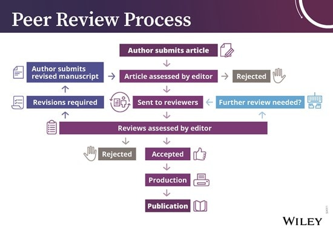

```{r}
# Link for the Figures
URL = c('https://raw.githubusercontent.com/fabbiocrux/Figures/main/')
library(countdown)
```


# For you,<br> What is Scientific Research ? <br> Why is it important?{.center}


## Objectives of the Module

1. 🧠 **Knowledge** : 
   - Sensibilization on the **scientific research  process** and High Superior Education system

1. 🔨 **Know-how** : 
   - Search on pertinent scientific databases. 
   - Sensibilization of a critical thinking of research.
   - Identify a pertinent bibliography.

1. ✍**Competences**  : 
   - Be able to structure a scientific document presening the main components (Context, Problem, Research Question, Methodology and Results).


## Evaluation of the Module

:::: {.columns}
::: {.column width="50%"}
1. A final output will be putted on **ARCHE**. 

2. Article of **State of the Art about your Internship** (7 pages).

   - **Title**
   - **Abstract**
   - **Résumé en anglais**
   - **Résumé en français**
   - **Synthèse (7 pages)**
   - **References**

:::
::: {.column width="50%"}

:::
::::


# Introduction to the Scientific Research

## What are the difference between <br> Engineering and Research (*in Innovation*) ? {.center}

## Engineering vs Research (*in Innovation*)


::: {.r-stack}
{.fragment width="1100" }

{.fragment width="1100" }

{.fragment width="1100" }

{.fragment width="1100" }

{.fragment width="1100" }

{.fragment width="1100" }

{.fragment width="1100" }

{.fragment width="1100" }
:::


## What is scientific research ?

>The process of finding solutions to a problem after a thorough study and analysis of the situational factors. (Sekaran and Bougie 2016)

:::: {.columns}
::: {.column width="50%"}
Based on two research elements:

- 🔎 Observations (information or data)

- 💡 Theory (arguments)

:::
::: {.column width="50%"}

```{mermaid}
%%| fig-height: 5
graph TD    
    1[Observation]
    2[Hypothesis Formation]
    3[Experimentation]
    4[Data Collection]
    5[Analysis]
    6[Conclusion Drawing]
    7[Peer Review]
    8[Publication]
    9[Continuous Improvement]
    10[Application]

    1 --> 2
    2 --> 3
    3 --> 4
    4 --> 5
    5 --> 6
    6 --> 7
    7 --> 8
    8 --> 9
    9 --> 10
    10 --> 1
 
```

:::
::::


::: footer
**Source**: Saunders, M.N.K., Lewis, P., Thornhill, A., 2019. Research methods for business students, Eighth Edition. ed. Pearson, New York.
:::


## Types of research

::: {layout="[40,40]"}


:::


::: attribution
Photos courtesy of [Wikipedia]()
:::


## Inductive vs Deductive Research ?


```{r, out.width="70%", fig.align='center'}
knitr::include_graphics(paste0(URL, 'Research/Inductive-deductive.png'))
``` 


## Scientific approaches


:::: {.columns}
::: {.column width="50%"}
**Deduction**

la méthode par laquelle on va de la cause aux effets, du principe aux conséquences, du général au particulier.

:::

::: {.column width="50%"}
**Induction**

La règle découle de l'observation répétée de faits réels, contingents.
:::
::::


## Mental model for the research development?

{width="60%" fig-align="center"}


# Why bother to study the scientific research?

## Pourquoi devrais-je me renseigner sur le processus de recherche ? {.center}


## Research and the "Managers"

- 🥼 To work as a researcher (PhD., R&D Department)
- 🗣️ To become a pertinent intelocutor at your company

- ⚖️ Help to make evidence-based decisions: e.g. Public politics

- 🔮 Help in the strategic and future decision-making

As an **Innovation Manager** you are going to face problems that your R&D department or/and external researcher (open-innovation) can help you to solve. 


## Why a company would bother with scientific research ? {.center}


## Technology Readiness → Maturity {.nostretch}

The industrial emergence mapping framework.

{width=60% fig-align='center'}

::: footer
Phaal, R., O’Sullivan, E., Routley, M., Ford, S., Probert, D., 2011. [A framework for mapping industrial emergence](https://doi.org/10.1016/j.techfore.2010.06.018). 
<br>Technological Forecasting and Social Change 78, 217–230. 
:::


## On the case of Entreprise

{width="90%"}


## Technology Readiness → Levels

Framework developed in the Aeronautical field.

](figures/TRL-00.png)

### Technology Readiness → The Valley of Death

{width="70%" fig-align="center"}

::: footer
Source: [Hensen, J., Loonen, R., Archontiki, M., Kanellis, M., 2015. Using building simulation for moving innovations across the "Valley of Death." <br>REHVA Journal 52, 58--62.](https://www.researchgate.net/profile/Roel-Loonen/publication/276205251_Using_building_simulation_for_moving_innovations_across_the_Valley_of_Death/links/5552333108ae6fd2d81d4406/Using-building-simulation-for-moving-innovations-across-the-Valley-of-Death.pdf)
:::

### Technology Readiness → Challenges TRL4 - TRL7

{width="70%" fig-align="center"}

::: footer
Source: [Hensen, J., Loonen, R., Archontiki, M., Kanellis, M., 2015. Using building simulation for moving innovations across the "Valley of Death." REHVA Journal 52, 58--62.](https://www.researchgate.net/profile/Roel-Loonen/publication/276205251_Using_building_simulation_for_moving_innovations_across_the_Valley_of_Death/links/5552333108ae6fd2d81d4406/Using-building-simulation-for-moving-innovations-across-the-Valley-of-Death.pdf)
:::

### Technology Readiness → Challenges TRL4 - TRL7

-   There is a **lack of tools** that can provide insights into **technology-integration** issues at an early R&D phase (TRL 1-5).
-   This results in a **mismatch between information** need and availability and **complicates decision-making**.
-   The process requires an **interdisciplinary approach**. The right combination of skills and expertise may not always be available

### Technology Readiness → Evolution

::: {.r-stack}
{width="70%" fig-align="center"}

{.fragment .absolute width="500"  top=250 left=0}

{.fragment width="500" fig-align="center"}

{.fragment .absolute top=50 right=50 width="400" }

{.fragment .absolute top=250 left=0 width="500" }

{.fragment  width="800" fig-align="center"}
:::


## What the difference these two googles? 

{width="50%" fig-align="center"}


## Peer Reviewing process

{width="60%" fig-align="center"}


## Literature review {background-image="figures/databases.png" background-size="40%" background-position="90% 50%" }

### Standing on the shoulders of giants

- Scientific databases
- Research papers
- Books 
- Institutional reports -> WHO, EU…
- Societies 
    - conferences proceedings (IEEE, IAMOT, IFAC...)
- Institutional repositories -> dissertations
- IP registrars -> Patents


## Web of science → Scientific & Patent databases

{width="400" fig-align="left"}

::: columns
::: {.column width="50%"}
{fig-align="center"}
:::

::: {.column width="50%"}
{fig-align="center"}
:::
:::


# Everything start with a good research question !


## Everything start with a good research question {background-image="figures/Research-questions.png" background-size="45%" background-position="100% 50%"}

<br>

::: {layout="[50,50]"}
:::{}
1 **Descriptive (What, When, Where, Who or How)**

e.g. What percentageof coachees report that coaching helped them with a problem they experienced

2 **Explanatory (Why?)**

e.g. Why dis 65% of coachees report that coacing helped them with a problem they experienced?
this
:::
:::

::: aside
Source: Rojon, C. & Saunders, M. N. K. [Formulating a convincing rationale for a research study](https://doi.org/10.1080/17521882.2011.648335). Coaching: An International Journal of Theory, Research and Practice 5, 55–61 (2012).
:::


## Good research question: Descriptive  Explanatory 

Being able to provide meaningful explanations requires answers to why (i.e. explanatory) questions in addition to what (i.e. descriptive) questions.

For example:

- *'How effective is the coaching process at helping coachees to solve a problem they experience and what are the reasons for this?'* 


- *'To what extent is the coaching process effective at helping coachees solve a problem and why?'*


::: aside
Source: Rojon, C. & Saunders, M. N. K. [Formulating a convincing rationale for a research study](https://doi.org/10.1080/17521882.2011.648335). Coaching: An International Journal of Theory, Research and Practice 5, 55–61 (2012).
:::


# Understanding a Research paper I : Abstract

## Reading an Article - Part I {.center}

## What is a Research Paper? {background-image="figures/Paper-Alex-01.jpg" background-size="45%" background-position="90% 50%" }

**💡 Tip 1**
**Start by the Outline !!**


## What is a Research Paper? {background-image="figures/Paper-Alex-02.png" background-size="45%" background-position="90% 50%" }


 Tip 2: **Méthode AIC**


- [Title]{.bg-yellow} ✅
- 🔎 **Abstract**
- 🔎 **Introduction**
- Literature review
- Methodology
- Results
- Discussion
- 🔎**Conclusion**
- References


## AIC Reading method

For screening read : **Title, Journal, keywords and Abstract**

For detailed synthesis use **AIC**:

- [**Abstract → Summary of the paper**]{.bg-yellow}🔎

- **Introduction → Context of problem and research, gap, summary of what is done**

- **Conclusions → Summary of results and importance of results given the context.**


## The abstract {.center}


:::: {layout="[50,-1,70]" layout-valign="center"}

::: {}
> The minimal viable product of a research.
:::

:::{}
- What’s the topic?
- What's the problem? (Is it important? )
- What’s the research question?
- What is the purpose ?
- How you resolved it?
- Implications for future ?
:::
::::


## Exemple 1 {background-image="figures/ferney-00.png" background-size="60%" background-position="90% 0%" }


::: footer
**Source**: Osorio et al (2019). [Design and management of innovation laboratories: Toward a performance assessment tool](https://doi.org/10.1111/caim.12301).
<br>Creativity and Innovation Management 28, 82–100. 
:::


## Exemple 1 {background-image="figures/ferney-01.png" background-size="60%" background-position="90% 0%" }

::: {layout="[30]"}

- What’s the topic?
- What's the problem?<br>(Is it important? )
- What’s the research question?
- What is the purpose ?
- How you resolved it?
- Implications for future ?

:::


::: footer
**Source**: Osorio et al (2019). [Design and management of innovation laboratories: Toward a performance assessment tool](https://doi.org/10.1111/caim.12301).
<br>Creativity and Innovation Management 28, 82–100. 
:::


## Exemple 2 {background-image="figures/Sandra-00.png" background-size="60%" background-position="90% 0%" }


::: {layout="[30]"}

- What’s the topic?
- What's the problem?<br>(Is it important? )
- What’s the research question?
- What is the purpose ?
- How you resolved it?
- Implications for future ?

:::


::: footer
**Source**: Marche, et al. (2022)., [Qualitative sustainability assessment of road verge management in France: <br>An approach from causal diagrams to seize the importance of impact pathways](https://doi.org/10.1016/j.eiar.2022.106911).
Environmental Impact Assessment Review 97, 106911. 
:::


## Exemple 2 {background-image="figures/Sandra-01.png" background-size="60%" background-position="90% 0%" }

::: {layout="[30]"}

- What’s the topic?
- What's the problem?<br>(Is it important? )
- What’s the research question?
- What is the purpose ?
- How you resolved it?
- Implications for future ?

:::

::: footer
**Source**: Marche, et al. (2022)., [Qualitative sustainability assessment of road verge management in France: <br>An approach from causal diagrams to seize the importance of impact pathways](https://doi.org/10.1016/j.eiar.2022.106911).
Environmental Impact Assessment Review 97, 106911. 
:::


## Exemple 3 {background-image="figures/Alex-00.png" background-size="60%" background-position="90% 0%" }

::: {layout="[30]"}

- What’s the topic?
- What's the problem?<br>(Is it important? )
- What’s the research question?
- What is the purpose ?
- How you resolved it?
- Implications for future ?

:::


::: footer
**Source**: Gabriel, et al. (2016), [Creativity support systems: A systematic mapping study,](https://doi.org/10.1016/j.tsc.2016.05.009)
<br>Thinking Skills and Creativity 21, 109–122.
:::


## Exemple 3 {background-image="figures/Alex-01.png" background-size="60%" background-position="90% 50%" }

::: {layout="[30]"}

- What’s the topic?
- What's the problem?<br>(Is it important? )
- What’s the research question?
- What is the purpose ?
- How you resolved it?
- Implications for future ?

:::

::: footer
**Source**: Gabriel, et al. (2016), [Creativity support systems: A systematic mapping study,](https://doi.org/10.1016/j.tsc.2016.05.009)
<br>Thinking Skills and Creativity 21, 109–122.
:::


## Mental model when reading an abstract 


1. [Topic]{.fragment .highlight-red} → *the writer provides background factual information.*

1. [Problem]{.t-blue} → *The writer presents the gap/problem to treat*

1. [Research Gap]{.t-blue} → *the writer states the limits of current knowledge.* 

1. [The purpose]{.t-blue} : *the writer presents the general aim and the specific aim of the study.*

1. [Methodology]{.t-blue} → *the writer summarises the methodology and provides details.*

1. [Results]{.t-blue} → *the writer indicates the achievement of the study.*

1. [Perspectives]{.t-blue} → *the writer presents the implications of the study.*


## Your turn ! {background-image="figures/Ratatouille-paper.png" background-size="60%" background-position="90% 20%" }

```{r echo=FALSE}
countdown(minutes = 5, font_size = "2.5em", color_background="#AED6F1")
```


::: {layout="[30]"}

- What’s the topic?
- What's the problem?<br>(Is it important? )
- What’s the research question?
- What is the purpose ?
- How you resolved it?
- Implications for future ?

:::


:::aside

**Video of the scene**: <br>
https://www.youtube.com/watch?v=GgiK-HWKPjw 

:::


::: footer
**Source**: Leone, L. The Ratatouille paradox. [An inductive study of creativity in haute cuisine. Technovation (2018)](https://doi.org/10.1016/j.technovation.2018.11.003)

:::


# Presentation of TD

## Mental model of the research process


## The Exercises

::: columns
::: {.column width="30%"}
{fig-align="center"}
:::

::: {.column width="30%"}
{fig-align="center"}
:::

::: {.column width="30%"}
{fig-align="center"}
:::

:::

📃 [Download the Document](https://raw.githubusercontent.com/fabbiocrux/CI12/quarto/01-introduction/01-TD-Vosviewer.docx)


## Bibliometric mapping: Vosviewer

{width="900" fig-align="center"}

[Download at https://www.vosviewer.com/](https://www.vosviewer.com/)

::: aside
van Eck, N.J., Waltman, L., 2010. Software survey: VOSviewer, a computer program for bibliometric mapping. Scientometrics 84, 523–538. https://doi.org/10.1007/s11192-009-0146-3
:::


# THank you