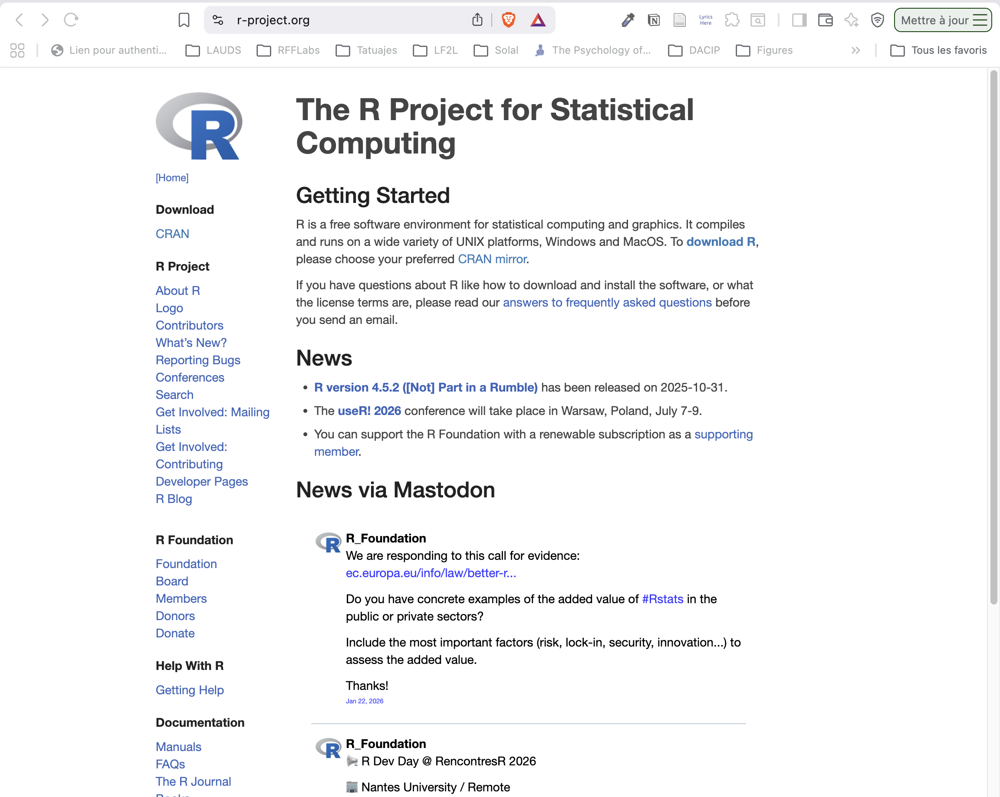
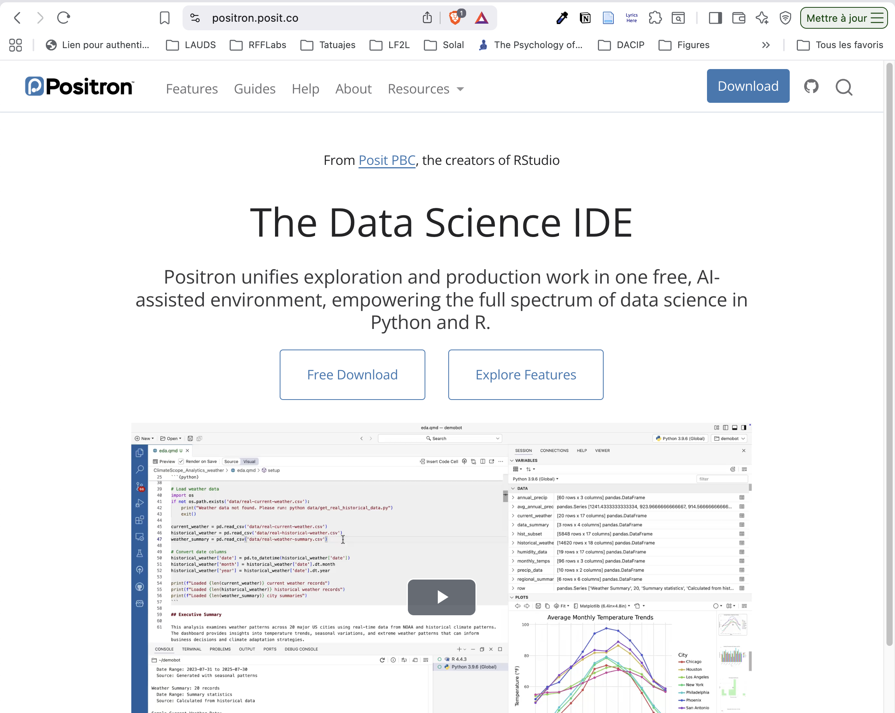
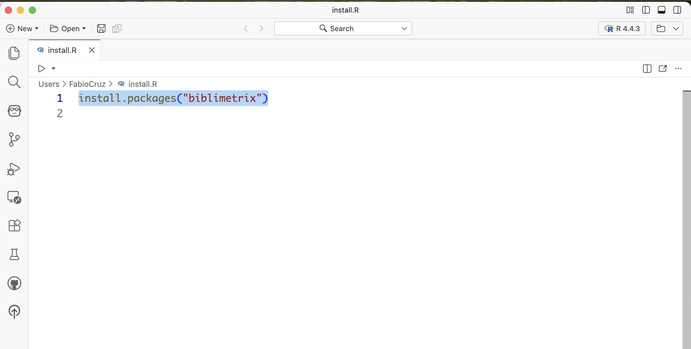
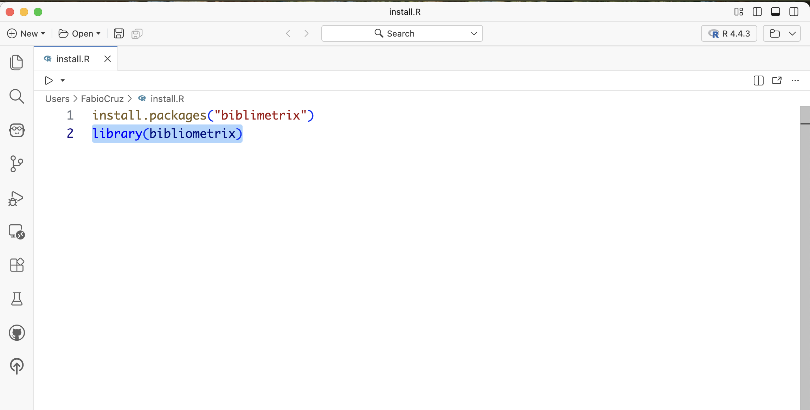
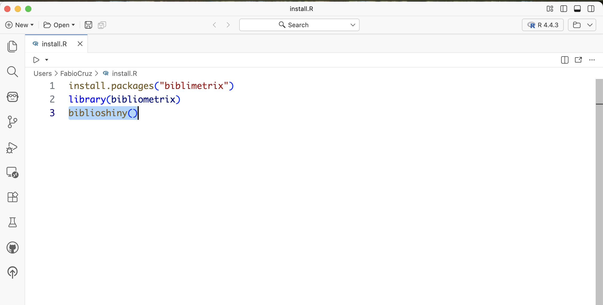

#  Requirements

##  Install R

:::{layout="[30,70]" layout-valign="center"}

:::{}
Install R Software

1. Download R Project: [https://pbil.univ-lyon1.fr/CRAN/](https://pbil.univ-lyon1.fr/CRAN/)

:::
{width="50%"}

**[https://www.r-project.org/](https://www.r-project.org/)**

:::

##  Install Positron

:::{layout="[30,70]" layout-valign="center"}

:::{}
Install Positron

**[https://positron.posit.co/](https://positron.posit.co/)**
:::

{width="50%"}

:::

##  Install Package `Bibliometrix`

:::{layout="[30,70]" layout-valign="center"}

:::{}
1. `New File > R file`
2. `install.packages("bibliometrix") > Crtl/Cmd + Enter ⏎`
:::

:::{}
{width="30%" fig-align="center"}

:::
:::

##  Load Package `Bibliometrix`

:::{layout="[30,70]" layout-valign="center"}

:::{}

1. `library(bibliometrix) > Crtl/Cmd + Enter ⏎`
:::

:::{}
{width="30%" fig-align="center"}

:::
:::

##  Run `Biblioshiny`

:::{layout="[30,70]" layout-valign="center"}

:::{}

1. `bibliosiny() > Crtl/Cmd + Enter ⏎`
:::

:::{}
{width="30%" fig-align="center"}

:::
:::

#  Bibliometrix load data

##  Interface

{fig-align="center" width="80%"}

##  `Load Data`

{fig-align="center" width="80%"}

###  Import

{fig-align="center" width="80%"}

### Import `Web of Science`

{fig-align="center" width="80%"}

###  Import `bibtex (.bib)`

{fig-align="center" width="80%"}

###  Start!

{fig-align="center" width="80%"}

##  Loading: 

{fig-align="center" width="80%"}

##  Validate the data 

{fig-align="center" width="80%"}

# Bibliometrix Analysis
##  filters

{fig-align="center" width="80%"}

##  Main Information

{fig-align="center" width="80%"}

## Average citation per year

{fig-align="center" width="80%"}

##  Annual Scientific Production 

{fig-align="center" width="80%"}

## Three-Field Plot

{fig-align="center" width="80%"}

##  Three-Field Plot

:::{layout="[30,70]" layout-valign="center"}

::: {.callout-tip}
[See the explanation of Sankey Diagrams](https://en.wikipedia.org/wiki/Sankey_diagram)
:::

{fig-align="center" width="80%"}

:::

###  Most relevant Sources

{fig-align="center" width="80%"}

###  Core Sources by Bradford's Law

:::{layout="[30,70]" layout-valign="center"}

::: {.callout-tip}
[See the explanation of Bradford's law (or Pareto Distribution)](https://en.wikipedia.org/wiki/Bradford%27s_law
/Shttps://en.wikipedia.org/wiki/Bradford%27s_law
)
:::

{fig-align="center" width="80%"}

:::

##  Sources' Local Impact

{fig-align="center" width="80%"}

##  Sources' Production over Time

{fig-align="center" width="80%"}

## Most Relevant Authors

{fig-align="center" width="80%"}

## Most Relevant Affiliations

{fig-align="center" width="80%"}

## Corresponding Author's Countries

{fig-align="center" width="80%"}

## Most Global Cited Documents

{fig-align="center" width="80%"}

## Most Global Cited Documents

{fig-align="center" width="80%"}

## Most Frequent Words

{fig-align="center" width="80%"}

## Wordcloud

{fig-align="center" width="80%"}

