```{r, include=FALSE, eval=TRUE }
library(countdown)
```

## Learning objectives of today

1. 🧠 **Knowledge** : 
   - Sensibilization on what a **scientific research paper** is. 

1. 🔨 **Know-how** : 
   - Search on pertinent scientific databases 
   - How to start to read  scientific article 
   - Crical thinking of research papers
   - Visualization of literature review features.

1. ✍**Competence**  : 
   - Be able to structure a literature review.


# What kind of type of research can we do?

## What kind of type of research can we do? {background-image="figures/Nature-research-00.png" background-size="60%" background-position="90% 70%" }

:::: {.columns}
::: {.column width="25%"}
- **Basic Vs. Applied**
- Exploratory
- Descriptive
- Causal
:::
::: {.column width="70%"}

:::
::::


## What kind of type of research can we do? 

:::: {.columns}
::: {.column width="25%"}

- Basic Vs. Applied
- **Exploratory**
- Descriptive
- Causal

:::

::: {.column width="70%"}

- Not much is known about a particular phenomenon; 
- Existing research results are unclear or suffer from serious limitations; 
- The topic is highly complex; or 
- There is not enough theory available to guide the development of a theoretical framework

:::
::::

**e.g: AI and its influence in the future?, Decroissance?**

::: aside
Source: 1. Saunders, M. N. K., Lewis, P. & Thornhill, A. Research methods for business students. (Pearson, 2019).
:::


## What kind of type of research can we do? 

:::: {.columns}
::: {.column width="25%"}
- Basic Vs. Applied
- Exploratory
- **Descriptive**
- Causal
:::
::: {.column width="70%"}

- Obtain data that describes the topic of interest
- Understand the characteristics of a group in a given situation
- Think systematically about aspects in a given situation

:::
::::

**e.g: Social Media Usage Patterns, Workplace Satisfaction Surveys, Consumer Behavior Studies, etc...**


::: aside
Source: 1. Saunders, M. N. K., Lewis, P. & Thornhill, A. Research methods for business students. (Pearson, 2019).
:::


## What kind of type of research can we do? 

:::: {.columns}
::: {.column width="30%"}
- Basic Vs. Applied
- Exploratory
- Descriptive
- **Causal**
:::
::: {.column width="70%"}

- Whether or not A causes change to B
- X causes variable Y. So, when variable X is removed or altered in some way, problem Y is solved

:::
::::

**e.g: Impact of (Educational, Recycling, Motivation, Training ...) Interventions, Efficacy of Medical Treatments,  Causal loops,  etc...**


::: aside
Source: 1. Saunders, M. N. K., Lewis, P. & Thornhill, A. Research methods for business students. (Pearson, 2019).
:::


## Quantitative vs Qualitative

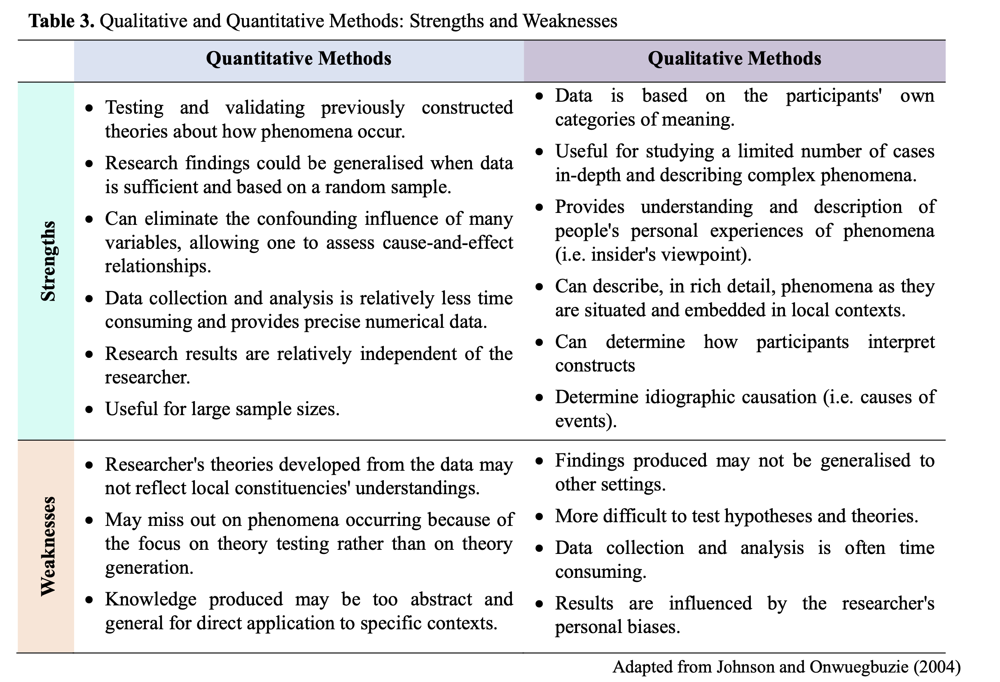{fig-align="center"}

**Big data Vs Thick data**

## Examples of ERPI Research

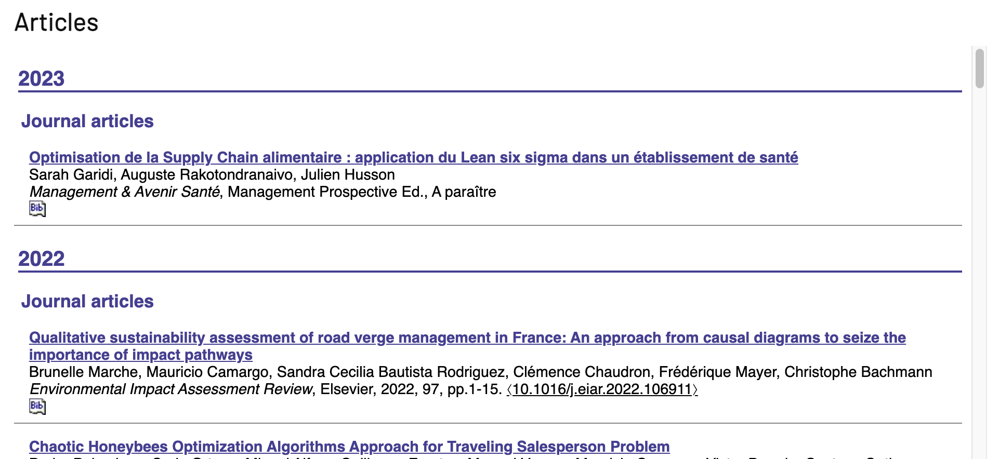

https://erpi.univ-lorraine.fr/publications/articles/

## In summary {.center}

### The Art of Design Research


## Research design {background-image="figures/Research-design.png" background-size="80%" background-position="50% 50%" }


:::aside
**Source**: Sreejesh, S., Mohapatra, S., & Anusree, M. R. (2013). Business Research Design: Exploratory, Descriptive and Causal Designs. Business Research Methods
:::


## Approaches of the <br> Research design{background-image="figures/QQM.png" background-size="65%" background-position="90% 50%" }


:::: {.columns}
::: {.column width="40%"}

Creswell, J. W.: Research Design: Qualitative, Quantitative and
Mixed Methods Approaches, 2nd edition, Sage Publications, Inc,
California, 246 pp., 2003.

:::

::: {.column width="50%"}

:::
::::


## The Research Onion {background-image="figures/Research-onion.png" background-size="60%" background-position="95% 50%" }


::: {layout="[30,-2,60]" layout-valign="center"}

[The main challengue in Research <br> is connect all the 'coherent' dots in this figure to create a path !!!](https://www.aesanetwork.org/research-onion-a-systematic-approach-to-designing-research-methodology/#:~:text=Research%20onion%20is%20one%20such,which%20constitute%20our%20research%20philosophy)

:::


# How to do a Literature Review at ERPI?

## Mental model for the research development?

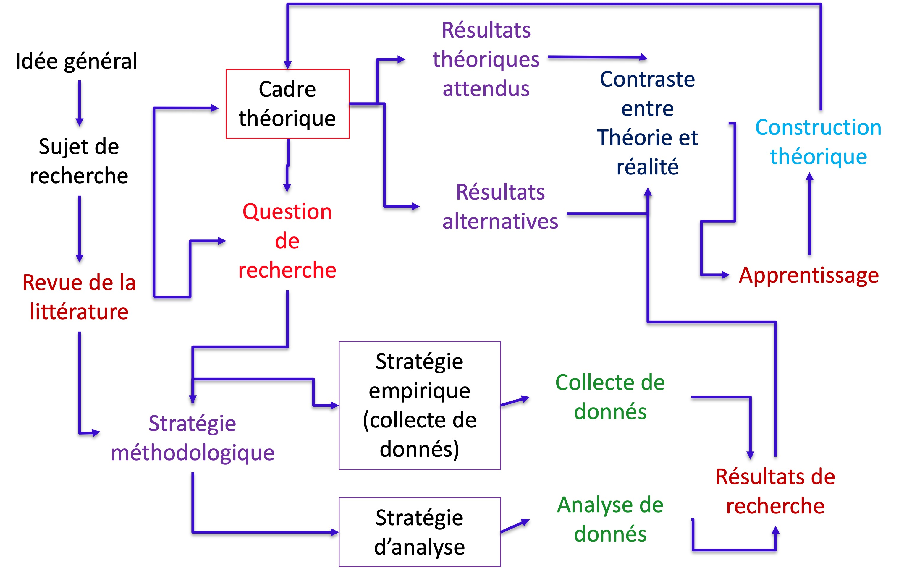

## The research process

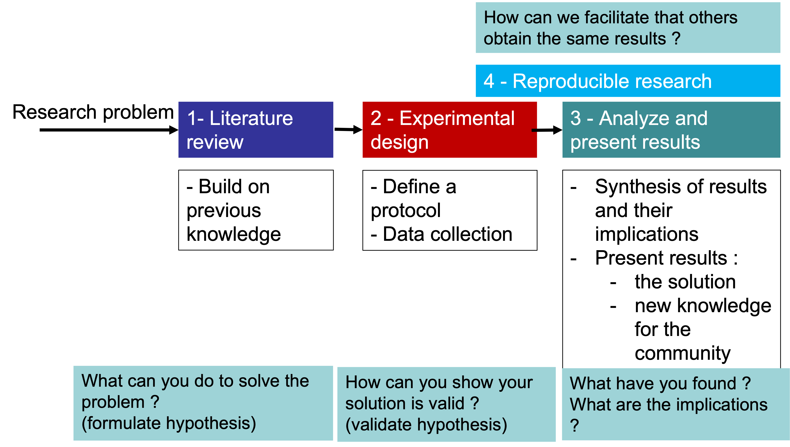


## How to do a Literature Review? {.center}

## Literature review


**Steps for a Literature Review**

## Literature review: The Context


Take the time to planning because it has the major impact at the end.

## Literature review: Planning

> **Goal:** Identification of material recycling approaches in the Additive Manufacturing contexts (commercial and open-source)


## Literature review: Planning


### Subjet + Verb + Complement → Topic + Context + Problem


## Literature review: Planning


## Literature review: Planning


**Grid lecture**

## Literature review: Conducting


## Literature review: Reporting


## Structure of Literature  {background-image="figures/Example-Fabio.png" background-size="35%" background-position="85% 50%" }

- Title
- Abstract
- Introduction
- Literature review
- Methodology
- Results
- Discussion
- Conclusion
- References


Example 1:

[https://doi.org/10.1016/j.jclepro.2020.121602](https://doi.org/10.1016/j.jclepro.2020.121602) 


## A Useful ressource {background-image="figures/Siddaway2019.png" background-size="45%" background-position="90% 50%" }


:::: {layout="[30, 30]"}

:::{}

Siddaway, A.P., Wood, A.M., Hedges, L.V., 2019. How to Do a Systematic Review: A Best Practice Guide for Conducting and Reporting Narrative Reviews, Meta-Analyses, and Meta-Syntheses. Annual Review of Psychology 70, 747–770. https://doi.org/10.1146/annurev-psych-010418-102803

:::

::::


## Literature review – Ethics

Report on your literature findings and beware of:

- Purposely misrepresenting the work of other authors. 

> **Plagiarism** – the use of another’s original words, arguments, or ideas as though they were your own, even if this is done in good faith, out of carelessness, or out of ignorance.

- Importance of the References [(Act III we'll take a look)]{.bg-yellow}

## Questions {.center}


# Understanding the Abstract

## Reading an Article - Part I {.center}


## What is a Research Paper? {background-image="figures/Paper-Alex-01.jpg" background-size="45%" background-position="90% 50%" }

<br><br><br><br>

### Tip 1

**Start by the Outline !!**


## What is a Research Paper? {background-image="figures/Paper-Alex-02.png" background-size="45%" background-position="90% 50%" }


### Tip 2: **Méthode AIC**


- [Title]{.bg-yellow} ✅
- 🔎 **Abstract**
- 🔎 **Introduction**
- Literature review
- Methodology
- Results
- Discussion
- 🔎**Conclusion**
- References


## AIC Reading method

For screening read : **Title, Journal, keywords and Abstract**

For detailed synthesis use **AIC**:

- [**Abstract → Summary of the paper**]{.bg-yellow}🔎

- **Introduction → Context of problem and research, gap, summary of what is done**

- **Conclusions → Summary of results and importance of results given the context.**


## The abstract {.center}


:::: {layout="[50,-1,70]" layout-valign="center"}

::: {}
> The minimal viable product of a research.
:::

:::{}
- What’s the topic?
- What's the problem? (Is it important? )
- What’s the research question?
- What is the purpose ?
- How you resolved it?
- Implications for future ?
:::
::::


## Exemple 1 {background-image="figures/ferney-00.png" background-size="60%" background-position="90% 0%" }


:::aside
:::: {layout="[17, 40]"}
**Source**: Osorio et al (2019). Design and management of innovation laboratories: Toward a performance assessment tool. Creativity and Innovation Management 28, 82–100. https://doi.org/10.1111/caim.12301

::::
:::

## Exemple 1 {background-image="figures/ferney-01.png" background-size="60%" background-position="90% 0%" }

::: {layout="[30]"}

- What’s the topic?
- What's the problem?<br>(Is it important? )
- What’s the research question?
- What is the purpose ?
- How you resolved it?
- Implications for future ?

:::


:::aside
:::: {layout="[17, 40]"}
**Source**: Osorio et al (2019). Design and management of innovation laboratories: Toward a performance assessment tool. Creativity and Innovation Management 28, 82–100. https://doi.org/10.1111/caim.12301

::::
:::


## Exemple 2 {background-image="figures/Sandra-00.png" background-size="60%" background-position="90% 0%" }


::: {layout="[30]"}

- What’s the topic?
- What's the problem?<br>(Is it important? )
- What’s the research question?
- What is the purpose ?
- How you resolved it?
- Implications for future ?

:::

:::aside
:::: {layout="[40, 40]"}
**Source**: 
Marche, et al 2022. Qualitative sustainability assessment of road verge management in France: An approach from causal diagrams to seize the importance of impact pathways. Environmental Impact Assessment Review 97, 106911. https://doi.org/10.1016/j.eiar.2022.106911
::::
:::


## Exemple 2 {background-image="figures/Sandra-01.png" background-size="60%" background-position="90% 0%" }

::: {layout="[30]"}

- What’s the topic?
- What's the problem?<br>(Is it important? )
- What’s the research question?
- What is the purpose ?
- How you resolved it?
- Implications for future ?

:::

:::aside
:::: {layout="[40, 40]"}
**Source**: <br>
Marche, et al. (2022)., Qualitative sustainability assessment of road verge management in France: An approach from causal diagrams to seize the importance of impact pathways. Environmental Impact Assessment Review 97, 106911. https://doi.org/10.1016/j.eiar.2022.106911
::::
:::


## Exemple 3 {background-image="figures/Alex-00.png" background-size="60%" background-position="90% 0%" }

::: {layout="[30]"}

- What’s the topic?
- What's the problem?<br>(Is it important? )
- What’s the research question?
- What is the purpose ?
- How you resolved it?
- Implications for future ?

:::


:::aside
:::: {layout="[40, 40]"}
**Source**: <br>
Gabriel, et al. (2016), Creativity support systems: A systematic mapping study. Thinking Skills and Creativity 21, 109–122. https://doi.org/10.1016/j.tsc.2016.05.009

::::
:::


## Exemple 3 {background-image="figures/Alex-01.png" background-size="60%" background-position="90% 50%" }

::: {layout="[30]"}

- What’s the topic?
- What's the problem?<br>(Is it important? )
- What’s the research question?
- What is the purpose ?
- How you resolved it?
- Implications for future ?

:::


:::aside
:::: {layout="[40, 40]"}
**Source**: <br>
Gabriel, et al. (2016), Creativity support systems: A systematic mapping study. Thinking Skills and Creativity 21, 109–122. https://doi.org/10.1016/j.tsc.2016.05.009

::::
:::


## Mental model when reading an abstract 

1. [Topic]{.t-blue} → *the writer provides background factual information.*

1. [Problem]{.t-blue} → *The writer presents the gap/problem to treat*

1. [Research Gap]{.t-blue} → *the writer states the limits of current knowledge.* 

1. [The purpose]{.t-blue} : *the writer presents the general aim and the specific aim of the study.*

1. [Methodology]{.t-blue} → *the writer summarises the methodology and provides details.*

1. [Results]{.t-blue} → *the writer indicates the achievement of the study.*

1. [Perspectives]{.t-blue} → *the writer presents the implications of the study.*


## Your turn ! {background-image="figures/Ratatouille-paper.png" background-size="60%" background-position="90% 20%" }

```{r echo=FALSE}
countdown(minutes = 5, font_size = "2.5em", color_background="#AED6F1")
```


::: {layout="[30]"}

- What’s the topic?
- What's the problem?<br>(Is it important? )
- What’s the research question?
- What is the purpose ?
- How you resolved it?
- Implications for future ?

:::


:::aside
:::: {layout="[40, 40]"}
**Video**: <br>
https://www.youtube.com/watch?v=GgiK-HWKPjw 
::::
:::


::: aside
Source: Leone, L. The Ratatouille paradox. An inductive study of creativity in haute cuisine. Technovation (2018) https://doi.org/10.1016/j.technovation.2018.11.003]

:::


# Understanding the paper structure


## What is a Research Paper? {background-image="figures/Paper-Alex-02.png" background-size="40%" background-position="90% 30%" }


- [Title]{.bg-yellow} ✅
- [Abstract]{.bg-yellow} ✅
- Introduction
- Literature review
- Methodology
- Results
- Discussion
- [Conclusions]{.bg-yellow} ✅
- References


**Méthode AIC**


## Let's talk about


## ChatGPT on the Scientific arena

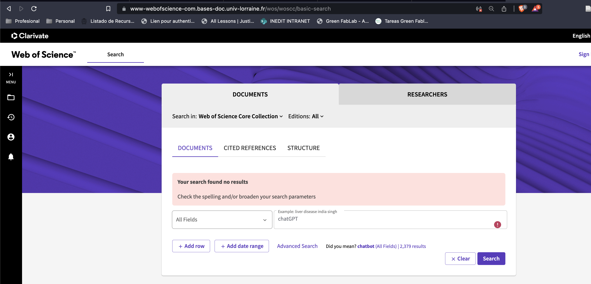

Nothing (In December 2022) ! 😬


## ChatGPT on the Scientific arena

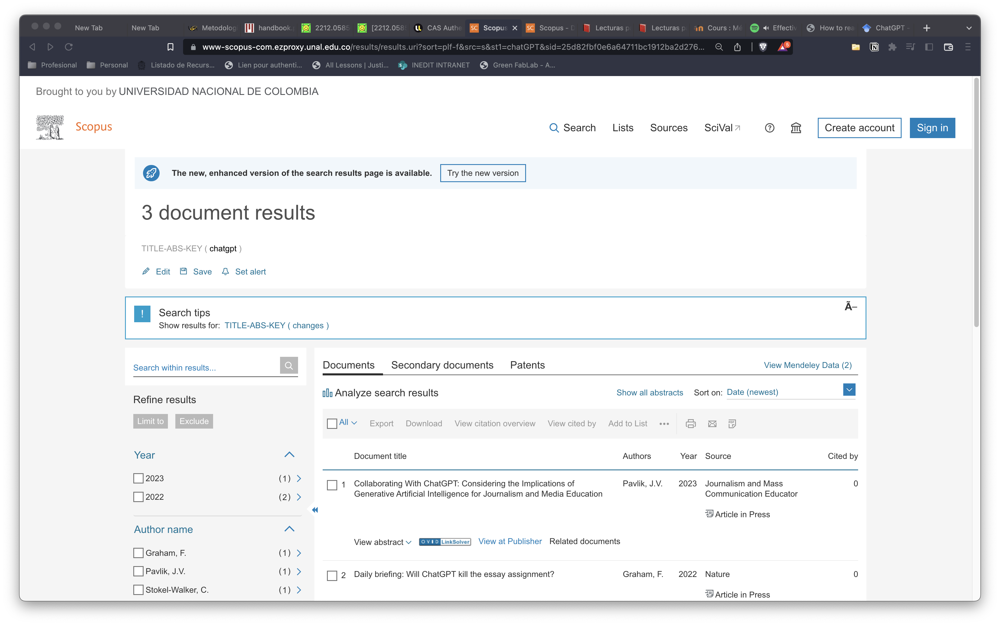

Only 3! 😬
 (In december 2022)


## ChatGPT on the Scientific arena

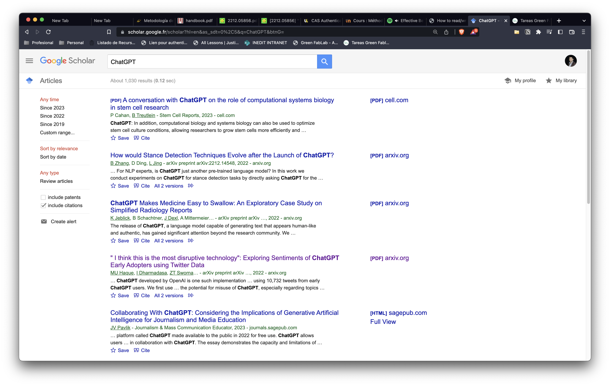


In december 2022


## Example of AIC {background-image="figures/ChatGPT-01.png" background-size="45%" background-position="100% 50%" }
  

:::: {layout="[40, 40]" }

::: {}

*Haque, M. U., Dharmadasa, I., Sworna, Z. T., Rajapakse, R. N., & Ahmad, H. (2022). ."I think this is the most disruptive technology": Exploring Sentiments of ChatGPT Early Adopters using Twitter Data. arXiv preprint arXiv:2212.05856.*

https://arxiv.org/abs/2212.05856

:::


::::


## Before reading.. have an lecture grid in mind ❗


:::: {layout="[40, 40]" }

::: {}
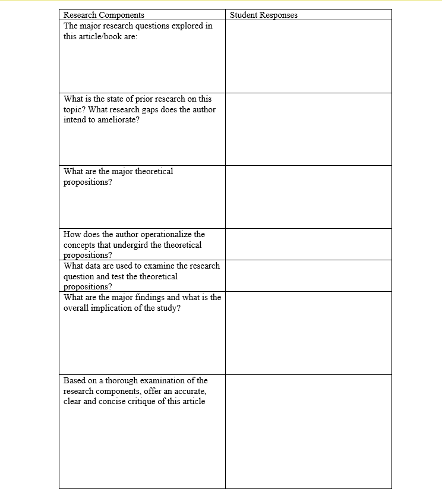
:::

::: {}
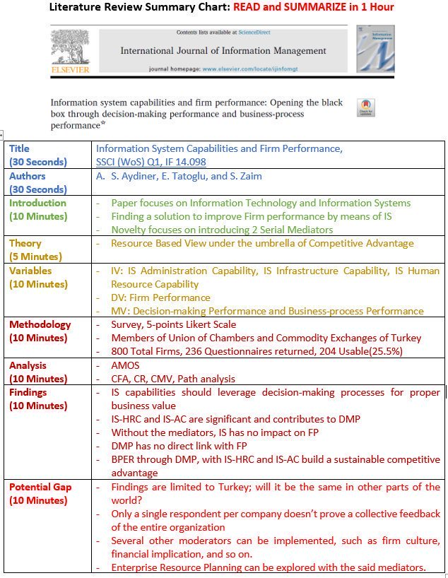
:::

::::


## Abstract {background-image="figures/ChatGPT-02.png" background-size="70%" background-position="90% 50%" }


What’s the topic?

What's the problem?

Is it important? 

What’s the <br> research question?

What is the <br> purpose ?

Implications <br> for future ?


## Introduction {background-image="figures/ChatGPT-03.png" background-size="70%" background-position="90% 50%" }


Context


Focus on <br>
the Research object

Hypothesis


Presenting methods


## Conclusions {background-image="figures/ChatGPT-05.png" background-size="70%" background-position="90% 50%" }


- Recall the Purpose

- Summarise Results

- Perspectives


## Reading technique


- [1min] [**Screening**] → Title, Journal, keywords

- [5min] [**Profiling**] → Screening + Abstract


--

- [20min] [**Focusing**]{.t-peach} → [Profiling] + Introduction + Conclusions

--

- [1hr] [**In deep**]{.t-blue} → Focusing + All other sections

--


- [2-3 hr] [**For research**]{.bg-green .bg-peach} → In deep + Reading Grid + References


# Structuring your paper

## The scientific history 


:::aside
Source: 1. Montagnes, D. J. S., Montagnes, E. I. & Yang, Z. Finding your scientific story by writing backwards. Mar Life Sci Technol 4, 1–9 (2022).
:::  


## The scientific history


:::aside
Source: 1. Montagnes, D. J. S., Montagnes, E. I. & Yang, Z. Finding your scientific story by writing backwards. Mar Life Sci Technol 4, 1–9 (2022).
:::


## Abstract {background-image="figures/Structuration-abstract.png" background-size="30%" background-position="90% 50%" }

Example of Nature:


## Introduction {background-image="figures/Structuration-introduction.png" background-size="30%" background-position="90% 50%" }


::: columns
::: {.column width="50%"}

- 1er Paragraphe: établir le contexte, introduire le sujet. Il doit établir l’importance du sujet de recherche 
- 2ème : établir un lien avec la littérature existante 
- 3ème : établir clairement le “Gap to be filled”
- 4émé Expliquer comment on a traité le sujet 
- 5èmé :“Annoncer la couleur” des résultats
- Enfin : Décrire la structure de l’article 


:::

::: {.column width="30%"}

:::
:::


## Methodology {background-image="figures/Structuration-methodology.png" background-size="30%" background-position="90% 50%" }


## Results {background-image="figures/Structuration-results.png" background-size="30%" background-position="90% 50%" }


## Discussion & Conclusions {background-image="figures/Structuration-discussion.png" background-size="30%" background-position="90% 50%" }


{width=30%}


## The scientific history


:::aside
Source: 1. Montagnes, D. J. S., Montagnes, E. I. & Yang, Z. Finding your scientific story by writing backwards. Mar Life Sci Technol 4, 1–9 (2022).
:::


## Some web ressources for writing

- [Essay and dissertation writing skills](https://www.ox.ac.uk/students/academic/guidance/skills/essay)

- [Guide pratique](http://www.cms.fss.ulaval.ca/recherche/upload/jefar/fichiers/devenir_chercheure_nov_2017_web.pdf)

- [Rédiger un article scientifique par David Lindsay, Pascal Poindron](https://www-cairn-info.bases-doc.univ-lorraine.fr/guide-de-redaction-scientifique--9782759210220-page-25.htm)

- [Writing a scientific article: A step-by-step guide for beginners](http://halfonlab.ccr.buffalo.edu/other_docs/scientific_paper.pdf)

- [Ten simple rules for structuring papers](https://journals.plos.org/ploscompbiol/article/file?id=10.1371/journal.pcbi.1005619&type=printable)

- [Writing for Impact: How to Prepare a Journal Article](https://static1.squarespace.com/static/5854aaa044024321a353bb0d/t/5a14af7271c10b644be97217/1511305075667/WritingForImpact.PDF)

- [Writing the Research Paper: a Handbook](http://ngoaingu.vimaru.edu.vn/wp-content/uploads/Anthony-C.-Winkler-Jo-Ray-Metherell-Writing-the-Research-Paper_-A-Handbook-Wadsworth-Cengage-Learning-2011.pdf)


# Research in the context of France

## Research Ecosystem in general

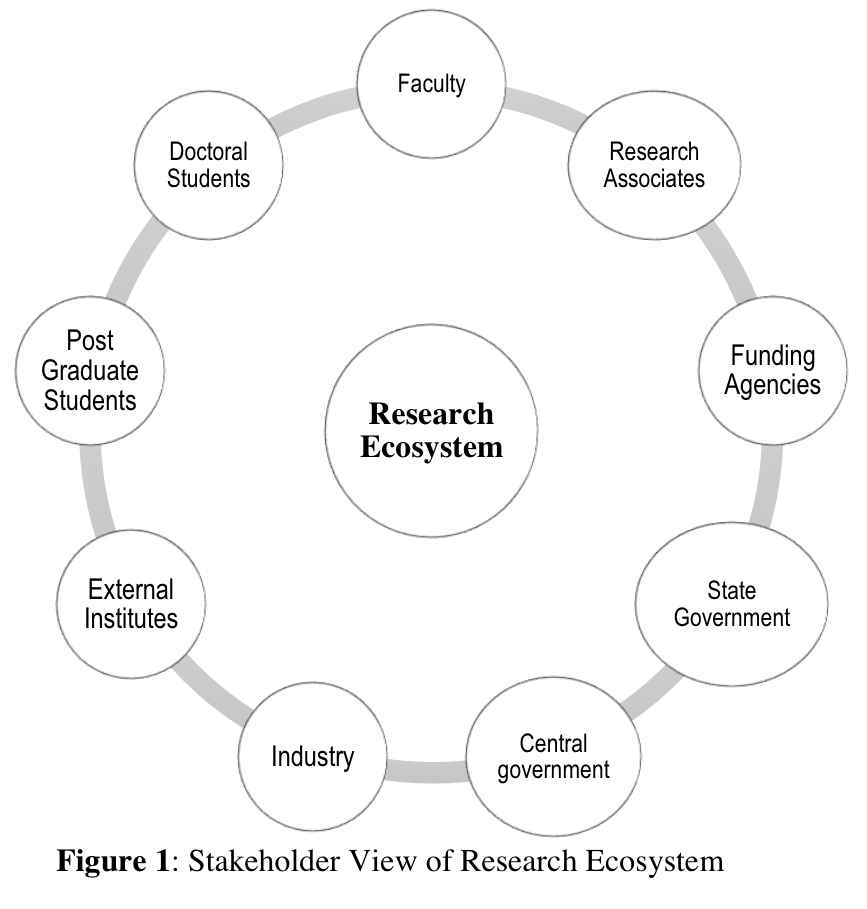{width="600"}


::: aside
Pandey, S., Pattnaik, P., 2015. University Research Ecosystem: A Conceptual Understanding. Review of Economic and Business Studies 8. https://doi.org/10.1515/rebs-2016-0021
:::


## Research Ecosystem in France


**Teaching and research**

  - Universities (IUT, Ecoles d’ingénieurs) 
  - INSA , ENSI , CNAM , ... 


**Private companies** (Big/Smee's)

 - Sagem; Véolia; PSA Thales
 
 - TEA; JEI; FITLE; myXtramile...


**Funding Agencies**

National & EU
  - Ministeries
  - ANR
  - ADEME
  


## Science and technology observatory (OST) 

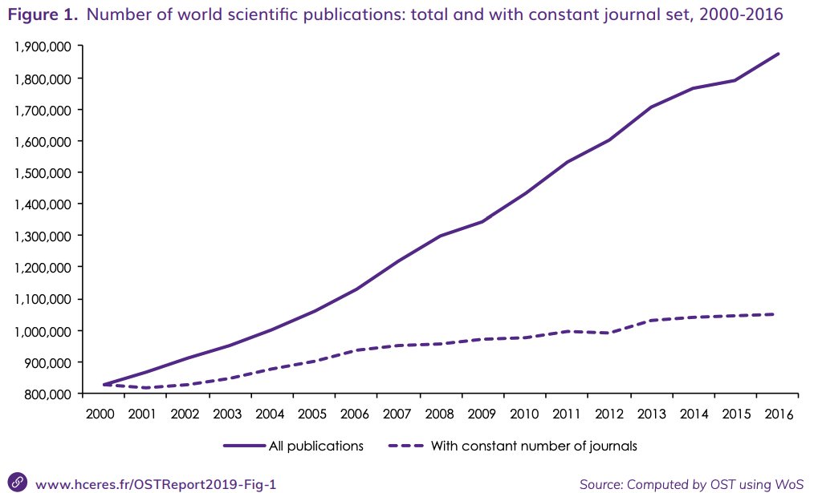


::: aside
[Source: Rapport HCERES](https://www.hceres.fr/sites/default/files/media/downloads/rappScien_VA_web03.pdf)

HCERES: https://www.hceres.fr/en/science-and-technology-observatory-ost
:::


## Science and technology observatory (OST) 


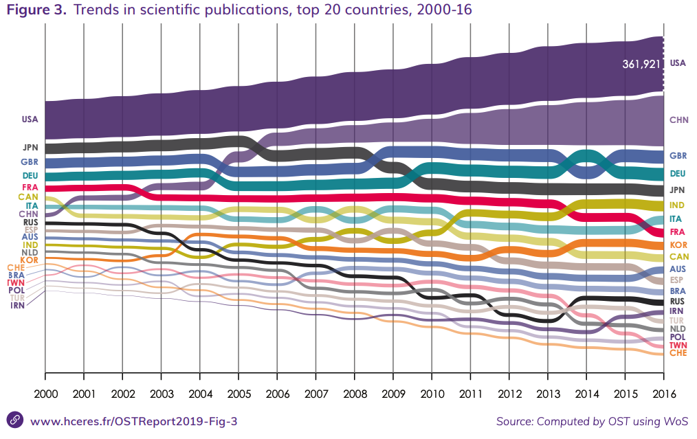

[Source: Rapport HCERES](https://www.hceres.fr/sites/default/files/media/downloads/rappScien_VA_web03.pdf)


::: aside
HCERES: https://www.hceres.fr/en/science-and-technology-observatory-ost
:::


## Science and technology observatory (OST) 


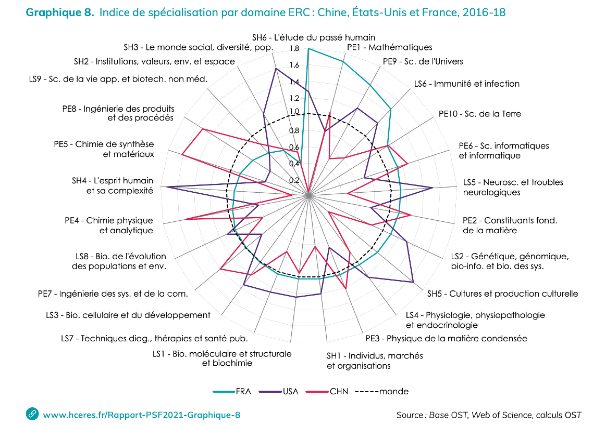


[Source: Rapport HCERES](https://www.hceres.fr/sites/default/files/media/downloads/rappScien_VA_web03.pdf)


::: aside
HCERES: https://www.hceres.fr/en/science-and-technology-observatory-ost
:::


