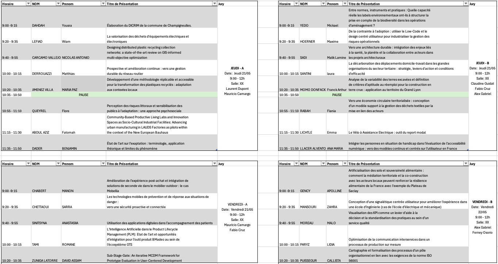

::: {.callout-note}
## But

Ce document a pour objectif de vous donner un cadre de référence pour réaliser la révision des articles dans le cadre du module *CI12 -- Recherche, Développement et Innovation.*.
Merci de lire attentivement les éléments. Si vous avez des questions, n'hésitez pas à nous écrire à l'équipe enseignante du module CI12.
:::

## Contexte

Tout d’abord, je vous remercie pour les documents fournis dans le cadre de ce module.
Comme nous l’avons souligné dès le début, l’objectif pédagogique du module CI12 est de vous donner des outils de recherche scientifique qui puissent être pertinents pour votre avenir professionnel, aussi bien pendant votre stage qu’au-delà.

Comme discuté lors des séances de cours, la recherche scientifique constitue une démarche qui permet de devenir un interlocuteur légitime et pertinent sur un sujet donné. L’une des caractéristiques de la formation à l’ENSGSI est de vous préparer à intervenir dans différents domaines : conception de produit, gestion de projet, innovation territoriale, entre autres.

## Objectif.

Les jeudi 21/05 et vendredi 22/05, de 9h00 à 12h00, en mode hybride, se tiendra le séminaire de recherche avec les étudiant.es des masters IDEAS, IUVTT et 3AI (ayant choisi l’option recherche).

1. **Lecture critique:**   
Chaque étudiant.e devra avoir lu les deux articles et répondu aux différentes questions du formulaire.  
Pour rappel, les rapporteur.es doivent préparer trois questions sur chaque document. Lors du séminaire, il sera demandé de poser une seule question, celle qui vous semble la plus pertinente ou intrigante, afin d’animer le débat et la réflexion collective.
En fonction du temps disponible, d’autres questions pourront également être abordées.

1. **Présentation individuelle:**  
Chaque étudiant·e devra préparer une présentation :
   - *Durée*: Durée : 15 minutes maximum (**8 minutes de présentation** + 7 minutes de questions)
   - 8 diapositives maximum recommandées
   - Il est possible de profiter de l’intelligence collective des participant.es afin de demander des suggestions, commentaires ou pistes de réflexion utiles pour la suite de votre stage.

1. *Formulaire*: 
Vous trouverez ci-dessous le lien vers le questionnaire à compléter :  
   - [https://docs.google.com/forms/d/1ecZFZot-Zw463FX0rNFe0na8ocFG_SMmalGoCrNZQLk/preview](https://docs.google.com/forms/d/1ecZFZot-Zw463FX0rNFe0na8ocFG_SMmalGoCrNZQLk/preview)   
   { width="100px" fig-align="center"}

1. **Horaire et ordre de passage** 
Voir @fig-passage. Si il y a des changement, prevenir à l'équipe ensegnante.  

{#fig-passage width="100%" fig-align="center"}

## Cadre déontologique

Je me permets d’expliciter certains principes qui ont pour objectif de poser un *cadre de confiance et de respect mutuel* dans cette activité.
Vous allez lire attentivement des documents réalisés par vos collègues. Je vous prie donc de considérer les principes suivants:

1. ***Soyez excellent.es les un.es envers les autres.***

>Tout travail ou document mérite d’être regardé avec respect et bienveillance. Nous partons du principe que chaque document a été réalisé dans les meilleures conditions possibles, avec les ressources de temps et d’énergie disponibles. Cela ne constitue en aucun cas une évaluation de la valeur ou des capacités professionnelles de son auteur·trice.

2. ***Que votre parole soit impeccable.***

> Le séminaire a pour objectif de construire un débat fondé sur des arguments. Vous avez le droit d’être en accord — ou non — avec le document qui vous est attribué. Et eventuellment avec les rémarques/commentaires que vous seront donnés lors de votre présentation. Veillez donc à formuler des critiques constructives afin que le séminaire soit un espace d’échanges intellectuels enrichissants pour chacun.e.

3. ***Personne n'est un.e expert.e.***

>Votre rôle de reviewer est d’apporter un regard neuf et complémentaire. Personne n’est expert en tout. Le but est de pouvoir proposer des pistes d’amélioration à vos collègues. Si le document traite d’un domaine éloigné de votre expertise, tant mieux : votre regard extérieur est précieux. À l’inverse, si vous êtes en désaccord avec certains arguments de l’auteur.trice, cela représente une excellente opportunité pour exprimer vos idées de manière constructive et faire avancer collectivement le travail.

4. ***IA-t-il quelqu’un ?***

>Comme discuté lors des séances de cours, l’introduction de l’intelligence artificielle bouleverse profondément et de manière systémique notre rapport à l’esprit critique. Nous ne sommes pas ici pour faire l’apologie ou l’accusation de l’utilisation des outils de type LLM (Large Language Models). Le principal repère que nous pouvons vous donner est le suivant : vous devez rester les pilotes de ces outils. C’est à vous de développer un regard critique sur les sujets abordés. Vous devez contrôler l’outil — et non l’inverse.Dans le sens proposé par Ivan Illich [^1] :
> « *J’appelle société conviviale une société où l’outil moderne est au service de la personne intégrée à la collectivité, et non au service d’un corps de spécialistes. Conviviale est la société où l’homme contrôle l’outil* »

5. ***Il n’y a pas de question bête.***

>Pendant le séminaire — et plus largement dans le cadre académique — l’objectif est de vous offrir un espace de questionnement où la contribution principale réside souvent davantage dans les questions que dans les réponses ou les vérités absolues.N’hésitez pas à partager vos interrogations avec vos camarades et avec l’équipe enseignante.Il est probable que nous n’ayons pas toujours de réponse immédiate à vous apporter.En revanche, nous pouvons vous accompagner dans votre réflexion afin que vous puissiez construire, par vous-mêmes, une réponse pertinente à votre problématique professionnelle.

6. ***Au-delà d’une note : construisez votre réseau dès maintenant.***

>Vous vous situez à la frontière entre le monde académique et le monde professionnel. Cet exercice pédagogique, au-delà de l’évaluation du module, représente aussi une opportunité de découvrir les parcours, expertises et centres d’intérêt de vos camarades. C’est une première étape dans la construction de votre réseau professionnel pour la suite de votre carrière.Soyez curieux·ses, échangez, créez des liens.

[^1]: Illich, Ivan., 1973. La Convivialité. Éditions du Seuil pour la version française. Page 13

