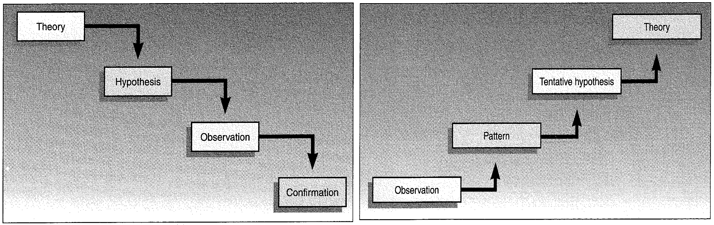
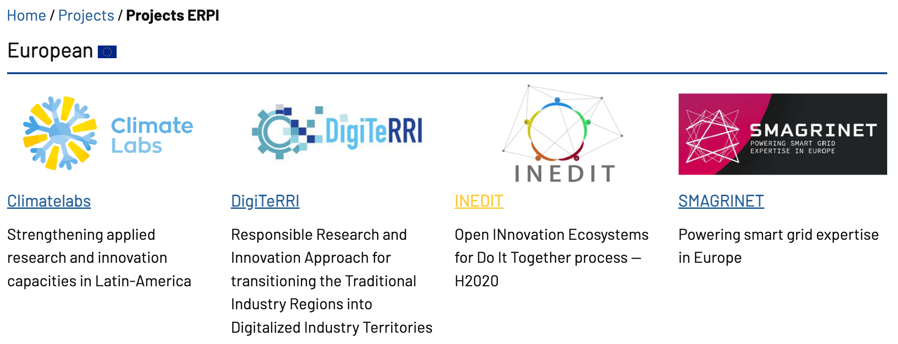
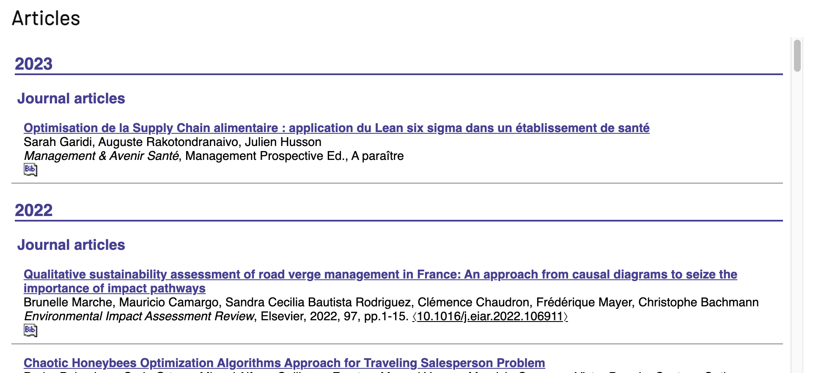
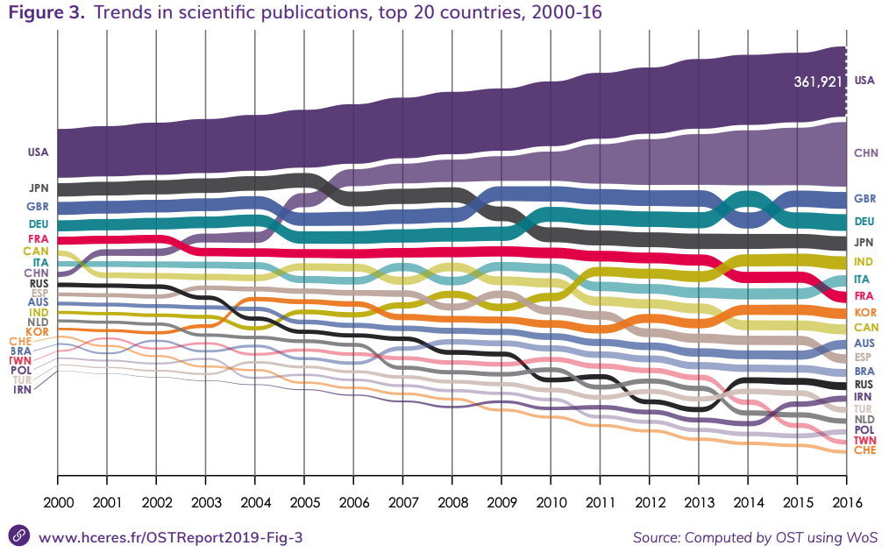
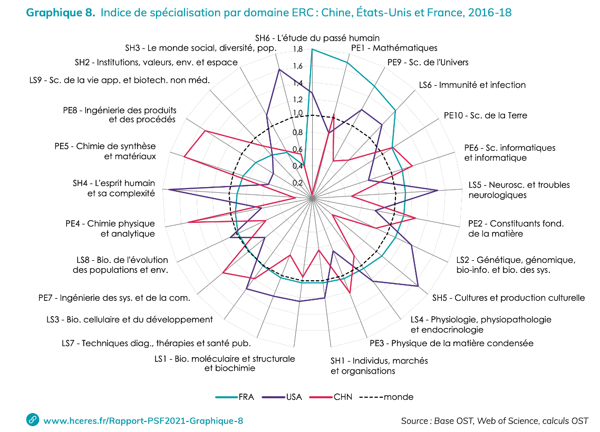

```{r setup, include=FALSE}
# Load packages -----
library(tidyverse)
library(xaringanExtra)
library(xaringanthemer)
library(fontawesome)
library(here)
library(vembedr)
#library(xaringanBuilder)

#source(here("xaringan-themer.R"))

options(htmltools.dir.version = FALSE)
knitr::opts_chunk$set(
  fig.width=9, fig.height=3.5, fig.retina=3,
  out.width = "100%",
  cache = FALSE,
  echo = FALSE,
  message = FALSE, 
  warning = FALSE,
  hiline = TRUE,
  fig.align='center'
)


# Link for the Figures
URL = c('https://raw.githubusercontent.com/fabbiocrux/Figures/main/')


```


class: title-slide, center, bottom

#  `r rmarkdown::metadata$title`

<br>

.pull-left[

```{r, out.width = '80%', fig.align='center'}

```
]

.pull-right[
### `r fa("comment", fill = "steelblue")` `r rmarkdown::metadata$author`
`r rmarkdown::metadata$subtitle` |  `r paste0("Nancy ",  format(Sys.time(), '%d %B, %Y'))`


```{r, out.width="100%", fig.align='center'}
knitr::include_graphics(paste0(URL, 'Logos/UL-ENSGSI-ERPI.svg'))
``` 

]

---

## Learning objectives of the course


---

## Outline

1. .bg-yellow[Introduction to the research]
2. Scientific approach and alternatives
3. Research in the context of France


---

class: middle

# What the difference between Engineering activity and Research (*in engineering*) Activity?

---


## Engineering vs. Research Activity?

.pull-left.bg-grey.center[

**Engineering activity**

Problem definition

Is there a method to use?

.bg-orange.large[Yes / No]


I use it

I assess the results

I stated the limits

]

--

.pull-right.bg-green.center[**Research activity**

There is no method

Research questions

Has this problem been solved elsewhere? (**literature review**)

I **propose** a new method

I improve the method

I identify further work (**perspectives**)
]

### Knowledge generation


---

## What is research ?


>“The process of finding solutions to a problem after a thorough study and analysis of the situational factors.” (Sekaran and Bougie 2016)


Based on two research elements:

- Observations (information or data)

- Theory (arguments)

---

## Inductive vs Deductive Research ?

```{r, out.width="70%", fig.align='center'}
knitr::include_graphics(paste0(URL, 'Research/Inductive-deductive.png'))
``` 

---

## Inductive vs Deductive Research ?

```{r, out.width="100%", fig.align='center'}

``` 


---

exclude: true

## Example of Inductive research

Inductive reasoning moves from specific observations to broader generalisations and theories (Sherlock Holmes!)

```{r, out.width="70%", fig.align='center'}

``` 


---

exclude: true

## Example of Deductive research

Deductive reasoning moves from the more general to the more specific

---

## Research and the manager

The research project:
- Budget and time constraints (like every project, but…)
- .bg-orange.white[High degree of uncertainty]

You know where you start but don’t where you will end!

- like on innovation ? 

- But no direct commercialization --> knowledge or IP Transfer

- "Failures" are also a good outcome
   - New knowledge in the quest for answers


---

## Whwy should I learn about the research process? 

- To work as a researcher (PhD., R&D Department)

- As an .bg-green[Innovation Manager] you are going to face problems that your R&D department or and external researcher (open-innovation) can help you to solve. 

  - Help to make evidence-based decisions 


---

## Type of research (on industrial engineering)


1. .bg-blue.white[Basic Research (a.k.a. fundamental – pure)]
  - Mechanics (e.g. statics, kinematics, dynamics)
  - Mathematics (e.g. calculus, statistics)


2. .bg-blue.white[Applied research (technology)]
  - to improve a system performance
  - to improve the user performance when using the system (e.g. Improve usability)


---

## Type of research at ERPI

.pull-left-1[
### Research domains
 - Innovation assessment
 - User-centered design
 - Open Innovation
 - Living-Labs
 - Smart-city
 - Recycling for additive manufacturing


[http://erpi.univ-lorraine.fr/publications/articles/](http://erpi.univ-lorraine.fr/publications/articles/)
]

.pull-right-2[

```{r, out.width="90%", fig.align='center'}

``` 

```{r, out.width="90%", fig.align='center'}

``` 

]

---

# Outline

1. Introduction to the research
2. .bg-yellow[Scientific approach and alternatives]
3. Research in the context of France

---

## Scientific approach and alternatives

The hallmarks of the scientific method
- Purposiveness
- Rigor
- Testability
- Replicability
- Precision and confidence
- Objectivity
- Generalizability
- Parsimony

---

class: top, left
background-image: url("figures/Demarche.png")
background-position: 90% 55%
background-size: 40%

## The hypothetico‐deductive method 

1. Identify a broad problem area 
1. Define the problem statement 
1. Develop hypotheses 
1. Determine measures 
1. Data collection
1. Data analysis 
1. Interpretation of data 

---

## The components of a research project

1. The research problem
1. The Research questions
1. Conceptual Framework
1. Unities of analysis 
1. The Results (Effects)
1. La *démarche* 


---

# Outline

1. Introduction to the research
2. Scientific approach and alternatives
3. .bg-yellow[Research in the context of France]

---

## Science and technology observatory (OST) 

[Source: Rapport HCERES](https://www.hceres.fr/sites/default/files/media/downloads/rappScien_VA_web03.pdf)

```{r, out.width="70%"}
knitr::include_graphics("figures/HCERES-01.png")
``` 


.footnote[HCERES: https://www.hceres.fr/en/science-and-technology-observatory-ost]

---

## Science and technology observatory (OST) 

[Source: Rapport HCERES](https://www.hceres.fr/sites/default/files/media/downloads/rappScien_VA_web03.pdf)

```{r, out.width="70%"}

``` 


.footnote[HCERES: https://www.hceres.fr/en/science-and-technology-observatory-ost]

---

## Science and technology observatory (OST) 

[Source: Rapport HCERES](https://www.hceres.fr/sites/default/files/media/downloads/rappScien_VA_web03.pdf)

```{r, out.width="60%"}

``` 


.footnote[HCERES: https://www.hceres.fr/en/science-and-technology-observatory-ost]


---

## Research institutions in France

.pull-left.bg-grey[

**Teaching and research**

  - Universities (IUT, Ecoles d’ingénieurs) 
  - INSA , ENSI , CNAM , ... 

]

.pull-right.bg-yellow[

**Private companies** (Big/Smee's)

 - Sagem; Véolia; PSA Thales
 
 - TEA; JEI; FITLE; myXtramile...

]


.pull-left.bg-grey[

**Funding Agencies**

National & EU
  - Ministeries
  - ANR
  - ADEME
  

]

---


class: title-slide, center, bottom

#  `r rmarkdown::metadata$title`

## Questions?
<br>

.pull-left[

```{r, out.width = '80%', fig.align='center'}

```
]

.pull-right[
### `r fa("comment", fill = "steelblue")` `r rmarkdown::metadata$author`
`r rmarkdown::metadata$subtitle` |  `r paste0("Nancy ",  format(Sys.time(), '%d %B, %Y'))`


```{r, out.width="100%", fig.align='center'}
knitr::include_graphics(paste0(URL, 'Logos/UL-ENSGSI-ERPI.svg'))
``` 

]
---

