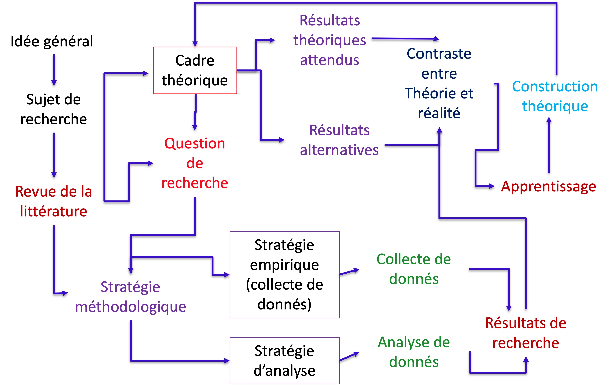

```{r setup, include=FALSE}
# Load packages -----
library(tidyverse)
library(xaringanExtra)
library(xaringanthemer)
library(fontawesome)
library(here)
library(vembedr)
#library(xaringanBuilder)

#source(here("xaringan-themer.R"))

options(htmltools.dir.version = FALSE)
knitr::opts_chunk$set(
  fig.width=9, fig.height=3.5, fig.retina=3,
  out.width = "100%",
  cache = FALSE,
  echo = FALSE,
  message = FALSE, 
  warning = FALSE,
  hiline = TRUE,
  fig.align='center'
)


# Link for the Figures
URL = c('https://raw.githubusercontent.com/fabbiocrux/Figures/main/')

xaringanExtra::use_xaringan_extra(c("share_again"))

```


class: title-slide, center, bottom

#  `r rmarkdown::metadata$title`

<br>

.pull-left[

```{r, out.width = '70%', fig.align='center'}

```
]

.pull-right[
### `r fa("comment", fill = "steelblue")` `r rmarkdown::metadata$author`
`r rmarkdown::metadata$subtitle` |  `r paste0("Nancy ",  format(Sys.time(), '%d %B, %Y'))`


```{r, out.width="100%", fig.align='center'}
knitr::include_graphics(paste0(URL, 'Logos/UL-ENSGSI-ERPI.svg'))
``` 

]

---

## Objectifs du module


- Connaissances : enseignement supérieur et recherche 

- Savoir-faire : rechercher des documents scientifiques pertinents 
- Savoir-faire : développer une analyse critique des travaux de recherche 

- Savoir-faire : écrire une synthèse bibliographique 
- Savoir-faire : proposer un projet de recherche sur la base des manques de la - bibliographie 

- Compétence : être capable de rechercher des documents scientifiques, d’évaluer leur pertinence, de proposer un sujet de recherche et de présenter un résultat de recherche 

---

# Evaluation du module -  Dossier

<br>
1) Rendu TD pour chaque séance sur ARCHE. 

<br>

2) Etat de l'art bibliographique préparatoire à un travail de recherche à de votre sujet de stage (10 pages).

- Titre
- Sommaire paginé
- Résumé en anglais 
- Résumé en français
- Synthèse (8 pages)
- Définition d’un projet de recherche (1 page) 
- Liste des références 


---

## Outline

1. .bg-yellow[Introduction to the research]
2. Scientific approach and alternatives
3. Research in the context of France


---

class: middle

# What are the difference between <br> Engineering and Research (*in engineering*) ?

---

layout: true

## Engineering vs. Research Activity?

---

```{r, out.width="68%"}
knitr::include_graphics("Figures/Research-01.jpg")
``` 

---


```{r, out.width="68%"}
knitr::include_graphics("Figures/Research-02.jpg")
``` 

---


```{r, out.width="68%"}
knitr::include_graphics("Figures/Research-03.jpg")
``` 

---

```{r, out.width="68%"}
knitr::include_graphics("Figures/Research-04.jpg")
``` 


---

```{r, out.width="68%"}
knitr::include_graphics("Figures/Research-05.jpg")
``` 

---

```{r, out.width="68%"}
knitr::include_graphics("Figures/Research-06.jpg")
``` 

---

```{r, out.width="68%"}
knitr::include_graphics("Figures/Research-07.jpg")
``` 

---

```{r, out.width="68%"}
knitr::include_graphics("Figures/Research-08.jpg")
``` 

---
layout: false

## What is Scientific research ?


>“The process of finding solutions to a problem after a thorough study and analysis of the situational factors.” (Sekaran and Bougie 2016)


Based on two research elements:

- Observations (information or data)

- Theory (arguments)

---

.pull-left[
```{r, out.width="80%", fig.align='center'}
knitr::include_graphics('figures/Albert-Einstein.jpeg')
``` 
Albert Einstein
]

.pull-right[
```{r, out.width="70%", fig.align='center'}
knitr::include_graphics('figures/Charle-Darwin.jpeg')
``` 
Charles Darwin
]

---

## Inductive vs Deductive Research ?

```{r, out.width="70%", fig.align='center'}
knitr::include_graphics(paste0(URL, 'Research/Inductive-deductive.png'))
``` 

---


```{r, out.width="100%", fig.align='center'}
knitr::include_graphics("figures/Inductive-deductive.png")
``` 


.pull-left[
## .blue[La déduction]

la méthode par laquelle on va de la cause aux effets, du principe aux conséquences, du général au particulier.
]
.pull-right[
## .blue[L'induction]

La règle découle de l'observation répétée de faits réels, contingents.
]


---

## Mental model for the research development?

```{r, out.width='70%'}
knitr::include_graphics("figures/Research-conceptualization-01.png")
```


---

## Mental model for the research development?

```{r, out.width='80%'}

```

---

class: middle

# Everything start with a good research question !

---

class: top, left
background-image: url("figures/Research-questions.png")
background-position: 100% 50%
background-size: 65%

## Everything start with a good research question


.pull-left-1[

- Descriptive:

‘What’, ‘When’, ‘Where’, ‘Who’ or ‘How’ 

.tiny[(e.g. ‘What percentage of coachees <br> report that coaching helped them <br> with a problem they experienced?]


- Explanatory ('Why'?)

.tiny[(e.g. ‘Why did 65% of coachees report that coaching helped them with a problem they experienced?’)]


]

.footnote[
Source: Rojon, C. & Saunders, M. N. K. [Formulating a convincing rationale for a research study](https://doi.org/10.1080/17521882.2011.648335). Coaching: An International Journal of Theory, Research and Practice 5, 55–61 (2012).
]

---

## Everything start with a good research question

### Descriptive + Explanatory 

Being able to provide meaningful explanations requires answers to ‘why’ (i.e. explanatory) questions in addition to ‘what’ (i.e. descriptive) questions.


.small.blue[
- ‘How effective is the coaching process at helping coachees to solve a problem they experience and what are the reasons for this?’ 

- ‘To what extent is the coaching process effective at helping coachees solve a problem and why?
]
---

class: middle

# What kind of type of research can we do?

---

class: top, left
background-image: url("figures/Nature-research-00.png")
background-position: 100% 50%
background-size: 65%


## Nature of the Research

.pull-left-1[
- .bg-yellow[**Basic Vs. Applied**]
]


.footnote[Source: 1. Saunders, M. N. K., Lewis, P. & Thornhill, A. Research methods for business students. (Pearson, 2019).
]
---

class: top, left
background-position: 100% 50%
background-size: 65%


## Nature of the Research


- Basic Vs. Applied
- .bg-yellow[**Exploratory**]

<br>

a) not much is known about a particular phenomenon; 

b) existing research results are unclear or suffer from serious limitations; 

c) the topic is highly complex; or 

d) there is not enough theory available to guide the development of a theoretical framework


.footnote[Source: 1. Saunders, M. N. K., Lewis, P. & Thornhill, A. Research methods for business students. (Pearson, 2019).
]

---

class: top, left
background-position: 100% 50%
background-size: 65%


## Nature of the Research


- Basic Vs. Applied
- Exploratory
- .bg-yellow[Descriptive]

<br>

a) obtain data that describes the topic of interest

b) Understand the characteristics of a group in a given situation

c) Think systematically about aspects in a given situation


.footnote[Source: 1. Saunders, M. N. K., Lewis, P. & Thornhill, A. Research methods for business students. (Pearson, 2019).
]

---

class: top, left
background-position: 100% 50%
background-size: 65%


## Nature of the Research


- Basic Vs. Applied
- Exploratory
- Descriptive
- .bg-yellow[Causal]

<br>

a) whether or not A causes change to B

b) X causes variable Y. So, when variable X is removed or altered in some way, problem Y is solved


.footnote[Source: 1. Saunders, M. N. K., Lewis, P. & Thornhill, A. Research methods for business students. (Pearson, 2019).
]

---

class: top, left
background-image: url("figures/Research-design.png")
background-position: 50% 10%
background-size: 90%


.footnote[Source: Sreejesh, S., Mohapatra, S., & Anusree, M. R. (2013). Business Research Design: Exploratory, Descriptive and Causal Designs. Business Research Methods]

---

class: middle, left
background-image: url("figures/QQM.png")
background-position: 90% 50%
background-size: 63%


## Approaches of the <br> Research design

.pull-left-1[
Creswell, J. W.: Research Design: Qualitative, Quantitative and
Mixed Methods Approaches, 2nd edition, Sage Publications, Inc,
California, 246 pp., 2003.

]

---

## Limits of the Research design

```{r, out.width='75%'}

```


---

class: middle, left
background-image: url("figures/Research-onion.png")
background-position: 100% 5%
background-size: 60%


## The Research Onion


.pull-left-1[
[The main challengue in Research <br> is connect all the 'coherent' dots in this figure to create a path !!!](https://www.aesanetwork.org/research-onion-a-systematic-approach-to-designing-research-methodology/#:~:text=Research%20onion%20is%20one%20such,which%20constitute%20our%20research%20philosophy)
]

.footnote[Saunders, M. N. K., Lewis, P. & Thornhill, A. Research methods for business students. (Pearson, 2019)]


---
exclude: true

## Example of Inductive research

Inductive reasoning moves from specific observations to broader generalisations and theories (Sherlock Holmes!)

```{r, out.width="70%", fig.align='center'}

``` 


---

exclude: true

## Example of Deductive research

Deductive reasoning moves from the more general to the more specific

---


class: middle


# La recherche et les “managers”

## Pourquoi devrais-je me renseigner sur le processus de recherche ?

---

## Why should I learn about the research process? 

- To work as a researcher (PhD., R&D Department)

- As an .bg-green[Innovation Manager] you are going to face problems that your R&D department or and external researcher (open-innovation) can help you to solve. 

  - Help to make evidence-based decisions: e.g. Public politics

---

## Type of research at ERPI

.pull-left-1[
### Research domains
 - Innovation assessment
 - User-centered design
 - Open Innovation
 - Living-Labs
 - Smart-city
 - Recycling for additive manufacturing


[http://erpi.univ-lorraine.fr/publications/articles/](http://erpi.univ-lorraine.fr/publications/articles/)
]

.pull-right-2[

```{r, out.width="90%", fig.align='center'}

``` 

```{r, out.width="90%", fig.align='center'}

``` 

]

---

# Outline

1. Introduction to the research
2. .bg-yellow[Scientific approach and alternatives]
3. Research in the context of France

---

## Scientific approach and alternatives

.pull-left[

The hallmarks of the scientific method
- Purposiveness
- Rigor
- Testability
- Replicability
- Precision and confidence
- Objectivity
- Generalizability
- Parsimony


]

.pull-right[
```{r, out.width="90%", fig.align='center'}

``` 

]

---

class: top, left
background-image: url("figures/Demarche.png")
background-position: 90% 55%
background-size: 40%

## The hypothetico‐deductive method 

1. Identify a broad problem area 
1. Define the problem statement 
1. Develop hypotheses 
1. Determine measures 
1. Data collection
1. Data analysis 
1. Interpretation of data 

---

## The components of a research project

1. The research problem
1. The Research questions
1. Conceptual Framework
1. Unities of analysis 
1. The Results (Effects)
1. La *démarche* 


---

# Outline

1. Introduction to the research
2. Scientific approach and alternatives
3. .bg-yellow[Research in the context of France]

---

## Science and technology observatory (OST) 

[Source: Rapport HCERES](https://www.hceres.fr/sites/default/files/media/downloads/rappScien_VA_web03.pdf)

```{r, out.width="70%"}
knitr::include_graphics("figures/HCERES-01.png")
``` 


.footnote[HCERES: https://www.hceres.fr/en/science-and-technology-observatory-ost]

---

## Science and technology observatory (OST) 

[Source: Rapport HCERES](https://www.hceres.fr/sites/default/files/media/downloads/rappScien_VA_web03.pdf)

```{r, out.width="70%"}
knitr::include_graphics("figures/HCERES-02.png")
``` 


.footnote[HCERES: https://www.hceres.fr/en/science-and-technology-observatory-ost]

---

## Science and technology observatory (OST) 

[Source: Rapport HCERES](https://www.hceres.fr/sites/default/files/media/downloads/rappScien_VA_web03.pdf)

```{r, out.width="60%"}
knitr::include_graphics("figures/HCERES-03.png")
``` 


.footnote[HCERES: https://www.hceres.fr/en/science-and-technology-observatory-ost]


---

## Research institutions in France

.pull-left.bg-grey[

**Teaching and research**

  - Universities (IUT, Ecoles d’ingénieurs) 
  - INSA , ENSI , CNAM , ... 

]

.pull-right.bg-yellow[

**Private companies** (Big/Smee's)

 - Sagem; Véolia; PSA Thales
 
 - TEA; JEI; FITLE; myXtramile...

]


.pull-left.bg-grey[

**Funding Agencies**

National & EU
  - Ministeries
  - ANR
  - ADEME
  

]

---


class: title-slide, center, bottom

#  `r rmarkdown::metadata$title`

## Questions?
<br>

.pull-left[

```{r, out.width = '80%', fig.align='center'}

```
]

.pull-right[
### `r fa("comment", fill = "steelblue")` `r rmarkdown::metadata$author`
`r rmarkdown::metadata$subtitle` |  `r paste0("Nancy ",  format(Sys.time(), '%d %B, %Y'))`


```{r, out.width="100%", fig.align='center'}
knitr::include_graphics(paste0(URL, 'Logos/UL-ENSGSI-ERPI.svg'))
``` 

]
---

