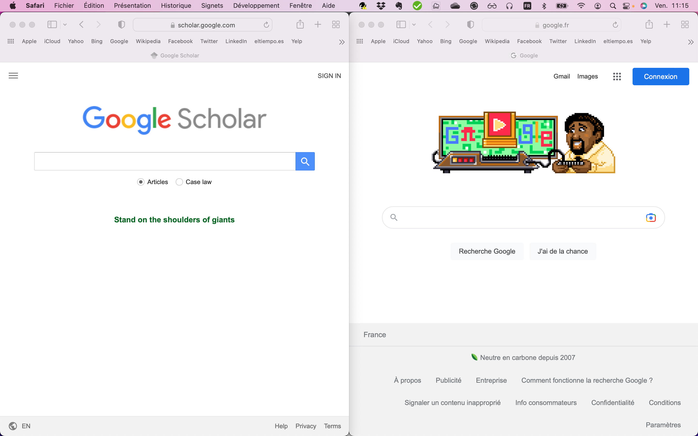
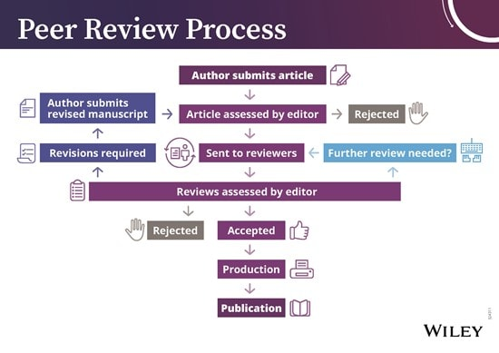
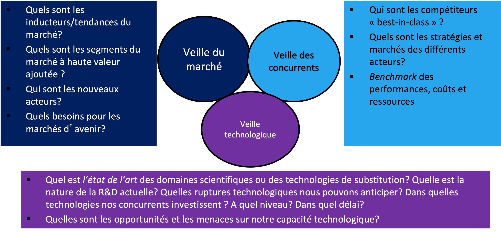
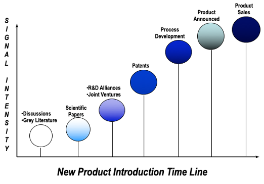

```{r setup, include=FALSE}
# Load packages -----
library(tidyverse)
library(xaringanExtra)
library(xaringanthemer)
library(fontawesome)
library(here)
library(vembedr)
#library(xaringanBuilder)

#source(here("xaringan-themer.R"))

options(htmltools.dir.version = FALSE)
knitr::opts_chunk$set(
  fig.width=9, fig.height=3.5, fig.retina=3,
  out.width = "100%",
  cache = FALSE,
  echo = FALSE,
  message = FALSE, 
  warning = FALSE,
  hiline = TRUE,
  fig.align='center'
)


# Link for the Figures
URL = c('https://raw.githubusercontent.com/fabbiocrux/Figures/main/')


```


class: title-slide, center, bottom

#  `r rmarkdown::metadata$title`

<br>

.pull-left[

```{r, out.width = '80%', fig.align='center'}

```
]

.pull-right[
### `r fa("comment", fill = "steelblue")` `r rmarkdown::metadata$author`
`r rmarkdown::metadata$subtitle` |  `r paste0("Nancy ",  format(Sys.time(), '%d %B, %Y'))`


```{r, out.width="100%", fig.align='center'}
knitr::include_graphics(paste0(URL, 'Logos/UL-ENSGSI-ERPI.svg'))
``` 

]

---

## Learning objectives of the course

1. Know the importance of a literature review
1. Know-how look for scientific databases


---

# Outline

1. .bg-yellow[Literature review – using what's already known]
2. For an Entreprise?
3. Examples of Literature review papers at ERPI


---

## What the difference these two googles? 

```{r, out.width="70%", fig.align='center'}

``` 


---

## Peer Reviewing process

```{r, out.width="70%", fig.align='center'}

``` 

---

class: top, left
background-image: url("figures/databases.png")
background-position: 90% 55%
background-size: 40%

## Literature review – using what's already known

.pull-left.bg-grey[

**Sources**

- Scientific databases
- Research papers
- Books 
- Institutional reports -> WHO, EU…
- Societies -> conferences proceedings (IEEE, IAMOT, IFAC...)
- Institutional repositories -> dissertations
- IP registrars -> Patents


]

---


# Outline

1. Literature review – using what's already known
2. .bg-yellow[For an Entreprise?]
3. Examples of Literature review papers at ERPI

---

## On the case of Entreprise

<br>
```{r, out.width="80%", fig.align='center'}

``` 

---

## On the case of Entreprise

TRL 1 --> TRL 9
```{r, out.width="80%", fig.align='center'}

``` 


---

## Literature review – Ethics

Report on your literature findings and beware of:

- Purposely misrepresenting the work of other authors. 

> **Plagiarism** – the use of another’s original words, arguments, or ideas as though they were your own, even if this is done in good faith, out of carelessness, or out of ignorance.

- Importance of the References .bg-yellow[(Act 03 we'll take a look)]

---


# Outline

1. Literature review – using what's already known
2. For an Entreprise?
3. .bg-yellow[Examples of Literature review papers at ERPI]

---

class: top, left
background-image: url("figures/Example-Fabio.png")
background-position: 80% 50%
background-size: 35%

## Structure of Literature 

- Title
- Abstract
- Introduction
- Literature review
- Methodology
- Results
- Discussion
- Conclusion
- References

<br>
Example 1: 

[https://doi.org/10.1016/j.jclepro.2020.121602](https://doi.org/10.1016/j.jclepro.2020.121602) 

---


class: top, left
background-image: url("figures/Example-Fabio.png")
background-position: 80% 50%
background-size: 35%

## Structure of Literature 

- Title
- Abstract
- Introduction
- Literature review
- Methodology
- Results
- Discussion
- Conclusion
- References

<br>
Example 2: 

[https://doi.org/10.1016/j.jclepro.2020.121602](https://doi.org/10.1016/j.jclepro.2020.121602) 


---

class: title-slide, center, bottom

#  `r rmarkdown::metadata$title`

## Questions?
<br>

.pull-left[

```{r, out.width = '80%', fig.align='center'}

```
]

.pull-right[
### `r fa("comment", fill = "steelblue")` `r rmarkdown::metadata$author`
`r rmarkdown::metadata$subtitle` |  `r paste0("Nancy ",  format(Sys.time(), '%d %B, %Y'))`


```{r, out.width="100%", fig.align='center'}
knitr::include_graphics(paste0(URL, 'Logos/UL-ENSGSI-ERPI.svg'))
``` 

]
