```{r setup, include=FALSE}
# Load packages -----
library(tidyverse)
library(xaringanExtra)
library(xaringanthemer)
library(fontawesome)
library(here)
library(vembedr)
#library(xaringanBuilder)

#source(here("xaringan-themer.R"))

options(htmltools.dir.version = FALSE)
knitr::opts_chunk$set(
  fig.width=9, fig.height=3.5, fig.retina=3,
  cache = FALSE,
  echo = FALSE,
  message = FALSE, 
  warning = FALSE,
  hiline = TRUE,
  fig.align='center',
  out.width = '75%' 
)


# Link for the Figures
URL = c('https://raw.githubusercontent.com/fabbiocrux/Figures/main/')

xaringanExtra::use_xaringan_extra(c("share_again"))

```


class: title-slide, center, bottom

#  `r rmarkdown::metadata$title`

<br>

.pull-left[

```{r, out.width = '80%', fig.align='center'}

```
]

.pull-right[
### `r fa("comment", fill = "steelblue")` `r rmarkdown::metadata$author`
`r rmarkdown::metadata$subtitle` |  `r paste0("Nancy ",  format(Sys.time(), '%d %B, %Y'))`


```{r, out.width="100%", fig.align='center'}
knitr::include_graphics(paste0(URL, 'Logos/UL-ENSGSI-ERPI.svg'))
``` 

]


---

# Outline


1. Connect to the databases of the UL
2. Web of Science / Clarivate
3. Vosviewer

---

class: middle

# 1. Connect to the databases of the UL

---

## Connecting to the ENT

```{r, }
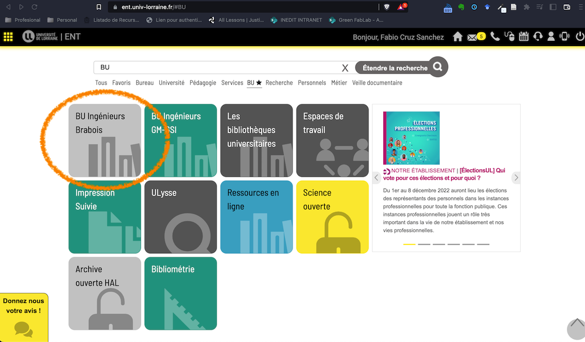
```

[https://ent.univ-lorraine.fr/#BU](https://ent.univ-lorraine.fr/#BU) -> BU Ingénieurs Brabois

---
## Connecting to "the ENT "Ressource online"

```{r}
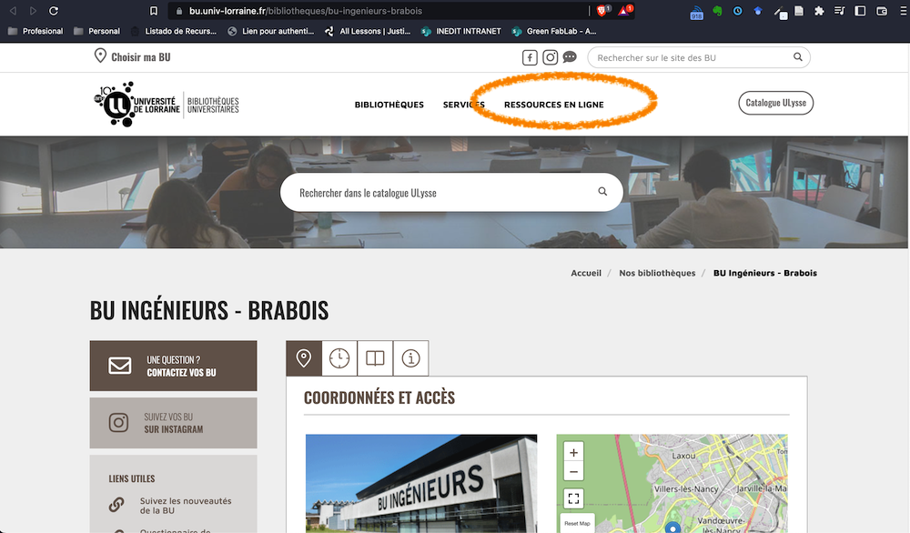
```

---

## Look for Web Of Science database

```{r, }
knitr::include_graphics("figures/04.png")
```


---

## Web of Science: Simple research mode

```{r, }

```

---

## Web of Science: Go for a Advance research

```{r}
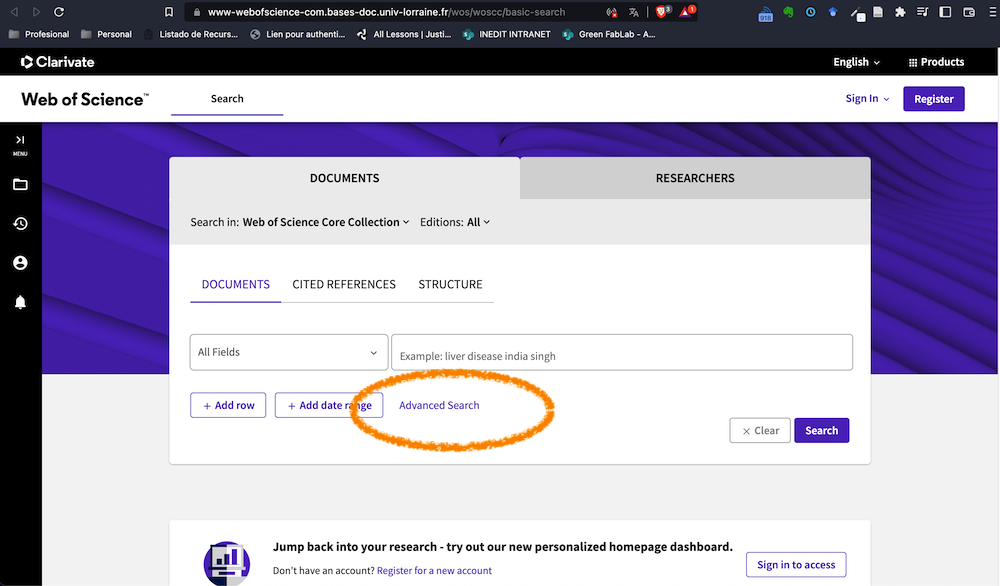
```

---

## Web of Science: Add you search query

```{r}
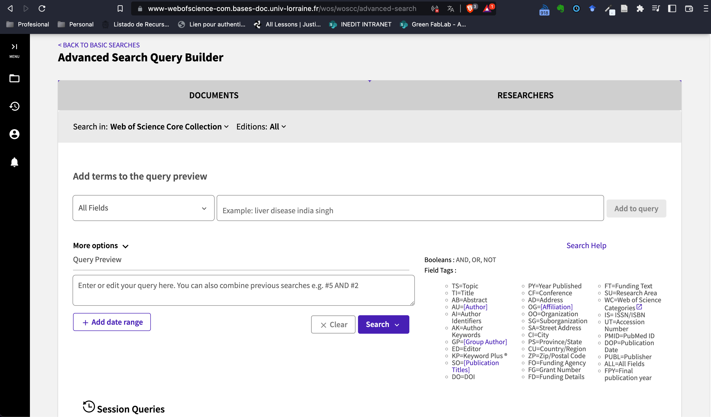
```

Remember the:  **Topic + Subject + Problem**

---

## Web of Science: Use `Topic` filter

```{r, }

```

But, take a look of the other type of searches 


---

# Outline


1. Connect to the databases of the UL
2. Web of Science / Clarivate
3. Vosviewer


---


class: middle

# 3. Vosviewer software

<br>
[Download at https://www.vosviewer.com/](https://www.vosviewer.com/)

---


## Add data 

```{r}
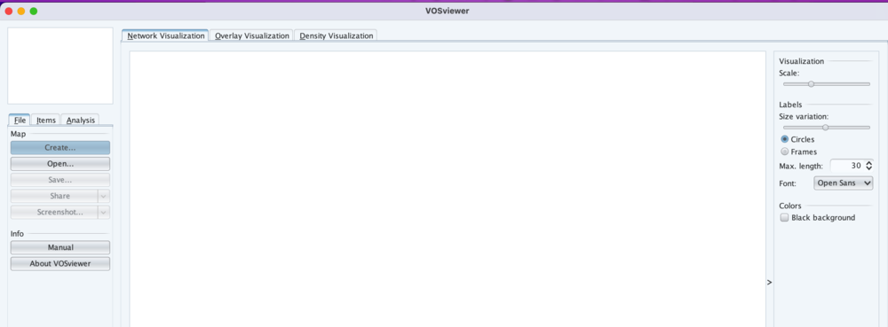
```

---

## Add data 

```{r}
knitr::include_graphics("figures/vos/02.png")
```

---


```{r}
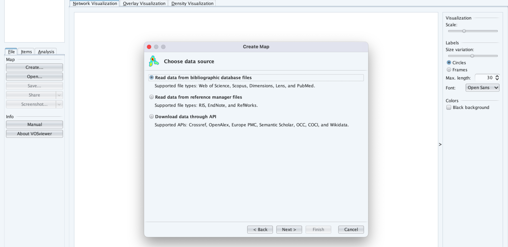
```


---


```{r}
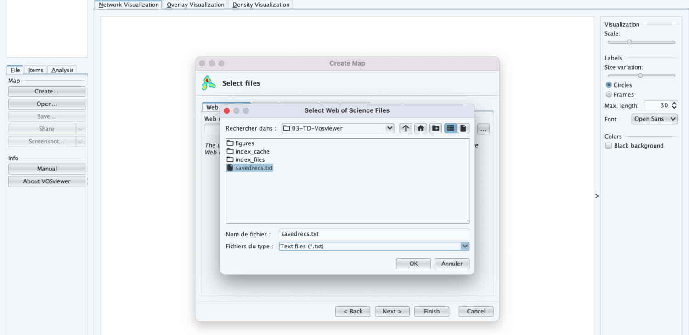
```


---

```{r}
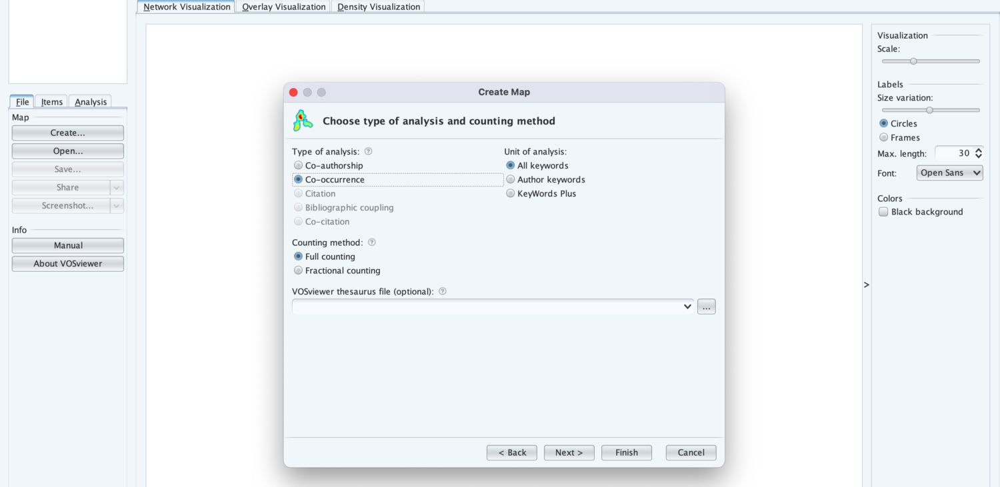
```


---

```{r}
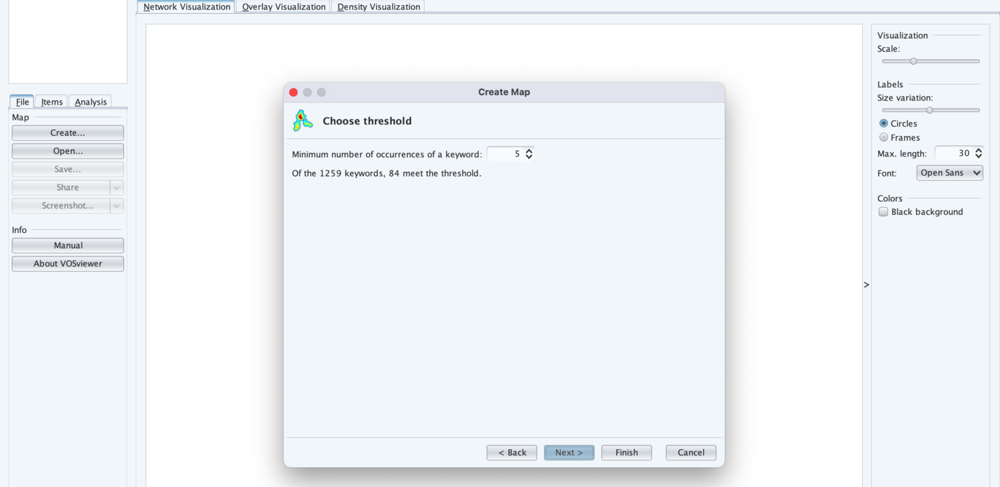
```


---

```{r}
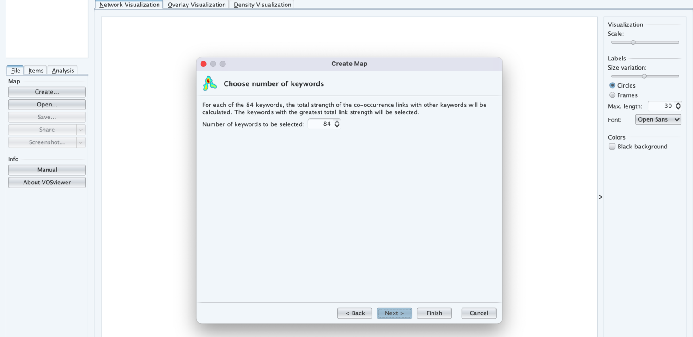
```


---

```{r}
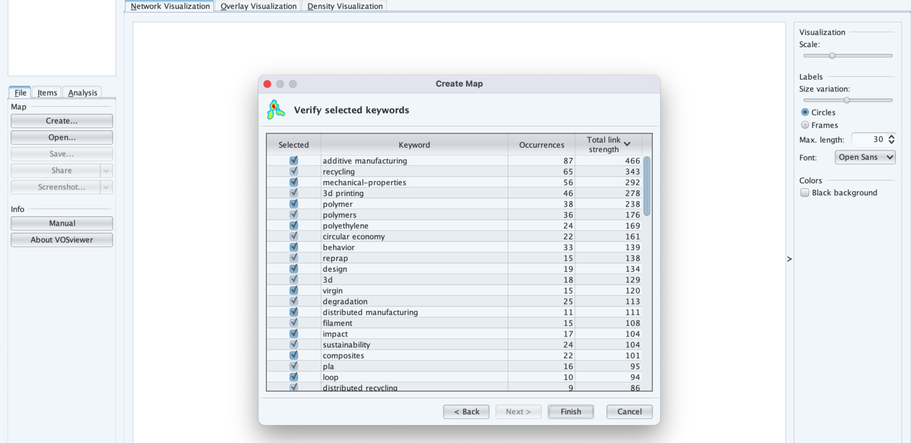
```


---

## Network Visualitation

```{r}
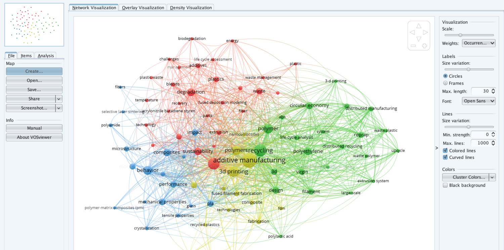
```

---


## Overlay Visualitation

```{r}
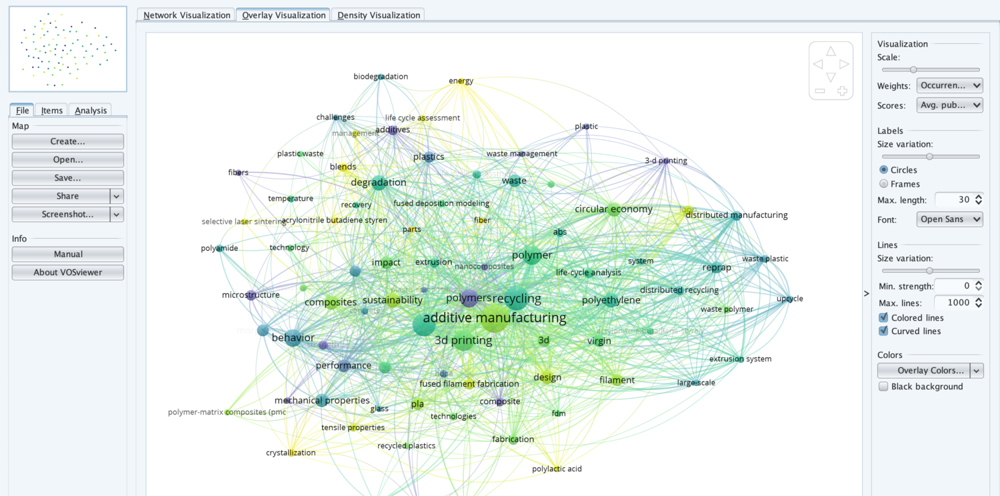
```

---

## Overlay Visualitation: Selecting the node

```{r}
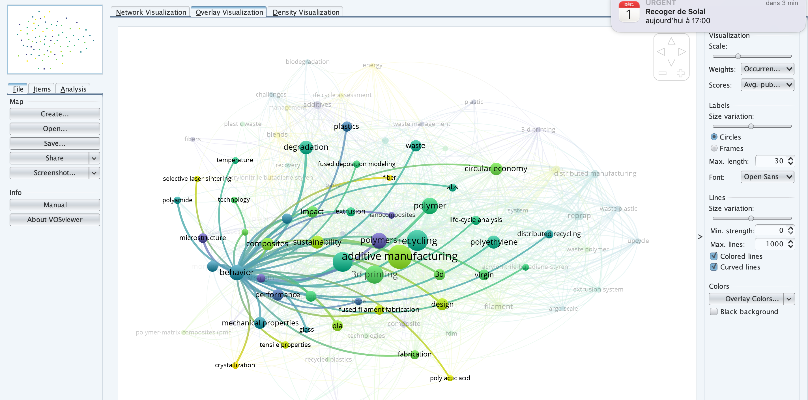
```


---


## Density Visualitation

```{r}
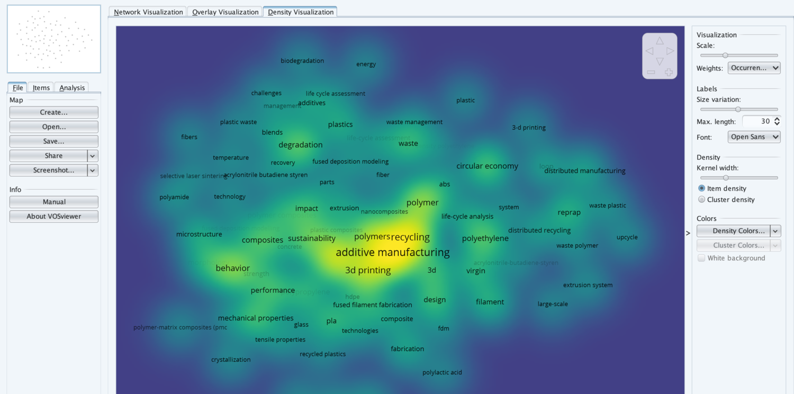
```


---
