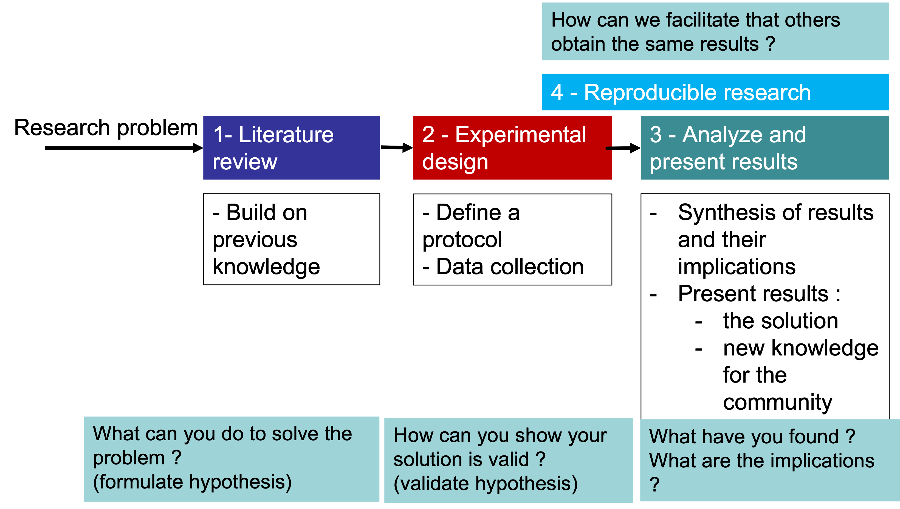
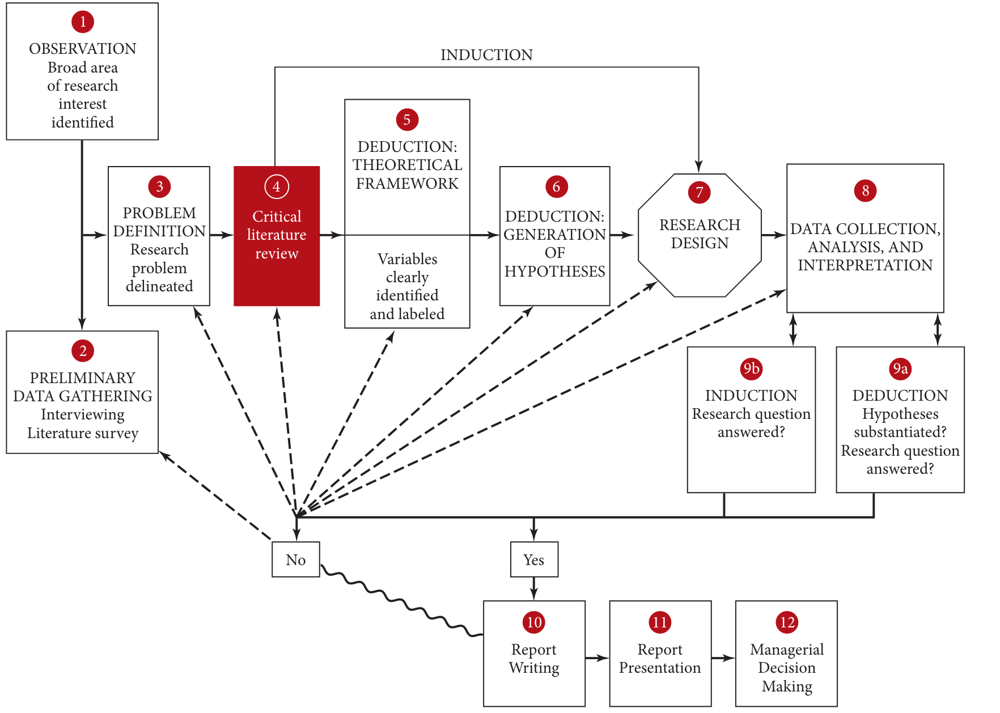

```{r setup, include=FALSE}
# Load packages -----
library(tidyverse)
library(xaringanExtra)
library(xaringanthemer)
library(fontawesome)
library(here)
library(vembedr)
library(countdown)
#library(xaringanBuilder)

#source(here("xaringan-themer.R"))

options(htmltools.dir.version = FALSE)
knitr::opts_chunk$set(
  fig.width=9, fig.height=3.5, fig.retina=3,
  out.width = "80%",
  cache = FALSE,
  echo = FALSE,
  message = FALSE, 
  warning = FALSE,
  hiline = TRUE,
  fig.align='center'
)


# Link for the Figures
URL = c('https://raw.githubusercontent.com/fabbiocrux/Figures/main/')


```


class: title-slide, center, bottom

#  `r rmarkdown::metadata$title`
##  `r rmarkdown::metadata$subtitle`
<br>

.pull-left[

```{r, out.width = '80%', fig.align='center'}

```
]

.pull-right[
### `r fa("comment", fill = "steelblue")` `r rmarkdown::metadata$author`
  `r paste0("Nancy ",  format(Sys.time(), '%d %B, %Y'))`


```{r, out.width="100%", fig.align='center'}
#knitr::include_graphics(paste0(URL, 'Logos/UL-ENSGSI-ERPI.svg'))
``` 

]

---


# Outline

1. .bg-yellow[Mental model of the research development]
2. Reading an Article - Part I
3. Nature of Research Vs. Approaches of the Researcher

---

## Research process

```{r, out.width='90%'}

```


---

## Mental model for the research development?

```{r, out.width='80%'}
knitr::include_graphics("figures/Research-conceptualization-00.jpg")
```

---

exclude: true

## Mental model for the research development?

```{r, out.width='70%'}

```

---

class: top, left
background-image: url("figures/Paper-Alex-01.jpg")
background-position: 50% 70%
background-size: 55%


## What is a Research Paper?


---

class: top, left
background-image: url("figures/Paper-Alex-02.png")
background-position: 90% 70%
background-size: 45%

## What is a Research Paper?

.pull-left[

- .bg-yellow[Title]
- .bg-yellow[Abstract]
- .bg-yellow[Introduction]
- Literature review
- Methodology
- Results
- Discussion
- .bg-yellow[Conclusion]
- References


**Méthode AIC**

]

---

## AIC reading method

<br>
For screening read .bg-yellow[**Title, Journal, keywords and Abstract**] 

For detailed synthesis use **AIC**
<br>
<br>

### .bg-green[Abstract → Summary of the paper]

### Introduction → Context of problem and research, gap, summary of what is done

### Conclusions → Summary of results and importance of results given the context.

---
class: middle

## The abstract

> The minimal viable product of a research.


---

class: top, left
background-image: url("figures/Paper-Ferney-00.jpg")
background-position: 90% 55%
background-size: 70%


## Exemple 1 

---

class: top, left
background-image: url("figures/Paper-Ferney-01.jpg")
background-position: 90% 55%
background-size: 70%

## Exemple 1 


.pull-left-1[

What’s the topic?

What's the problem?

Is it important? 

What’s the research question?

What is the <br> purpose ?

Implications <br> for future ?

.footnote[
Source: http://doi.wiley.com/10.1111/caim.12301]

]

---

class: top, left
background-image: url("figures/Paper-Sandra.png")
background-position: 90% 55%
background-size: 70%


## Exemple 2 


.pull-left-1[

What’s the topic?

What's the problem?

Is it important? 

What’s the research question?

What is the <br> purpose ?

Implications <br> for future ?


.footnote[
Source: https://doi.org/10.1016/j.eiar.2022.106911]

]


---
class: top, left
background-image: url("figures/Paper-Alex.png")
background-position: 90% 55%
background-size: 70%


## Exemple 3  


.pull-left-1[

What’s the topic?

What's the problem?

Is it important? 

What’s the research question?

What is the <br> purpose ?

Implications <br> for future ?


]

---

## Mental model when reading an abstract 

1. Topic
1. Problem
1. Research Gap
1. Hypothesis
1. Methodology
1. Results
1. Implications for the future

---

class: top, left
background-image: url("figures/Ratatouille-paper.png")
background-position: 100% 10%
background-size: 70%


```{r echo=FALSE}
countdown(minutes = 5, font_size = "2.5em", color_background="#AED6F1")
```


## Your turn !


.pull-left-1[

What’s the topic?

What's the problem?

Is it important? 

What’s the research question?

What is the <br> purpose ?

Implications <br> for future ?


]

.footnote[
Source: Leone, L. The Ratatouille paradox. An inductive study of creativity in haute cuisine. Technovation (2018) https://doi.org/10.1016/j.technovation.2018.11.003]

---
class: title-slide, center, bottom

#  `r rmarkdown::metadata$title`

## Questions?
<br>

.pull-left[

```{r, out.width = '80%', fig.align='center'}

```
]

.pull-right[
### `r fa("comment", fill = "steelblue")` `r rmarkdown::metadata$author`
`r rmarkdown::metadata$subtitle` |  `r paste0("Nancy ",  format(Sys.time(), '%d %B, %Y'))`


```{r, out.width="100%", fig.align='center'}
#knitr::include_graphics(paste0(URL, 'Logos/UL-ENSGSI-ERPI.svg'))
``` 

]

