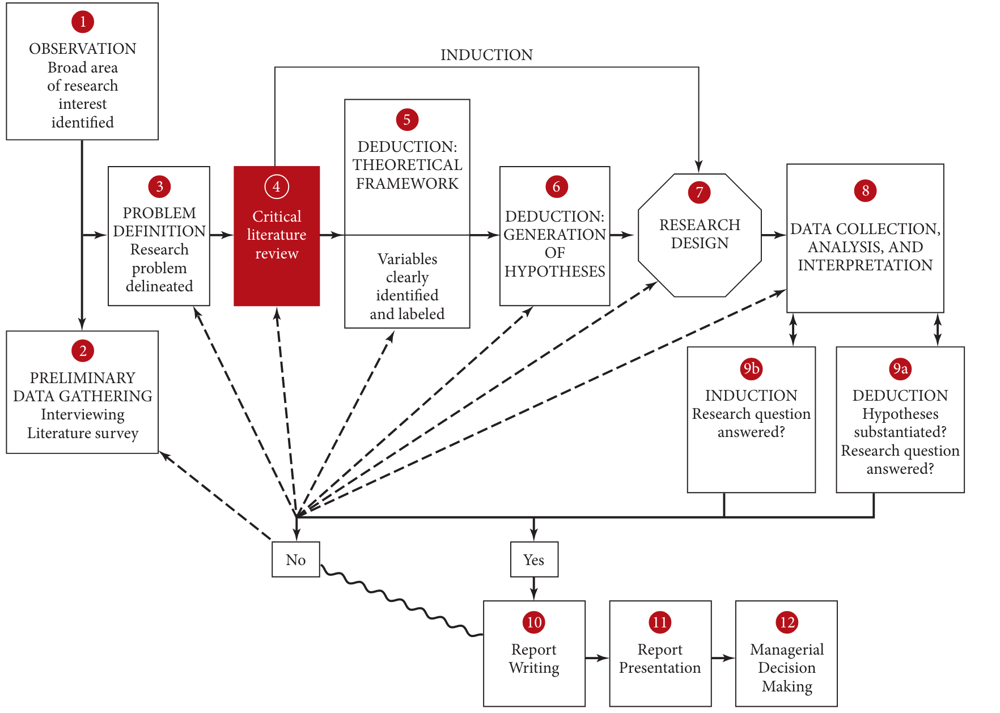

```{r setup, include=FALSE}
# Load packages -----
library(tidyverse)
library(xaringanExtra)
library(xaringanthemer)
library(fontawesome)
library(here)
library(vembedr)
#library(xaringanBuilder)

#source(here("xaringan-themer.R"))

options(htmltools.dir.version = FALSE)
knitr::opts_chunk$set(
  fig.width=9, fig.height=3.5, fig.retina=3,
  out.width = "90%",
  cache = FALSE,
  echo = FALSE,
  message = FALSE, 
  warning = FALSE,
  hiline = TRUE,
  fig.align='center'
)


# Link for the Figures
URL = c('https://raw.githubusercontent.com/fabbiocrux/Figures/main/')


```


class: title-slide, center, bottom

#  `r rmarkdown::metadata$title`
##  `r rmarkdown::metadata$subtitle`
<br>

.pull-left[

```{r, out.width = '80%', fig.align='center'}

```
]

.pull-right[
### `r fa("comment", fill = "steelblue")` `r rmarkdown::metadata$author`
  `r paste0("Nancy ",  format(Sys.time(), '%d %B, %Y'))`


```{r, out.width="100%", fig.align='center'}
#knitr::include_graphics(paste0(URL, 'Logos/UL-ENSGSI-ERPI.svg'))
``` 

]

---

## Learning objectives of the course

1. Have a mental model to understand research development.
2. Clearly identify the concept of research protocol

---

## Mental model for the research development?

```{r, out.width='80%'}
knitr::include_graphics("figures/Research-conceptualization-00.jpg")
```

---

## Mental model for the research development?

```{r, out.width='70%'}

```

---


# NAture of the Research

NAture of Vs. Approaches
<b>

|| Quantitative| Qualitative| Mixed |
|----------|---|---|----|
| Exploratory | | | |
| Descriptive | | | |
| Causal | | | |

---

## Exploratory Research


---

## Descriptive Research

---

## Causal Research


---

class: middle 

# Research approaches 


---

# Quantitative


---

# Qualitative

---

## Research design: Case studies

.pull-left[

- Collecting information of a specific object, event or activity, such as a particular business unit or organization.

- To obtain a clear picture of a problem one must examine the real‐life situation from various angles and perspectives using multiple methods of data collection. 

- Useful for studying different organizations (historical records, interviews etc). 

]


---

## Research design: Ethnography 

.pull-left-2[
 - The researcher *"closely observes, records, and engages in the daily life of another culture [...] and then writes accounts of this culture, emphasizing descriptive detail"*.
 
-  Immersion in the particular culture of the social group. Observing behavior [listening, asking questions]. 
   
- Aims to generate an understanding of the culture and behavior of a social group from an "insider’s point of view". 

> e.g. Ethnography of virtual communities, understanding why people behave a certain way
]

---

## Research design: Action research

- Research strategy aimed at effecting planned changes. 
- A tentative problem solution is implemented, with the knowledge that there may be unintended consequences. 
- The effects are then evaluated, defined, and diagnosed, and the research continues on an ongoing basis until the problem is fully resolved. 

> Linked to change management, interesting when for modifying a practice in action (teachers)


---

## Research design: Action research


```{r, out.width='75%'}
knitr::include_graphics("figures/Action-research-01.png")
```


---

## Research design: Action research

```{r, out.width='75%'}

```

---

## Research design: Experiments

- To study causal relationships between variables. A->B

> e.g: A “reward system”, to establish whether (and to what extent) this change will produce a change in “productivity”. Employees might be assigned to two groups after a certain time we are able to determine whether the productivity of the two groups is different after the treatment. 


---


