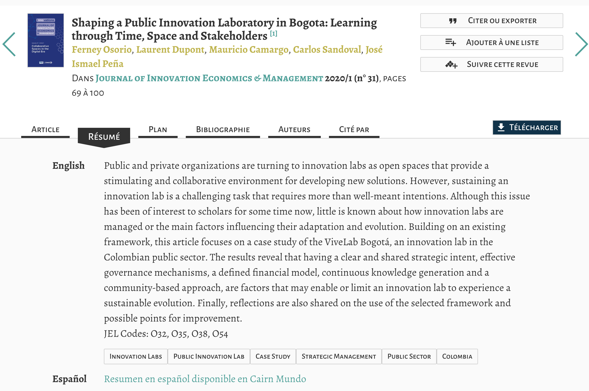
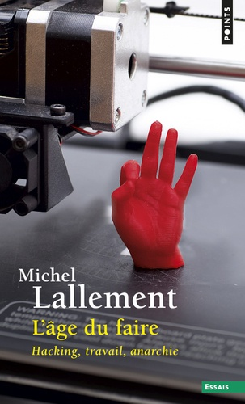
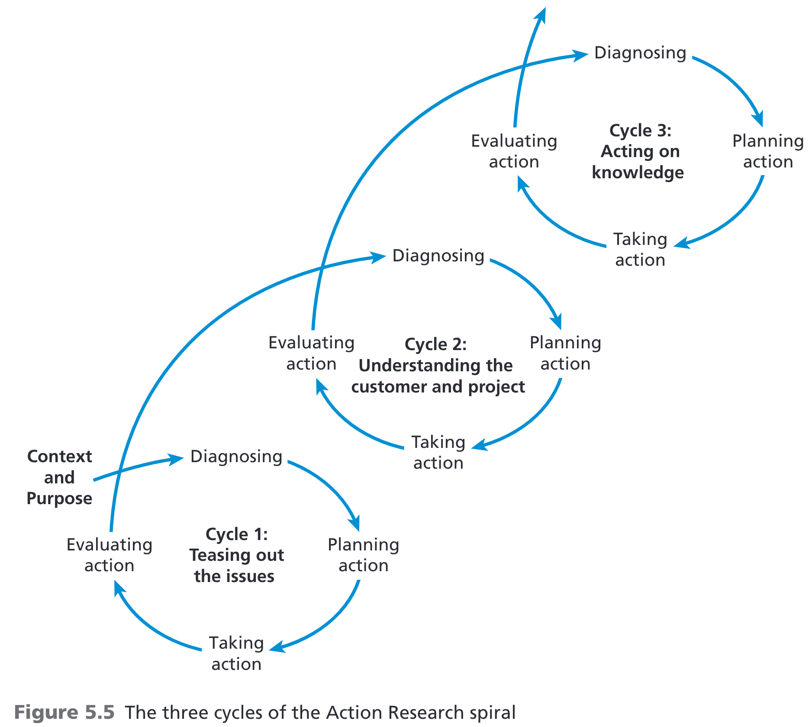
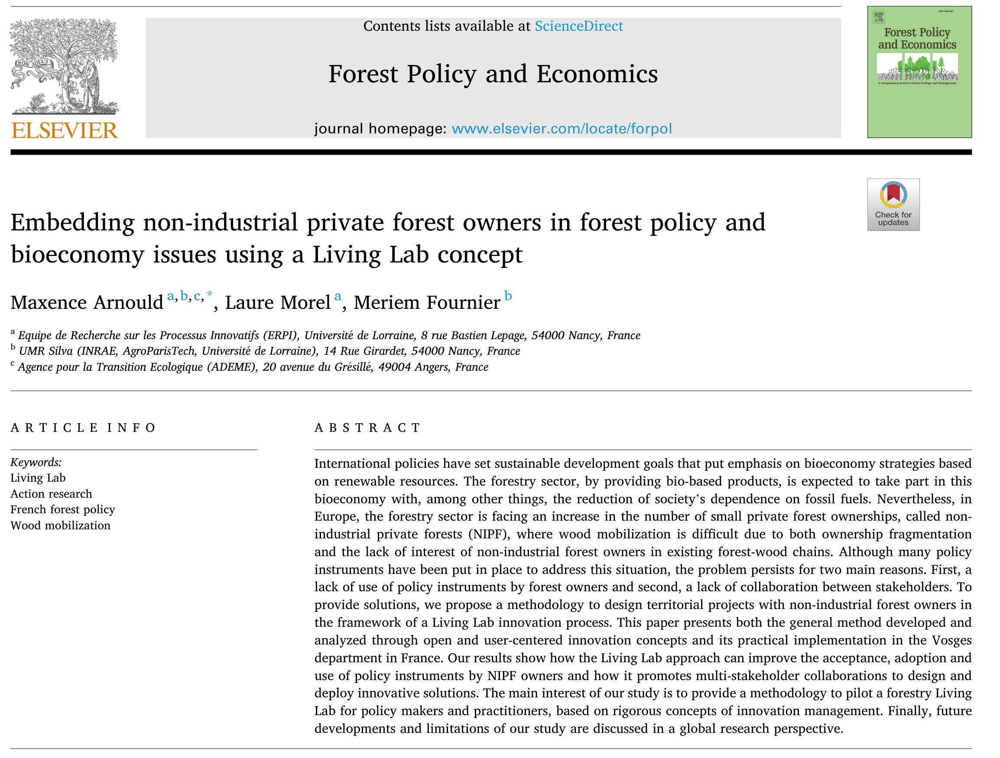
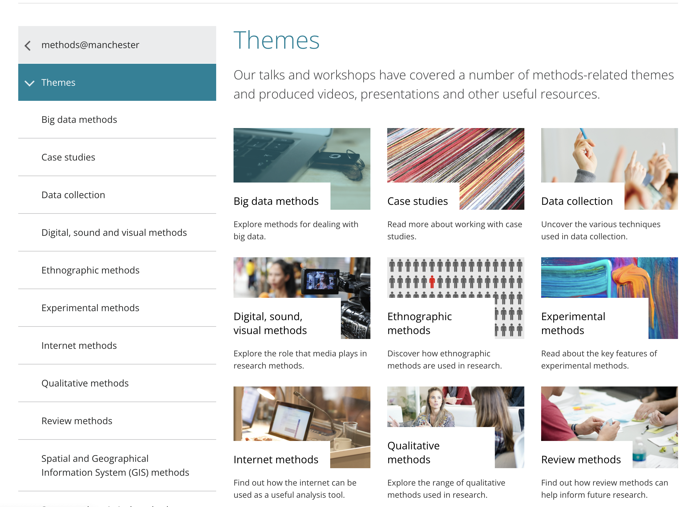

```{r setup, include=FALSE}
# Load packages -----
library(tidyverse)
library(xaringanExtra)
library(xaringanthemer)
library(fontawesome)
library(here)
library(vembedr)
#library(xaringanBuilder)

#source(here("xaringan-themer.R"))

options(htmltools.dir.version = FALSE)
knitr::opts_chunk$set(
  fig.width=9, fig.height=3.5, fig.retina=3,
  out.width = "90%",
  cache = FALSE,
  echo = FALSE,
  message = FALSE, 
  warning = FALSE,
  hiline = TRUE,
  fig.align='center'
)


# Link for the Figures
URL = c('https://raw.githubusercontent.com/fabbiocrux/Figures/main/')

xaringanExtra::use_xaringan_extra(c("share_again"))

```


class: title-slide, center, bottom

#  `r rmarkdown::metadata$title`
##  `r rmarkdown::metadata$subtitle`
<br>

.pull-left[

```{r, out.width = '80%', fig.align='center'}

```
]

.pull-right[
### `r fa("comment", fill = "steelblue")` `r rmarkdown::metadata$author`
  `r paste0("Nancy ",  format(Sys.time(), '%d %B, %Y'))`


```{r, out.width="100%", fig.align='center'}
#knitr::include_graphics(paste0(URL, 'Logos/UL-ENSGSI-ERPI.svg'))
``` 

]

---

## Learning objectives

1. Have a mental model to understand research development.
2. Clearly identify the concept of research protocol

---

## Mental model for the research development?

```{r, out.width='80%'}
knitr::include_graphics("figures/Research-conceptualization-00.jpg")
```

---

class: top, left
background-image: url("figures/Research-questions.png")
background-position: 100% 50%
background-size: 65%


## Everything start with a good research question

.pull-left-1[

- Descriptive:

‘What’, ‘When’, ‘Where’, ‘Who’ or ‘How’ 

.tiny[(e.g. ‘What percentage of coachees <br> report that coaching helped them <br> with a problem they experienced?]


- Explanatory ('Why'?)

.tiny[(e.g. ‘Why did 65% of coachees report that coaching helped them with a problem they experienced?’)]


]

.footnote[
Source: Rojon, C. & Saunders, M. N. K. [Formulating a convincing rationale for a research study](https://doi.org/10.1080/17521882.2011.648335). Coaching: An International Journal of Theory, Research and Practice 5, 55–61 (2012).

]


---

exclude: true 

## Mental model for the research development?

```{r, out.width='70%'}
knitr::include_graphics("figures/Research-conceptualization-01.png")
```

---

class: middle

# What kind of type of research can we do?

---

class: top, left
background-image: url("figures/Nature-research-00.png")
background-position: 100% 50%
background-size: 65%


## Nature of the Research

.pull-left-1[
- .bg-yellow[**Basic Vs. Applied**]
]


.footnote[Source: 1. Saunders, M. N. K., Lewis, P. & Thornhill, A. Research methods for business students. (Pearson, 2019).
]
---

class: top, left
background-position: 100% 50%
background-size: 65%


## Nature of the Research


- Basic Vs. Applied
- .bg-yellow[**Exploratory**]

<br>

a) not much is known about a particular phenomenon; 

b) existing research results are unclear or suffer from serious limitations; 

c) the topic is highly complex; or 

d) there is not enough theory available to guide the development of a theoretical framework


.footnote[Source: 1. Saunders, M. N. K., Lewis, P. & Thornhill, A. Research methods for business students. (Pearson, 2019).
]

---

class: top, left
background-position: 100% 50%
background-size: 65%


## Nature of the Research


- Basic Vs. Applied
- Exploratory
- .bg-yellow[Descriptive]

<br>

a) obtain data that describes the topic of interest

b) Understand the characteristics of a group in a given situation

c) Think systematically about aspects in a given situation


.footnote[Source: 1. Saunders, M. N. K., Lewis, P. & Thornhill, A. Research methods for business students. (Pearson, 2019).
]

---

class: top, left
background-position: 100% 50%
background-size: 65%


## Nature of the Research


- Basic Vs. Applied
- Exploratory
- Descriptive
- .bg-yellow[Causal]

<br>

a) whether or not A causes change to B

b) X causes variable Y. So, when variable X is removed or altered in some way, problem Y is solved


.footnote[Source: 1. Saunders, M. N. K., Lewis, P. & Thornhill, A. Research methods for business students. (Pearson, 2019).
]

---

class: top, left
background-image: url("figures/Research-design.png")
background-position: 50% 10%
background-size: 90%


.footnote[Source: Sreejesh, S., Mohapatra, S., & Anusree, M. R. (2013). Business Research Design: Exploratory, Descriptive and Causal Designs. Business Research Methods]

---

class: middle, left
background-image: url("figures/QQM.png")
background-position: 90% 50%
background-size: 63%


## Approaches of the <br> Research design

.pull-left-1[
Creswell, J. W.: Research Design: Qualitative, Quantitative and
Mixed Methods Approaches, 2nd edition, Sage Publications, Inc,
California, 246 pp., 2003.

]

---

## Limits of the Research design

```{r, out.width='75%'}
knitr::include_graphics("figures/QQ-limits.png")
```


---

class: middle, left
background-image: url("figures/Research-onion.png")
background-position: 100% 5%
background-size: 60%


## The Research Onion


.pull-left-1[
[The main challengue in Research <br> is connect all the 'coherent' dots in this figure to create a path !!!](https://www.aesanetwork.org/research-onion-a-systematic-approach-to-designing-research-methodology/#:~:text=Research%20onion%20is%20one%20such,which%20constitute%20our%20research%20philosophy)
]

.footnote[Saunders, M. N. K., Lewis, P. & Thornhill, A. Research methods for business students. (Pearson, 2019)]
---

class: middle

# Some Examples methodologies

---

## Research design: Case studies

.pull-left[

- Collecting information of a specific object, event or activity, such as a particular business unit or organization.

- To obtain a clear picture of a problem one must examine the real‐life situation from various angles and perspectives using multiple methods of data collection. 

- Useful for studying different organizations (historical records, interviews etc). 

]

.pull-right[

```{r, out.width='100%'}

```

.footnote[Osorio, F., Dupont, L., Camargo, M., Sandoval, C. & Peña, J. I. Shaping a Public Innovation Laboratory in Bogota: Learning through Time, Space and Stakeholders. Journal of Innovation Economics & Management 31, 69–100 (2020).
]

]


---

## Research design: Ethnography 

.pull-left-2[
 - The researcher *"closely observes, records, and engages in the daily life of another culture [...] and then writes accounts of this culture, emphasizing descriptive detail"*.
 
-  Immersion in the particular culture of the social group. Observing behavior [listening, asking questions]. 
   
- Aims to generate an understanding of the culture and behavior of a social group from an "insider’s point of view". 

> e.g. Ethnography of virtual communities, understanding why people behave a certain way
]

.pull-right-1[
```{r, out.width='90%'}

```

]
---

## Research design: Action research

.pull-left[
- Research strategy aimed at effecting planned changes. 
- A tentative problem solution is implemented, with the knowledge that there may be unintended consequences. 
- The effects are then evaluated, defined, and diagnosed, and the research continues on an ongoing basis until the problem is fully resolved. 

> Linked to change management, interesting when for modifying a practice in action

]


.pull-right[
```{r, out.width='100%'}

```

]


---

## Research design: Action research

.pull-left[
- Research strategy aimed at effecting planned changes. 
- A tentative problem solution is implemented, with the knowledge that there may be unintended consequences. 
- The effects are then evaluated, defined, and diagnosed, and the research continues on an ongoing basis until the problem is fully resolved. 

> Linked to change management, interesting when for modifying a practice in action

]

.pull-right[
```{r, out.width='100%'}

```

.footnote[Arnould, M., Morel, L. & Fournier, M. Embedding non-industrial private forest owners in forest policy and bioeconomy issues using a Living Lab concept. Forest Policy and Economics 139, 102716 (2022).
]
]


---

## Research design: Action research


```{r, out.width='75%'}

```


---

## Research design: Action research

```{r, out.width='75%'}
knitr::include_graphics("figures/Action-research-02.png")
```

---

## Research design: Experiments

- To study causal relationships between variables A->B

```{r, out.width='80%'}
knitr::include_graphics(paste0(URL, "Metodologies/Master-recherche/Master-00.png"))
```

.footnote[Cruz Sanchez, F. A., Boudaoud, H., Muller, L. & Camargo, M. Towards a standard experimental protocol for open source additive manufacturing. Virtual and Physical Prototyping 9, 151–167 (2014).
]

---

# More details of useful methodologies

```{r, out.width='55%'}

```

.pull-left[
University of Manchester: https://www.methods.manchester.ac.uk/themes/
]


---

class: title-slide, center, bottom

#  `r rmarkdown::metadata$title`

## Questions?
<br>

.pull-left[

```{r, out.width = '80%', fig.align='center'}

```
]

.pull-right[
### `r fa("comment", fill = "steelblue")` `r rmarkdown::metadata$author`
`r rmarkdown::metadata$subtitle` |  `r paste0("Nancy ",  format(Sys.time(), '%d %B, %Y'))`


```{r, out.width="100%", fig.align='center'}
#knitr::include_graphics(paste0(URL, 'Logos/UL-ENSGSI-ERPI.svg'))
``` 

]

