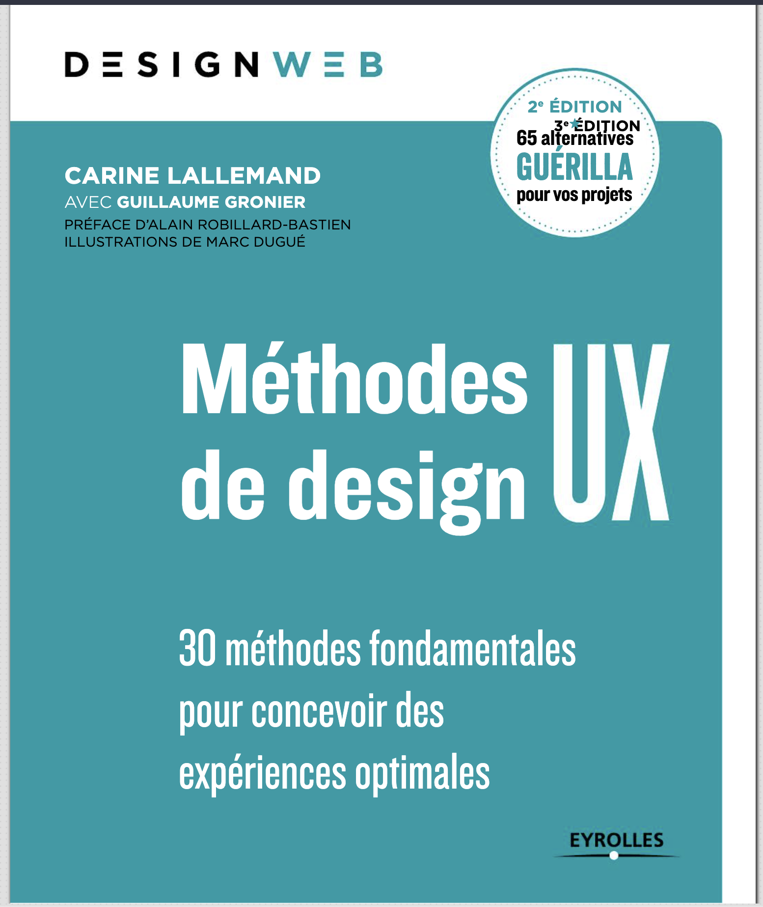
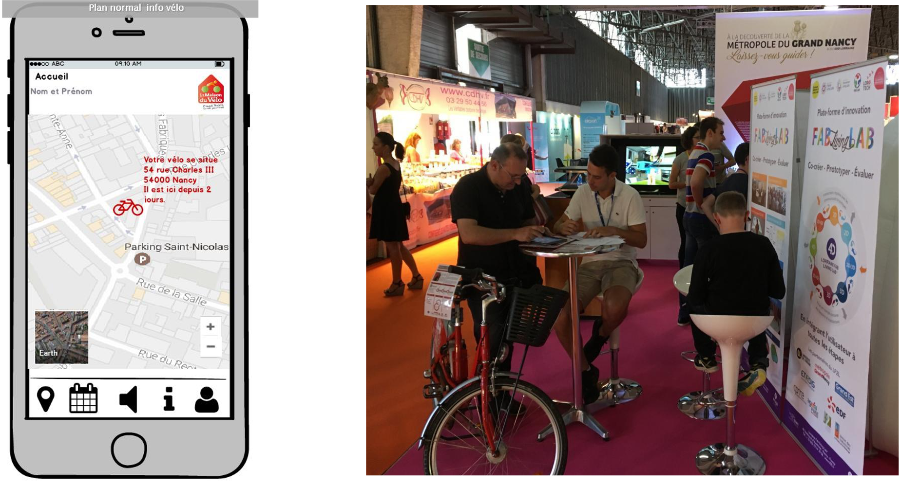
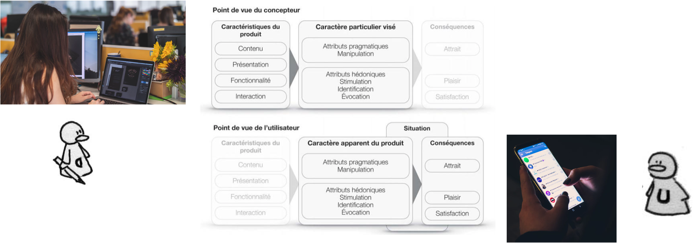
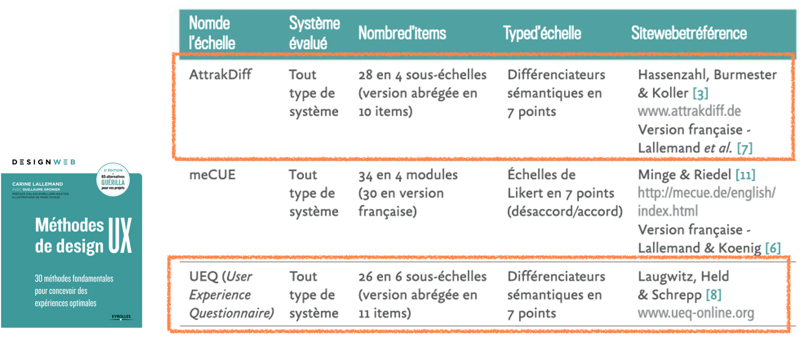
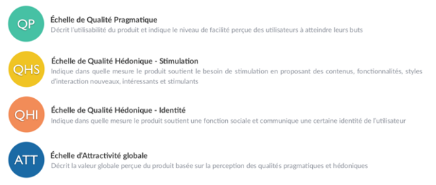
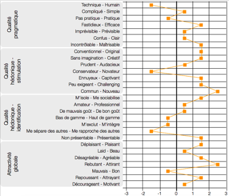
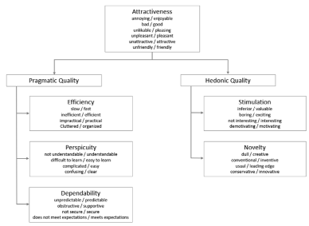
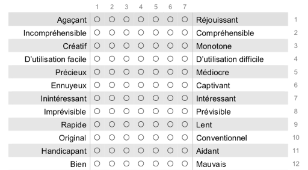
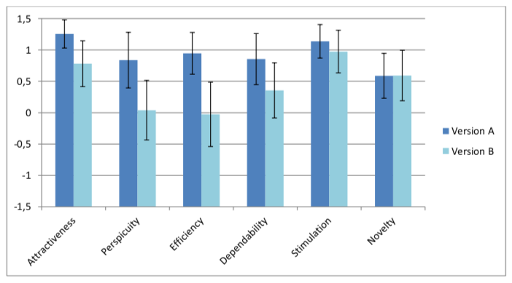
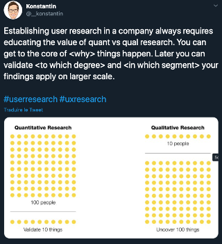

```{r setup, include=FALSE}
# Load packages -----
library(tidyverse)
library(xaringanExtra)
library(xaringanthemer)
library(fontawesome)
library(here)
library(vembedr)
#library(xaringanBuilder)

#source(here("xaringan-themer.R"))

options(htmltools.dir.version = FALSE)
knitr::opts_chunk$set(
  fig.width=9, fig.height=3.5, fig.retina=3,
  cache = FALSE,
  echo = FALSE,
  message = FALSE, 
  warning = FALSE,
  hiline = TRUE,
  fig.align='center',
  out.width = '75%' 
)


# Link for the Figures
URL = c('https://raw.githubusercontent.com/fabbiocrux/Figures/main/')

xaringanExtra::use_xaringan_extra(c("share_again"))

```


class: title-slide, center, bottom

#  `r rmarkdown::metadata$title`

<br>

.pull-left[

```{r, out.width = '50%', fig.align='center'}

```
]

.pull-right[
### `r fa("comment", fill = "steelblue")` `r rmarkdown::metadata$author`
`r rmarkdown::metadata$subtitle` |  `r paste0("Nancy ",  format(Sys.time(), '%d %B, %Y'))`


```{r, out.width="100%", fig.align='center'}
knitr::include_graphics(paste0(URL, 'Logos/UL-ENSGSI-ERPI.svg'))
``` 

]


---

# Outline

1. .bg-yellow[Theoretical Models]
2. Support for test protocols
3. In practice

---

## **U**ser E**X**perience

+ How is the UX of the web site perceived ?
+ what are the key factors for improvement ?


```{r, out.width='70%'}

```

---

## UX theory

Confrontation of Perspectives:

- Qualités pragmatiques
- Qualités hédoniques

<br>
```{r, out.width='100%'}

```

---

## UX Tools & Scales

- Standardized measures (reliability)
- Single assessment, before/after, benchmark

<br>
```{r, out.width='100%'}

```

---
class: middle

# AttrakDiff

---
## Attrakdiff scale

- 28 items  

```{r, out.width='100%'}

```

[See the complete Documents here](https://carinelallemand.files.wordpress.com/2015/09/version-franc3a7aise-attrakdiff_lallemand_2015.pdf)


---

## Attrakdiff scale

Résultats attendus:
<br>

```{r, out.width='50%'}

```

---

class: middle

# User Experience Questionnaire - UEQ

---
## Méthode  UEQ


.pull-left-1[
- 26 items
[Handbook of UEQ](https://www.ueq-online.org/Material/Handbook.pdf)
]
.pull-right-2[
```{r, out.width='100%'}

```

]

---

## Méthode  UEQ

```{r, out.width='70%'}

```

---

## Méthode  UEQ

```{r, out.width='70%'}

```

---

## User testing in one Tweet 

Qualitative Vs. Quantitative data

```{r, out.width='40%'}

```

---

class: middle

# Outline

1. Theoretical Models
2. Support for test protocols
3. .bg-yellow[En pratique]

---

class: middle

## Mise en situation:

Vous faites partie du département R&D d’une entreprise. Celle-ci a créé une application web pour supporter le processus d’innovation et collecter les idées. Ils ont une version fonctionnelle de l’application. Ils aimeraient évaluer l’expérience utilisateur de l’outil et collecter des informations qualitatives pour améliorer l’expérience des versions futur de l’outil. En tant qu’UX researcher dans ce département R&D, vous devez appliquer une démarche structurée de “test utilisateur” et basée sur des questionnaires standard pour collecter les données et proposer des pistes d’amélioration.


