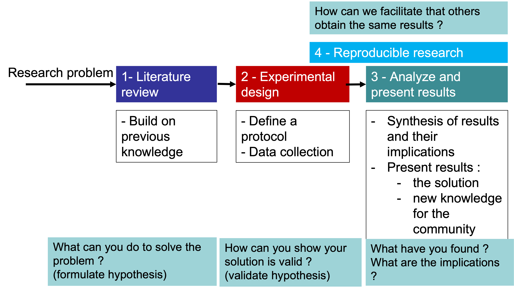
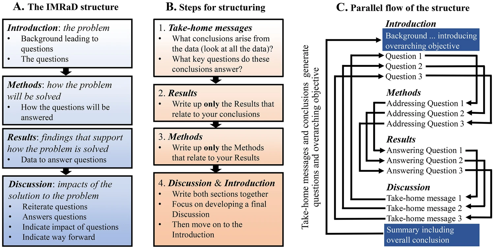

```{r setup, include=FALSE}
# Load packages -----
library(tidyverse)
library(xaringanExtra)
library(xaringanthemer)
library(fontawesome)
library(here)
library(vembedr)
library(countdown)
#library(xaringanBuilder)

#source(here("xaringan-themer.R"))

options(htmltools.dir.version = FALSE)
knitr::opts_chunk$set(
  fig.width=9, fig.height=3.5, fig.retina=3,
  out.width = "80%",
  cache = FALSE,
  echo = FALSE,
  message = FALSE, 
  warning = FALSE,
  hiline = TRUE,
  fig.align='center'
)


# Link for the Figures
URL = c('https://raw.githubusercontent.com/fabbiocrux/Figures/main/')

xaringanExtra::use_xaringan_extra(c("share_again"))

```


class: title-slide, center, bottom

#  `r rmarkdown::metadata$title`
##  `r rmarkdown::metadata$subtitle`
<br>

.pull-left[

```{r, out.width = '100%', fig.align='center'}
knitr::include_graphics("figures/Writing.jpg")
```
]

.pull-right[
### `r fa("comment", fill = "steelblue")` `r rmarkdown::metadata$author`
  `r paste0("Nancy ",  format(Sys.time(), '%d %B, %Y'))`


```{r, out.width="100%", fig.align='center'}
knitr::include_graphics(paste0(URL, 'Logos/UL-ENSGSI-ERPI.svg'))
``` 

]

---


# Outline

1. .bg-yellow[Understanding the Paper structure]
2. Structuring your paper

---

## Research process

```{r, out.width='90%'}

```

---


class: top, left
background-image: url("figures/Paper-Alex-02.png")
background-position: 90% 70%
background-size: 45%

## What is a Research Paper?

.pull-left[

- .bg-yellow[Title] ✅
- .bg-yellow[Abstract] ✅
- .bg-yellow[Introduction]
- Literature review
- Methodology
- Results
- Discussion
- .bg-yellow[Conclusion]s
- References


**Méthode AIC**
]

---

## General Reading Grid


---

class: middle


## Example:  

.small.pull-left-1[

<br> <br> <br> 
*Haque, M. U., Dharmadasa, I., Sworna, Z. T., Rajapakse, R. N., & Ahmad, H. (2022). ."I think this is the most disruptive technology": Exploring Sentiments of ChatGPT Early Adopters using Twitter Data. arXiv preprint arXiv:2212.05856.*


https://arxiv.org/abs/2212.05856

```{r, out.width='80%'}
knitr::include_graphics("figures/ChatGPT-00.webp")
```

]

.pull-right-2[
```{r, out.width='70%'}

```

]


---

class: top, left
background-image: url("figures/Lecture-grid-00.jpg")
background-position: 85% 100%
background-size: 38%

### Before reading.. have an lecture grid in mind ❗

```{r, out.width='45%', fig.align='left'}

```

---

class: middle

## Exercise:

**Lire**: 

-  Abstract, Introduction et Conclusions de cet article


.tiny.pull-left-1[

<br> <br> <br> 
*Haque, M. U., Dharmadasa, I., Sworna, Z. T., Rajapakse, R. N., & Ahmad, H. (2022). ."I think this is the most disruptive technology": Exploring Sentiments of ChatGPT Early Adopters using Twitter Data. arXiv preprint arXiv:2212.05856.*

https://arxiv.org/abs/2212.05856


```{r echo=FALSE}
countdown(minutes = 15, font_size = "5em", color_background="#AED6F1", left='0px')
```

]

.pull-right-2[
```{r, out.width='70%'}

```

]


---

class: top, left
background-image: url("figures/ChatGPT-02.png")
background-position: 100% 50%
background-size: 70%


### Abstract


.pull-left-1[

What’s the topic?

What's the problem?

Is it important? 

What’s the research question?

What is the <br> purpose ?

Implications <br> for future ?


]

---

class: top, left
background-image: url("figures/ChatGPT-03.png")
background-position: 100% 50%
background-size: 70%

### Introduction

.pull-left-1[

Context


Focus on <br>
the Research object

Hypothesis


Presenting methods
]

---

class: top, left
background-image: url("figures/ChatGPT-05.png")
background-position: 100% 50%
background-size: 70%

### Conclusions

.pull-left-1[

Recall the Purpose


Summarise Results

Perspectives

]

---

class: middle

## Reading technique

<br>

### [1min] Screening → Title, Journal, keywords

### [5min] Profiling → Screening + Abstract

### [20min] Focusing → Profiling + Introduction + Conclusions

### [1hr] In deep → All paper

### [2-3 hr] For research → In deep + Reading Grid + References


---

## The scientific history

--

```{r, out.width='90%'}

```

.footnote[Source: 1. Montagnes, D. J. S., Montagnes, E. I. & Yang, Z. Finding your scientific story by writing backwards. Mar Life Sci Technol 4, 1–9 (2022).]


---
### Introduction


- 1er Paragraphe: établir le contexte, introduire le sujet. Il doit établir l’importance du sujet de recherche 

- 2ème : établir un lien avec la littérature existante 

- 3ème : établir clairement le “Gap to be filled”

- 4émé Expliquer comment on a traité le sujet 

- 5èmé :“Annoncer la couleur” des résultats

- Enfin : Décrire la structure de l’article 

---

## Abstract

.pull-left-1[

]
.pull-right-2[
```{r, out.width='80%'}
knitr::include_graphics("figures/Abstract-nature.jpeg")
```

]


---

## [Optionnal] Zotero + Obsidian


---

## Some web ressources for writing

- [Essay and dissertation writing skills](https://www.ox.ac.uk/students/academic/guidance/skills/essay)
