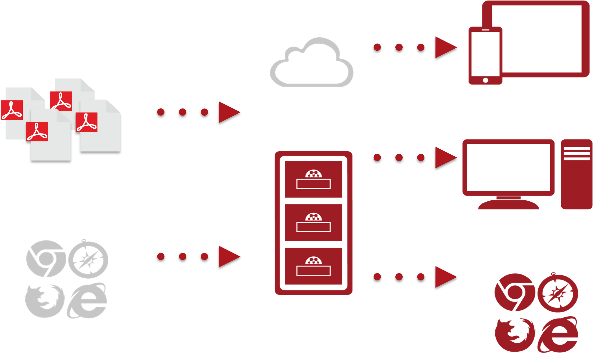

```{r setup, include=FALSE}
# Load packages -----
library(tidyverse)
library(xaringanExtra)
library(xaringanthemer)
library(fontawesome)
library(here)
library(vembedr)
library(countdown)
#library(xaringanBuilder)

#source(here("xaringan-themer.R"))

options(htmltools.dir.version = FALSE)
knitr::opts_chunk$set(
  fig.width=9, fig.height=3.5, fig.retina=3,
  out.width = "80%",
  cache = FALSE,
  echo = FALSE,
  message = FALSE, 
  warning = FALSE,
  hiline = TRUE,
  fig.align='center'
)


# Link for the Figures
URL = c('https://raw.githubusercontent.com/fabbiocrux/Figures/main/')

xaringanExtra::use_xaringan_extra(c("share_again"))

```


class: title-slide, center, bottom

#  `r rmarkdown::metadata$title`
##  `r rmarkdown::metadata$subtitle`
<br>

.pull-left[

```{r, out.width = '80%', fig.align='center'}

```
]

.pull-right[
### `r fa("comment", fill = "steelblue")` `r rmarkdown::metadata$author`
  `r paste0("Nancy ",  format(Sys.time(), '%d %B, %Y'))`


```{r, out.width="100%", fig.align='center'}
#knitr::include_graphics(paste0(URL, 'Logos/UL-ENSGSI-ERPI.svg'))
``` 

]

---

class: middle

# What do you understand by *'Academic Integrity'*?

```{r, out.width='90%'}
#knitr::include_graphics("figures/Research-process.png")
```

---

## Ethical Issues

.pull-left-2[
- **Purposely misrepresenting** the work of other authors – their viewpoints, ideas, models, findings, conclusions, interpretations, and so on. 

- **Plagiarism** – the use of another’s original words, arguments, or ideas as though they were your own, even if this is done in good faith, out of carelessness, or out of ignorance.

Both **purposely misrepresenting the work of others** and **plagiarism** are considered to be fraud.
]


---

## Plagiarism


- Using the work of others as if it were your own does not convey much respect for the efforts that other people have put into their work.

- Makes it is difficult for the reader to verify whether your claims about other authors and sources are accurate

- You are participating in a scientific debate.


---

## Common Forms of  Plagiarism : Sources not cited
### Sources .bg-yellow[not cited]


--

- 👻 .bg-grey.black["The Ghost Writer"]: The writer copies significant portions of text straight from a single source, without alteration.

--

- 🖨️ .bg-grey.black["The Photocopy"]: The writer copies significant portions of text straight from a single source, without alteration.

--

- 📜 .bg-grey.black["The Potluck Paper"]: The writer tries to disguise plagiarism by copying from several different sources, tweaking the sentences to make them fit together while retaining most of the original phrasing.

--

- 🥸 .bg-grey.black["The Poor Disguise"]: Although the writer has retained the essential content of the source, S/he has altered the paper’s appearance slightly by changing key words and phrases.


---

## Common Forms of  Plagiarism : Sources not cited
### Sources .bg-yellow[not cited]


- .bg-grey.black["The Labor of Laziness"]: Although the writer has retained the essential content of the source, S/he has altered the paper’s appearance slightly by changing key words and phrases..

--

- .bg-grey.black["The Self‐Stealer"]
The writer “borrows” generously from his or her previous work, violating policies concerning the expectation of originality adopted by most academic institutions.

---


## Common Forms of  Plagiarism 
### Sources .bg-green[**are** cited]

- .bg-grey.black[**The Forgotten Footnote**]: The writer mentions an author’s name for a source, but neglects to include specific information on the location of the material referenced.
--

- .bg-grey.black[**The Misinformer**]: The writer provides inaccurate information regarding the sources, making it impossible to find them. 


--

- .bg-grey.black[**The Too‐Perfect Paraphrase**]: The writer properly cites a source, but neglects to put in quotation marks text that has been copied word‐for‐word, or close to it. 

--

- .bg-grey.black[**The Resourceful Citer**]: The writer properly cites all sources, paraphrasing and using quotations appropriately. The catch? The paper contains almost no original work! 


---

class: top, left
background-image: url("figures/ChatGPT.jpg")
background-position: 90% 50%
background-size: 30%


## ChatGPT

```{r, fig.align='left', out.width='60%'}

```

Source: 

https://www.nature.com/articles/d41586-022-04397-7


---

class: middle

# Research reference managers (Mendeley, Zotero)

---

## Research reference managers (Mendeley, Zotero)

- allows you to organize, collaborate, discover, and to cite as you write 

```{r,  out.width='60%'}

```

---

## Research reference managers (Mendeley, Zotero)

- allows you to organize, collaborate, discover, and to cite as you write 

<br>

```{r, out.width='80%'}

```


https://www.zotero.org/


---

## [Optional] Zotero + ...

<br>

- Zotero with Notion: .tiny[https://medium.com/@anna-everett/a-technical-guide-to-setting-up-notero-zotero-notion-plugin-d467d675039b]


- Zotero with Obsidian: .tiny[https://medium.com/@alexandraphelan/an-academic-workflow-zotero-obsidian-56bf918d51ab]


- Zotero with ResearchRabbit: 
  - Research rabbit to discover 'pertinent' scientific papers: 
  
     - https://twitter.com/mushtaqbilalphd/status/1577907501248430082?lang=en
     - https://www.youtube.com/watch?v=wHBql2JncyU
     - https://www.youtube.com/watch?v=6vVcqwdpfK0 
  
  
  
  
  
