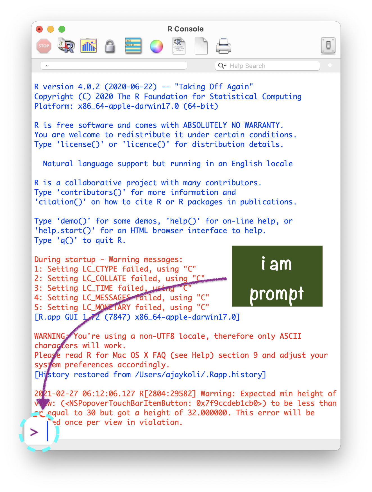

```{r packages, echo = FALSE, message=FALSE, warning=FALSE}
# Source
# source("xaringan-themer.R")

# load packages ----------------------------------------------------------------
library(tidyverse)
library(xaringanExtra)
library(xaringanthemer)
library(fontawesome)
library(here)
library(countdown)


options(htmltools.dir.version = FALSE)
knitr::opts_chunk$set(
  fig.width=9, fig.height=3.5, fig.retina=3,
  out.width = "80%",
  cache = FALSE,
  echo = FALSE,
  message = FALSE, 
  warning = FALSE,
  hiline = TRUE,
  fig.align='center'
)


# Link for the Figures
URL = c('https://raw.githubusercontent.com/fabbiocrux/Figures/main/')

#library(xaringanBuilder)
#build_pdf("index.Rmd")

# xaringanExtra
xaringanExtra::use_xaringan_extra(c("share_again",
                                    "panelset"))


xaringanExtra::use_extra_styles(hover_code_line = TRUE, mute_unhighlighted_code = TRUE)
```


---

# Modules:

1. .bg-yellow[[Basics of R & RStudio](#module1)]

1. [Data Visualisation using ggplot2](#module3)

1. [Data Wrangling using dplyr](#module4)


---

background-image: url("https://github.com/allisonhorst/stats-illustrations/raw/master/rstats-artwork/r_first_then.png")
background-size: contain

.footnote[
[Source](https://github.com/allisonhorst/stats-illustrations)
]


---

# R is FREE 

- R is a language and environment for statistical computing and graphics. (R project)
- In August 1993, designed by

.pull-left[
```{r founders-r1, out.width="80%", fig.align='center', fig.cap="Ross Ihaka <br>(New Zealand Statistician)"  }
knitr::include_graphics("https://cdn.auckland.ac.nz/aem/content/auckland/en/science/about-the-faculty/department-of-statistics/ihaka-lecture-series/_jcr_content/leftpar/imagecomponent/image.img.480.low.jpg/1561079330278.jpg")
```

]

.pull-right[
```{r founders-r2, out.width="50%",  fig.align='center', fig.cap="Robert Gentleman<br>(Canadian Statistician)"}
knitr::include_graphics("https://www.computerhope.com/people/pictures/robert_gentleman.jpg")
```

]


---


class: center

# Download R from [CRAN](https://cran.r-project.org/mirrors.html)

```{r cran, fig.align='center', out.width="80%"}
knitr::include_graphics("figures/cran.png")
```


---


class: right

.pull-left[
# R Console

##- R version

##- R name

##- R licence

##- prompt `>`
]

.pull-right[

```{r console-img, out.width="100%", fig.align='left'}

```
]


---


# R as a calculator


---

## R as a calculator

.pull-left[

### .center[What you code]

```{r calci1, eval=FALSE, echo=TRUE}
1 #<<
```

]

.pull-right[

### .center[What you see]

```{r ref.label="calci1", echo=FALSE}

```
]

---

## R as a calculator

.pull-left[

### .center[What you code]

```{r calci2, eval=FALSE, echo=TRUE}
1
1 + 1 #<<
```

]

.pull-right[

### .center[What you see]

```{r ref.label="calci2", echo=FALSE}
```

]


---

## R as a calculator

.pull-left[

### .center[What you code]

```{r calci3, eval=FALSE, echo=TRUE}
1
1 + 1
34 / 40 #<<
```

]

.pull-right[

### .center[What you see]

```{r ref.label="calci3", echo=FALSE}
```

]


---

## R as a calculator

.pull-left[

### .center[What you code]

```{r calci4, eval=FALSE, echo=TRUE}
1
1 + 1
34 / 40
5 < 4 #<<
```

]

.pull-right[

### .center[What you see]

```{r ref.label="calci4", echo=FALSE}
```

]


---

## R as a calculator

.pull-left[

### .center[What you code]

```{r calci5, eval=FALSE, echo=TRUE}
1
1 + 1
34 / 40
5 < 4
16 == 16 #<<
```

]

.pull-right[
### .center[What you see]
```{r ref.label="calci5", echo=FALSE}
```
]

---


class: middle left
background-size: 50%
background-position: 50% 5%

# Functions


---


## R Function

- "A function, in a programming environment, is a set of instructions. A programmer builds a function to avoid repeating the same task, or reduce complexity."

<br>

--

.panelset[

  .panel[.panel-name[Code]

```{r func1, eval=FALSE, echo=TRUE}
round(9.1565, 2) #<<
```

]
  .panel[.panel-name[Output]

```{r ref.label="func1", }
```

]

  .panel[.panel-name[Picture]

```{r }


```

]
]


---


class: center
background-image: url("figures/function-args.png")
background-size: 90%
background-position: 60% 70%

# Structure of R function


